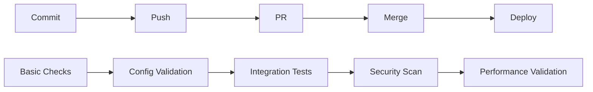

# Architectural Decisions & Maintenance Procedures

## Overview

This document captures the key architectural decisions made during the design of the preventive measures system, the rationale behind these decisions, and comprehensive maintenance procedures to ensure long-term system reliability and effectiveness.

## Table of Contents

1. [Architectural Decision Records (ADRs)](#architectural-decision-records-adrs)
2. [System Maintenance Procedures](#system-maintenance-procedures)
3. [Performance Tuning & Optimization](#performance-tuning--optimization)
4. [Security Maintenance](#security-maintenance)
5. [Documentation Maintenance](#documentation-maintenance)
6. [Team Responsibilities & Handover](#team-responsibilities--handover)
7. [Long-term Sustainability](#long-term-sustainability)
8. [Troubleshooting Procedures](#troubleshooting-procedures)
9. [Update & Upgrade Processes](#update--upgrade-processes)
10. [Monitoring & Alerting Maintenance](#monitoring--alerting-maintenance)

## Architectural Decision Records (ADRs)

### ADR-001: Multi-Layer Quality Gates Architecture

**Status**: Accepted  
**Date**: 2024-01-01  
**Context**: Need to prevent deployment failures at multiple stages of development lifecycle.

**Decision**: Implement progressive quality gates from commit to production deployment.

**Rationale**:
- **Early Detection**: Issues caught closer to source are cheaper to fix
- **Progressive Rigor**: More comprehensive checks as code moves toward production
- **Developer Experience**: Lightweight checks don't slow development
- **Risk Management**: Multiple checkpoints reduce probability of failures

**Architecture Choice**:


**Consequences**:
- **Positive**: Comprehensive coverage, early issue detection
- **Negative**: Increased complexity, potential for pipeline slowdown
- **Mitigations**: Performance optimization, intelligent caching, parallel execution

**Maintenance Requirements**:
- Weekly review of gate performance metrics
- Monthly evaluation of threshold effectiveness
- Quarterly assessment of gate relevance and optimization opportunities

---

### ADR-002: TypeScript for System Implementation

**Status**: Accepted  
**Date**: 2024-01-01  
**Context**: Need consistent, maintainable code across all preventive systems.

**Decision**: Use TypeScript for all system components including monitoring, validation, and automation.

**Rationale**:
- **Type Safety**: Prevents runtime errors in critical systems
- **Developer Experience**: Better tooling and IDE support
- **Maintainability**: Self-documenting interfaces and clear contracts
- **Team Familiarity**: Aligns with existing project technology stack

**Implementation Standards**:
```typescript
// Strict TypeScript configuration
{
  "compilerOptions": {
    "strict": true,
    "noImplicitAny": true,
    "strictNullChecks": true,
    "noImplicitReturns": true,
    "noUnusedLocals": true,
    "noUnusedParameters": true
  }
}
```

**Consequences**:
- **Positive**: Reduced bugs, better maintainability, improved developer experience
- **Negative**: Slight increase in development time, learning curve for complex types
- **Mitigations**: Comprehensive type definitions, gradual type adoption, team training

---

### ADR-003: Edge Runtime First Architecture

**Status**: Accepted  
**Date**: 2024-01-01  
**Context**: Vercel Edge Runtime provides better performance but has API limitations.

**Decision**: Design all API functions for Edge Runtime compatibility by default.

**Rationale**:
- **Performance**: Significantly better cold start times and global distribution
- **Scalability**: Automatic scaling without infrastructure management
- **Future-Proofing**: Vercel's strategic direction toward Edge Runtime
- **Cost Efficiency**: More efficient resource utilization

**Implementation Guidelines**:
```typescript
// Edge Runtime compatible patterns
export const config = { runtime: 'edge' };

// Safe environment access
const envVar = process?.env?.VAR_NAME || 'default';

// Web API usage
const response = await fetch(url);
const data = await response.json();

// Avoid Node.js APIs
// ❌ process.uptime()
// ✅ Date.now() - startTime
```

**Consequences**:
- **Positive**: Better performance, lower costs, improved scalability
- **Negative**: API limitations, learning curve, migration complexity
- **Mitigations**: Comprehensive compatibility testing, alternative patterns documentation

---

### ADR-004: Configuration-as-Code with Templates

**Status**: Accepted  
**Date**: 2024-01-01  
**Context**: Configuration drift causes frequent deployment failures.

**Decision**: Implement centralized configuration management with templates and validation.

**Rationale**:
- **Consistency**: Templates ensure standardized configurations
- **Validation**: Automated checking prevents invalid configurations
- **Version Control**: All configuration changes are tracked
- **Drift Prevention**: Real-time monitoring prevents configuration drift

**Template System Design**:
```typescript
interface ConfigTemplate {
  name: string;
  version: string;
  variables: TemplateVariable[];
  validation: ValidationRule[];
  autoFix: AutoFixRule[];
}

class ConfigurationManager {
  async applyTemplate(template: ConfigTemplate, variables: Record<string, any>) {
    // Template resolution
    // Validation execution
    // Auto-fix application
    // Change tracking
  }
}
```

**Consequences**:
- **Positive**: Reduced configuration errors, consistent setup, automated maintenance
- **Negative**: Initial setup complexity, template maintenance overhead
- **Mitigations**: Gradual template adoption, automated template updates, comprehensive documentation

---

### ADR-005: Real-Time Validation with Performance Constraints

**Status**: Accepted  
**Date**: 2024-01-01  
**Context**: Balance between comprehensive validation and development speed.

**Decision**: Implement tiered validation with performance budgets and intelligent caching.

**Rationale**:
- **Developer Experience**: Fast feedback without workflow interruption
- **Comprehensive Coverage**: More thorough checks when time allows
- **Resource Efficiency**: Avoid redundant validation through caching
- **Scalability**: System performs well with team growth

**Performance Budget Framework**:
```typescript
interface ValidationBudget {
  maxDuration: number;
  priority: 'critical' | 'high' | 'medium' | 'low';
  cacheable: boolean;
  parallelizable: boolean;
}

const budgets = {
  preCommit: { maxDuration: 10000, priority: 'critical' },
  prePush: { maxDuration: 30000, priority: 'high' },
  pullRequest: { maxDuration: 120000, priority: 'medium' },
  preDeployment: { maxDuration: 300000, priority: 'low' }
};
```

**Consequences**:
- **Positive**: Fast development workflow, comprehensive validation coverage
- **Negative**: Complex caching logic, performance monitoring overhead
- **Mitigations**: Performance testing, cache invalidation strategies, monitoring dashboards

---

## System Maintenance Procedures

### Daily Maintenance Tasks (Automated)

**System Health Checks**:
```bash
#!/bin/bash
# daily-health-check.sh

echo "=== Daily System Health Check ==="
date

# Check system availability
curl -f http://monitoring-dashboard/health || alert "Dashboard unavailable"

# Validate configuration consistency
npm run validate:config-drift || alert "Configuration drift detected"

# Check performance metrics
npm run metrics:performance-check || alert "Performance degradation"

# Verify alert systems
npm run test:alert-system || alert "Alert system failure"

# Check disk usage and cleanup
df -h | awk '$5 >= 80 {print "High disk usage: " $5 " on " $6}' | tee /tmp/disk-check

# Database cleanup (if applicable)
npm run cleanup:old-metrics --days=30

echo "✅ Daily health check completed"
```

**Automated Monitoring**:
- System performance metrics collection
- Configuration drift detection
- Security vulnerability scanning
- Dependency update checking
- Log rotation and cleanup
- Backup verification

### Weekly Maintenance Tasks (Semi-Automated)

**Performance Review** (Monday, 9:00 AM):
```bash
#!/bin/bash
# weekly-performance-review.sh

echo "=== Weekly Performance Review ==="

# Generate performance report
npm run report:performance --period=7days --format=detailed

# Check threshold effectiveness
npm run analyze:thresholds --adjust=auto --dry-run

# Review quality gate metrics
npm run report:quality-gates --period=7days

# Analyze developer feedback
npm run analyze:feedback --period=7days --actionable-only

# Check resource utilization
npm run report:resources --recommendations
```

**Configuration Audit** (Wednesday, 2:00 PM):
```typescript
// weekly-config-audit.ts
class ConfigurationAuditor {
  async performWeeklyAudit(): Promise<AuditReport> {
    const report = {
      timestamp: new Date(),
      issues: [],
      recommendations: [],
      metrics: {}
    };

    // Check template compliance
    const complianceCheck = await this.checkTemplateCompliance();
    report.issues.push(...complianceCheck.violations);

    // Analyze configuration patterns
    const patterns = await this.analyzeConfigurationPatterns();
    report.recommendations.push(...patterns.optimizations);

    // Review auto-fix effectiveness
    const autoFixMetrics = await this.analyzeAutoFixPerformance();
    report.metrics.autoFixSuccess = autoFixMetrics.successRate;

    return report;
  }
}
```

**Security Review** (Friday, 11:00 AM):
- Dependency vulnerability assessment
- Access control review
- Secret scanning validation
- Security policy compliance check
- Threat model updates

### Monthly Maintenance Tasks (Manual Oversight Required)

**System Architecture Review** (First Monday):
```typescript
// monthly-architecture-review.ts
interface ArchitectureReview {
  performanceAnalysis: PerformanceAnalysis;
  scalabilityAssessment: ScalabilityAssessment;
  technologyUpdates: TechnologyUpdate[];
  optimizationOpportunities: OptimizationOpportunity[];
}

class ArchitectureReviewer {
  async performMonthlyReview(): Promise<ArchitectureReview> {
    return {
      performanceAnalysis: await this.analyzeSystemPerformance(30), // 30 days
      scalabilityAssessment: await this.assessScalabilityNeeds(),
      technologyUpdates: await this.identifyTechnologyUpdates(),
      optimizationOpportunities: await this.identifyOptimizations()
    };
  }
}
```

**Stakeholder Reporting** (Last Friday):
- Monthly metrics dashboard
- ROI analysis and trends
- Developer satisfaction survey results
- System reliability metrics
- Cost analysis and optimization recommendations

### Quarterly Maintenance Tasks (Strategic Review)

**Comprehensive System Evaluation** (First week of quarter):
1. **Architecture Assessment**
   - System design effectiveness
   - Technology stack evaluation
   - Performance benchmarking
   - Scalability planning

2. **Process Optimization**
   - Workflow efficiency analysis
   - Tool effectiveness review
   - Training needs assessment
   - Process improvement identification

3. **Strategic Planning**
   - Technology roadmap updates
   - Resource planning
   - Budget forecasting
   - Risk assessment updates

## Performance Tuning & Optimization

### Performance Monitoring Framework

**Key Performance Indicators**:
```typescript
interface SystemPerformanceKPIs {
  validationPerformance: {
    averageExecutionTime: number;
    p95ExecutionTime: number;
    p99ExecutionTime: number;
    cacheHitRate: number;
  };
  
  systemReliability: {
    uptime: number;
    errorRate: number;
    alertAccuracy: number;
    falsePositiveRate: number;
  };
  
  developerExperience: {
    satisfactionScore: number;
    adoptionRate: number;
    timeToResolution: number;
    supportTicketVolume: number;
  };
  
  businessImpact: {
    deploymentSuccessRate: number;
    mttr: number; // Mean Time To Recovery
    costSavings: number;
    productivityGain: number;
  };
}
```

**Performance Optimization Procedures**:

**1. Validation Performance Optimization**:
```bash
# Analyze validation bottlenecks
npm run analyze:validation-performance --profile

# Optimize slow validators
npm run optimize:validators --target-time=5000ms

# Update caching strategies
npm run cache:optimize --hit-rate-target=90%

# Parallel execution tuning
npm run tune:parallel-execution --max-workers=auto
```

**2. System Resource Optimization**:
```typescript
class ResourceOptimizer {
  async optimizeSystemResources(): Promise<OptimizationResult> {
    // Memory usage optimization
    const memoryOpt = await this.optimizeMemoryUsage();
    
    // CPU utilization tuning
    const cpuOpt = await this.optimizeCpuUtilization();
    
    // I/O performance improvement
    const ioOpt = await this.optimizeIoPerformance();
    
    // Network optimization
    const networkOpt = await this.optimizeNetworkUsage();
    
    return {
      memory: memoryOpt,
      cpu: cpuOpt,
      io: ioOpt,
      network: networkOpt,
      overallImprovement: this.calculateOverallImprovement([
        memoryOpt, cpuOpt, ioOpt, networkOpt
      ])
    };
  }
}
```

**3. Alert System Optimization**:
```typescript
class AlertOptimizer {
  async optimizeAlertSystem(): Promise<void> {
    // Analyze alert patterns
    const patterns = await this.analyzeAlertPatterns(90); // 90 days
    
    // Adjust thresholds based on historical data
    await this.optimizeThresholds(patterns);
    
    // Reduce false positives
    await this.reduceFalsePositives(patterns);
    
    // Improve alert correlation
    await this.improveAlertCorrelation(patterns);
  }
  
  private async optimizeThresholds(patterns: AlertPattern[]): Promise<void> {
    for (const pattern of patterns) {
      if (pattern.falsePositiveRate > 0.1) { // 10% threshold
        const newThreshold = this.calculateOptimalThreshold(pattern);
        await this.updateThreshold(pattern.metric, newThreshold);
      }
    }
  }
}
```

## Security Maintenance

### Security Maintenance Schedule

**Daily Automated Security Tasks**:
- Vulnerability scanning of dependencies
- Secret detection in code commits
- Security policy compliance checking
- Access log analysis for anomalies

**Weekly Security Tasks**:
- Security configuration review
- Access control audit
- Incident response plan testing
- Security awareness training updates

**Monthly Security Tasks**:
- Comprehensive security assessment
- Threat model review and updates
- Security metrics analysis
- Third-party security tool evaluation

**Quarterly Security Tasks**:
- Penetration testing
- Security architecture review
- Compliance audit
- Security training effectiveness assessment

### Security Procedures

**Vulnerability Management**:
```typescript
class SecurityManager {
  async performSecurityMaintenance(): Promise<SecurityReport> {
    const report: SecurityReport = {
      vulnerabilities: [],
      remediations: [],
      riskAssessment: {},
      compliance: {}
    };

    // Scan for vulnerabilities
    const vulnScan = await this.scanVulnerabilities();
    report.vulnerabilities = vulnScan.findings;

    // Apply automatic remediations
    for (const vuln of vulnScan.autoRemediable) {
      const remediation = await this.applyRemediation(vuln);
      report.remediations.push(remediation);
    }

    // Update risk assessment
    report.riskAssessment = await this.updateRiskAssessment();

    // Check compliance status
    report.compliance = await this.checkComplianceStatus();

    return report;
  }
}
```

**Incident Response Procedures**:
```bash
#!/bin/bash
# security-incident-response.sh

INCIDENT_TYPE=$1
SEVERITY=$2

echo "=== Security Incident Response ==="
echo "Type: $INCIDENT_TYPE"
echo "Severity: $SEVERITY"
echo "Time: $(date -u)"

case $SEVERITY in
  "CRITICAL")
    # Immediate response for critical incidents
    alert_security_team_immediately
    isolate_affected_systems
    preserve_evidence
    begin_containment
    ;;
  "HIGH")
    # Urgent response for high severity
    alert_security_team_urgent
    assess_impact
    begin_investigation
    ;;
  "MEDIUM"|"LOW")
    # Standard response for medium/low severity
    log_incident
    schedule_investigation
    notify_stakeholders
    ;;
esac
```

## Documentation Maintenance

### Documentation Update Procedures

**Automated Documentation Updates**:
```typescript
class DocumentationMaintainer {
  async updateDocumentation(): Promise<void> {
    // Update API documentation from code comments
    await this.generateAPIDocumentation();
    
    // Update configuration schema documentation
    await this.updateConfigurationDocs();
    
    // Generate metrics and reporting documentation
    await this.updateMetricsDocs();
    
    // Update troubleshooting guides from incident history
    await this.updateTroubleshootingGuides();
  }
  
  private async generateAPIDocumentation(): Promise<void> {
    // Extract TypeScript interfaces and generate docs
    const apis = await this.extractAPIInterfaces();
    const documentation = await this.generateMarkdownDocs(apis);
    await this.updateDocumentationFiles(documentation);
  }
}
```

**Documentation Review Schedule**:
- **Weekly**: Technical documentation accuracy review
- **Monthly**: User guide and tutorial updates
- **Quarterly**: Comprehensive documentation audit and reorganization

**Documentation Quality Standards**:
```yaml
documentation_standards:
  accuracy:
    - All code examples must be tested and working
    - Screenshots updated within 30 days of UI changes
    - API documentation matches current implementation
  
  completeness:
    - Every feature has user documentation
    - All configuration options documented
    - Troubleshooting guides for common issues
  
  accessibility:
    - Clear, jargon-free language
    - Progressive complexity (basic to advanced)
    - Multiple learning formats (text, video, interactive)
```

## Team Responsibilities & Handover

### Role Definitions

**System Administrator** (Primary Responsibility):
- Daily system health monitoring
- Performance optimization
- Security maintenance
- Incident response coordination
- Documentation updates

**DevOps Engineer** (Secondary Responsibility):
- CI/CD pipeline maintenance
- Infrastructure management
- Deployment automation
- Monitoring system administration
- Tool integration and updates

**Quality Assurance Lead** (Supporting Responsibility):
- Quality gate effectiveness review
- Test framework maintenance
- Validation rule optimization
- User acceptance testing coordination
- Quality metrics analysis

**Development Team Lead** (Advisory Responsibility):
- Developer experience feedback
- Tool adoption guidance
- Training coordination
- Feature request prioritization
- Architecture decision participation

### Handover Procedures

**Knowledge Transfer Checklist**:
```markdown
## System Administration Handover

### Pre-Handover (1 week before)
- [ ] Schedule handover meetings
- [ ] Prepare system documentation review
- [ ] Set up access credentials and permissions
- [ ] Identify critical system knowledge gaps

### During Handover (1-2 weeks)
- [ ] Shadow current administrator for daily tasks
- [ ] Review all system components and integrations
- [ ] Practice incident response procedures
- [ ] Understand monitoring and alerting systems
- [ ] Review maintenance schedules and procedures

### Post-Handover (1 month after)
- [ ] Perform independent system health check
- [ ] Execute maintenance procedures under supervision
- [ ] Handle minor incidents independently
- [ ] Update documentation based on learning
- [ ] Provide feedback on handover process
```

**Critical System Knowledge**:
1. **Emergency Procedures**
   - System shutdown/restart procedures
   - Rollback mechanisms
   - Contact information for escalations
   - Service recovery procedures

2. **Monitoring and Alerting**
   - Dashboard navigation and interpretation
   - Alert triage and response procedures
   - Log analysis techniques
   - Performance troubleshooting

3. **Configuration Management**
   - Template system administration
   - Validation rule updates
   - Drift detection and resolution
   - Change approval processes

## Long-term Sustainability

### Technology Evolution Strategy

**Annual Technology Review**:
```typescript
interface TechnologyRoadmap {
  currentStack: TechStack;
  emerging: EmergingTechnology[];
  migrationPlan: MigrationPlan;
  riskAssessment: TechRisk[];
}

class TechnologyPlanner {
  async planTechnologyEvolution(): Promise<TechnologyRoadmap> {
    return {
      currentStack: await this.analyzeCurrent

[stack(),
      emerging: await this.identifyEmergingTech(),
      migrationPlan: await this.createMigrationPlan(),
      riskAssessment: await this.assessTechnologyRisks()
    };
  }
}
```

**Sustainability Framework**:
1. **Technical Debt Management**
   - Monthly technical debt assessment
   - Quarterly refactoring sprints
   - Annual architecture review
   - Continuous performance optimization

2. **Knowledge Management**
   - Documentation as code
   - Video tutorials for complex procedures
   - Interactive learning modules
   - Regular knowledge sharing sessions

3. **Community and Ecosystem**
   - Open source contribution strategy
   - Industry best practices adoption
   - Conference participation and learning
   - Vendor relationship management

This comprehensive architectural decisions and maintenance documentation ensures the long-term success and sustainability of the preventive measures system while providing clear guidance for ongoing system administration and evolution.