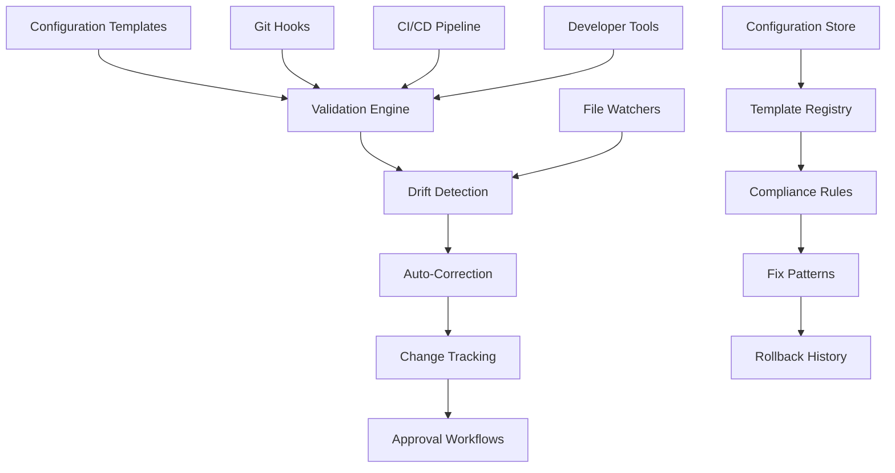
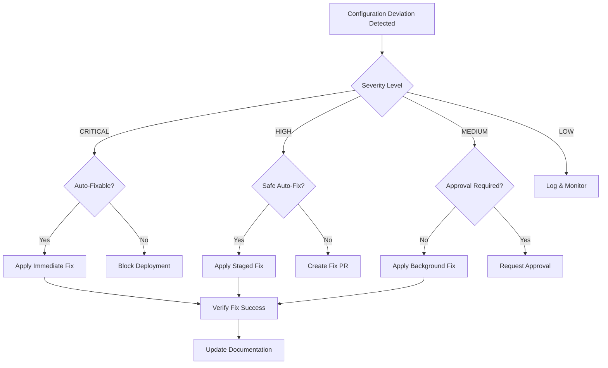

# Configuration Management System Design

## Overview

The Configuration Management System is a central component of the preventive measures architecture that ensures configuration consistency, detects drift, and automatically corrects common misconfigurations that lead to Vercel deployment failures.

## Architecture Components



## 1. Template Engine System

### Configuration Templates Structure

**Purpose**: Provide standardized, validated configuration templates that prevent common misconfigurations.

```
config-templates/
├── vercel/
│   ├── base-vercel.json.template
│   ├── edge-runtime-vercel.json.template
│   ├── spa-vercel.json.template
│   └── pwa-vercel.json.template
├── typescript/
│   ├── base-tsconfig.json.template
│   ├── edge-compatible-tsconfig.json.template
│   └── strict-tsconfig.json.template
├── ignore-files/
│   ├── base.vercelignore.template
│   ├── spa.vercelignore.template
│   └── secure.vercelignore.template
├── package/
│   ├── base-package.json.template
│   ├── edge-runtime-package.json.template
│   └── pwa-package.json.template
└── validation/
    ├── schema-rules.json
    ├── compatibility-rules.json
    └── security-rules.json
```

### Template Variables System

**Template Variable Resolution:**
- Environment-specific variables (`{{ENVIRONMENT}}`)
- Project-specific variables (`{{PROJECT_NAME}}`)
- Version-specific variables (`{{NODE_VERSION}}`)
- Feature flags (`{{ENABLE_EDGE_RUNTIME}}`)

**Example Template - vercel.json:**
```json
{
  "version": 2,
  "buildCommand": "{{BUILD_COMMAND}}",
  "outputDirectory": "{{OUTPUT_DIR}}",
  "framework": "{{FRAMEWORK}}",
  "functions": {
    "api/**/*.ts": {
      "runtime": "{{RUNTIME_TYPE}}",
      "maxDuration": {{MAX_DURATION}}
    }
  },
  "env": {
    "NODE_ENV": "{{NODE_ENV}}",
    "ENVIRONMENT": "{{ENVIRONMENT}}"
  }
}
```

### Template Validation Rules

**JSON Schema Validation:**
```json
{
  "$schema": "http://json-schema.org/draft-07/schema#",
  "type": "object",
  "properties": {
    "version": {
      "type": "number",
      "enum": [2]
    },
    "buildCommand": {
      "type": "string",
      "pattern": "^(npm|yarn|pnpm) run build$"
    },
    "outputDirectory": {
      "type": "string",
      "not": {
        "enum": ["src", "node_modules", ".git"]
      }
    }
  },
  "required": ["version", "buildCommand"]
}
```

## 2. Configuration Validation Engine

### Real-Time Validation System

**Validation Triggers:**
- File save events in IDE
- Pre-commit hooks
- CI/CD pipeline stages
- Manual validation commands
- Scheduled compliance audits

### Validation Rule Categories

**1. Structural Validation**
- JSON/YAML syntax validation
- Schema compliance checking
- Required field validation
- Value range validation

**2. Compatibility Validation**
- Edge Runtime compatibility
- Node.js version compatibility
- Framework version compatibility
- Dependency compatibility matrix

**3. Security Validation**
- Secret detection in configuration
- Insecure default detection
- Access control validation
- CORS configuration validation

**4. Performance Validation**
- Resource limit validation
- Cache configuration optimization
- Bundle size impact analysis
- Build time estimation

### Custom Validation Rules Engine

**Rule Definition Format:**
```json
{
  "rules": [
    {
      "id": "vercelignore-critical-dirs",
      "name": "Critical Directory Exclusion Check",
      "description": "Ensures dist and public directories are not excluded",
      "severity": "CRITICAL",
      "files": [".vercelignore"],
      "condition": {
        "type": "not_contains_lines",
        "patterns": ["^dist$", "^public$"]
      },
      "fix": {
        "type": "remove_lines",
        "patterns": ["^dist$", "^public$"]
      }
    },
    {
      "id": "edge-runtime-process-usage",
      "name": "Edge Runtime Process API Check",
      "description": "Detects Node.js process API usage in Edge Runtime functions",
      "severity": "CRITICAL",
      "files": ["api/**/*.ts"],
      "condition": {
        "type": "contains_pattern",
        "patterns": ["process\\.uptime\\(", "process\\.memoryUsage\\("]
      },
      "fix": {
        "type": "suggest_replacement",
        "replacements": {
          "process.uptime()": "Date.now() - startTime",
          "process.memoryUsage()": "{ rss: 0, heapUsed: 0, heapTotal: 0, external: 0 }"
        }
      }
    }
  ]
}
```

## 3. Configuration Drift Detection System

### Continuous Monitoring Architecture

**File System Watchers:**
- Real-time configuration file monitoring
- Change detection with checksums
- Unauthorized modification alerts
- Automatic backup creation

### Drift Detection Algorithms

**1. Configuration Fingerprinting**
```typescript
interface ConfigurationFingerprint {
  file: string;
  checksum: string;
  templateVersion: string;
  lastValidated: Date;
  complianceScore: number;
  deviations: ConfigurationDeviation[];
}

interface ConfigurationDeviation {
  path: string;
  expected: any;
  actual: any;
  severity: 'CRITICAL' | 'HIGH' | 'MEDIUM' | 'LOW';
  autoFixable: boolean;
}
```

**2. Semantic Drift Analysis**
- Configuration impact analysis
- Dependency compatibility checking
- Performance impact assessment
- Security posture evaluation

### Drift Classification System

**Drift Categories:**
- **Authorized Changes**: Approved through proper channels
- **Unauthorized Changes**: Direct modifications without approval
- **Template Updates**: Changes due to template evolution
- **Environmental Drift**: Changes due to environment differences

**Severity Levels:**
- **CRITICAL**: Changes that will cause deployment failures
- **HIGH**: Changes that impact security or performance
- **MEDIUM**: Changes that may cause warnings or inefficiencies
- **LOW**: Cosmetic or documentation changes

## 4. Automated Correction System

### Auto-Fix Engine Architecture

**Fix Strategy Decision Tree:**


### Auto-Fix Capabilities

**1. Immediate Auto-Fixes (CRITICAL)**
- Remove `dist` and `public` from `.vercelignore`
- Fix TypeScript import extensions
- Add missing Node.js engine specifications
- Correct malformed JSON syntax

**2. Staged Auto-Fixes (HIGH)**
- Update outdated dependency versions
- Fix security vulnerabilities in dependencies
- Optimize configuration for performance
- Update deprecated configuration options

**3. Background Auto-Fixes (MEDIUM/LOW)**
- Code formatting and style fixes
- Documentation updates
- Dependency license compliance
- Performance optimization suggestions

### Fix Application Framework

**Pre-Fix Validation:**
1. Create configuration backup
2. Validate fix against current environment
3. Test fix in isolated environment
4. Estimate impact and risk assessment

**Fix Application Process:**
1. Apply fix with atomic operations
2. Validate configuration post-fix
3. Run automated tests
4. Create rollback point

**Post-Fix Verification:**
1. Configuration compliance check
2. Build and deployment test
3. Performance impact assessment
4. Documentation and audit trail update

## 5. Change Tracking & Approval Workflows

### Configuration Change Management

**Change Classification:**
- **Emergency Fixes**: Critical issues requiring immediate resolution
- **Planned Changes**: Scheduled configuration updates
- **Template Updates**: Changes due to template evolution
- **Compliance Fixes**: Changes required for regulatory compliance

### Approval Workflow Engine

**Approval Matrix:**
```yaml
approval_rules:
  emergency_fixes:
    severity: CRITICAL
    auto_approve: true
    post_approval: technical_lead
    notification: immediate
  
  planned_changes:
    severity: HIGH|MEDIUM
    approval_required: true
    approvers: [technical_lead, devops_lead]
    review_window: 24h
  
  template_updates:
    severity: ANY
    auto_approve: true
    notification: async
    rollback_window: 72h
  
  compliance_fixes:
    severity: HIGH
    approval_required: true
    approvers: [security_team, compliance_officer]
    review_window: 48h
```

### Change Audit System

**Audit Trail Components:**
- Change request details
- Approval workflow history
- Implementation timestamps
- Rollback capabilities
- Impact assessment results

**Compliance Reporting:**
- Monthly configuration change reports
- Compliance drift analysis
- Security impact assessments
- Performance impact tracking

## 6. Integration Architecture

### Git Integration

**Git Hooks Integration:**
```bash
# pre-commit hook
#!/bin/bash
config-validator --files $(git diff --cached --name-only | grep -E '\.(json|yml|yaml|ts)$')

# pre-push hook
#!/bin/bash
config-validator --full-scan --block-on-critical
```

### CI/CD Pipeline Integration

**Pipeline Stages:**
1. **Configuration Validation Stage**
   - Template compliance checking
   - Drift detection analysis
   - Auto-fix application
   - Validation report generation

2. **Edge Runtime Compatibility Stage**
   - API function compatibility testing
   - Import resolution verification
   - Runtime environment simulation
   - Performance benchmarking

3. **Security Validation Stage**
   - Secret scanning
   - Dependency vulnerability assessment
   - Access control validation
   - Compliance checking

### IDE Integration

**Developer Experience Features:**
- Real-time validation feedback
- Auto-fix suggestions
- Configuration templates access
- Drift detection warnings
- Performance impact indicators

**IDE Extensions Specifications:**
- VSCode extension for configuration validation
- IntelliJ plugin for template management
- Vim/Neovim integration for command-line workflows
- Web-based configuration editor

## 7. Monitoring & Alerting

### Configuration Health Monitoring

**Health Metrics:**
- Configuration compliance score
- Drift detection frequency
- Auto-fix success rate
- Manual intervention requirements
- Security posture assessment

### Alert Management System

**Alert Categories:**
- **CRITICAL**: Deployment-blocking configuration issues
- **HIGH**: Security or performance-impacting changes
- **MEDIUM**: Compliance drift or optimization opportunities
- **LOW**: Information and trend notifications

**Alert Routing:**
```yaml
alert_routing:
  critical:
    channels: [slack, email, sms]
    escalation: immediate
    recipients: [on_call_engineer, technical_lead]
  
  high:
    channels: [slack, email]
    escalation: 15_minutes
    recipients: [development_team, devops_team]
  
  medium:
    channels: [slack]
    escalation: 1_hour
    recipients: [development_team]
  
  low:
    channels: [email]
    escalation: daily_digest
    recipients: [technical_lead]
```

## 8. Performance & Scalability

### System Performance Requirements

**Response Time Targets:**
- Real-time validation: < 100ms
- Drift detection: < 5 seconds
- Auto-fix application: < 30 seconds
- Full compliance audit: < 5 minutes

**Scalability Considerations:**
- Support for multi-project environments
- Horizontal scaling for large teams
- Configuration caching and optimization
- Efficient file watching mechanisms

### Optimization Strategies

**Caching System:**
- Template compilation caching
- Validation result caching
- Configuration fingerprint caching
- Dependency resolution caching

**Performance Monitoring:**
- Validation execution time tracking
- Memory usage monitoring
- Disk I/O optimization
- Network request minimization

## 9. Security & Compliance

### Security Architecture

**Access Control:**
- Role-based configuration access
- Template modification permissions
- Auto-fix approval requirements
- Audit trail protection

**Secret Management:**
- Configuration secret detection
- Secure template variable handling
- Encrypted configuration storage
- Access logging and monitoring

### Compliance Framework

**Regulatory Compliance:**
- SOC 2 configuration controls
- PCI DSS configuration requirements
- GDPR data protection compliance
- Industry-specific requirements

**Internal Compliance:**
- Configuration change approval workflows
- Security policy enforcement
- Performance standard compliance
- Documentation requirements

## 10. Implementation Strategy

### Phase 1: Core Infrastructure (Week 1-2)
1. **Template System Setup**
   - Create base configuration templates
   - Implement template validation engine
   - Set up template variable resolution
   - Create template registry system

2. **Validation Engine Development**
   - Implement JSON Schema validation
   - Create custom rule engine
   - Set up real-time validation
   - Integrate with existing scripts

### Phase 2: Automation & Integration (Week 3-4)
1. **Auto-Fix Engine Implementation**
   - Develop fix strategy decision logic
   - Implement safe auto-fix capabilities
   - Create rollback mechanisms
   - Set up verification systems

2. **CI/CD Integration**
   - Integrate with existing GitHub workflows
   - Add validation pipeline stages
   - Implement blocking mechanisms
   - Set up reporting systems

### Phase 3: Advanced Features (Week 5-6)
1. **Drift Detection System**
   - Implement file system watchers
   - Create fingerprinting system
   - Set up continuous monitoring
   - Develop drift classification

2. **Approval Workflows**
   - Create approval matrix system
   - Implement workflow engine
   - Set up notification systems
   - Create audit trail mechanisms

### Phase 4: Optimization & Monitoring (Week 7-8)
1. **Performance Optimization**
   - Implement caching systems
   - Optimize validation algorithms
   - Set up performance monitoring
   - Create scalability improvements

2. **Comprehensive Testing**
   - Create test suites for all components
   - Implement integration testing
   - Set up performance testing
   - Conduct security testing

This configuration management system provides a comprehensive solution for preventing configuration-related deployment failures while maintaining flexibility and developer productivity.