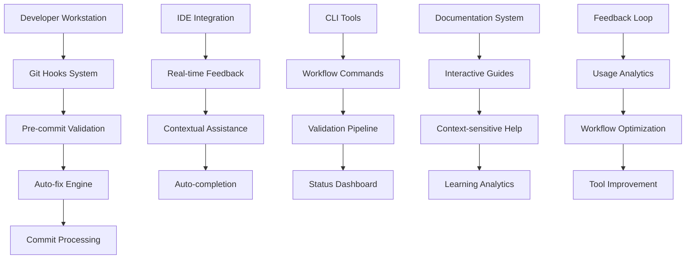

# Developer Workflow Integration System Design

## Overview

The Developer Workflow Integration System seamlessly embeds preventive measures into existing development workflows, ensuring that validation, configuration management, and quality assurance become natural parts of the development process without disrupting productivity.

## Core Principles

1. **Invisible Integration**: Tools work behind the scenes without interrupting flow
2. **Progressive Enhancement**: Guidance that scales with developer experience
3. **Fail-Fast Feedback**: Issues caught at the earliest possible stage
4. **Self-Service Recovery**: Developers can resolve issues independently
5. **Learning System**: Continuous improvement based on developer behavior

## System Architecture



## 1. Git Hooks Integration System

### Intelligent Pre-commit Hook Framework

**Purpose**: Catch and fix issues before they enter version control, with smart performance optimization.

```typescript
interface HookConfiguration {
  enabled: boolean;
  priority: number;
  conditions: HookCondition[];
  actions: HookAction[];
  timeout: number;
  skipPatterns: string[];
}

interface HookCondition {
  type: 'file_pattern' | 'branch_name' | 'commit_size' | 'time_constraint';
  pattern: string;
  operator: 'matches' | 'not_matches' | 'contains' | 'gt' | 'lt';
  value?: string | number;
}

class IntelligentHookManager {
  private hooks: Map<string, HookConfiguration> = new Map();
  private performanceTracker: PerformanceTracker;
  private autoFixEngine: AutoFixEngine;

  constructor() {
    this.performanceTracker = new PerformanceTracker();
    this.autoFixEngine = new AutoFixEngine();
    this.initializeHooks();
  }

  private initializeHooks(): void {
    // Configuration Validation Hook
    this.hooks.set('config-validation', {
      enabled: true,
      priority: 1,
      conditions: [
        {
          type: 'file_pattern',
          pattern: '\\.(json|yml|yaml|ts|js)$',
          operator: 'matches'
        }
      ],
      actions: [
        { type: 'validate_config', params: { strict: false } },
        { type: 'auto_fix', params: { safe_fixes_only: true } }
      ],
      timeout: 10000,
      skipPatterns: ['node_modules/', '.git/', 'dist/']
    });

    // Edge Runtime Compatibility Hook
    this.hooks.set('edge-runtime-check', {
      enabled: true,
      priority: 2,
      conditions: [
        {
          type: 'file_pattern',
          pattern: '^api/.*\\.ts$',
          operator: 'matches'
        }
      ],
      actions: [
        { type: 'check_edge_compatibility', params: {} },
        { type: 'suggest_alternatives', params: { auto_apply: false } }
      ],
      timeout: 5000,
      skipPatterns: ['**/*.test.ts', '**/*.spec.ts']
    });

    // TypeScript Import Validation Hook
    this.hooks.set('typescript-imports', {
      enabled: true,
      priority: 3,
      conditions: [
        {
          type: 'file_pattern',
          pattern: '\\.ts$',
          operator: 'matches'
        }
      ],
      actions: [
        { type: 'validate_imports', params: { fix_extensions: true } },
        { type: 'check_circular_deps', params: {} }
      ],
      timeout: 8000,
      skipPatterns: ['**/*.d.ts']
    });

    // Security Scanning Hook
    this.hooks.set('security-scan', {
      enabled: true,
      priority: 4,
      conditions: [
        {
          type: 'file_pattern',
          pattern: '\\.(ts|js|json|yml|yaml)$',
          operator: 'matches'
        }
      ],
      actions: [
        { type: 'scan_secrets', params: {} },
        { type: 'check_dependencies', params: { vulnerability_check: true } }
      ],
      timeout: 15000,
      skipPatterns: ['test/', '__tests__/', '.env.example']
    });

    // Performance Impact Hook
    this.hooks.set('performance-check', {
      enabled: true,
      priority: 5,
      conditions: [
        {
          type: 'commit_size',
          operator: 'gt',
          value: 10 // More than 10 files
        }
      ],
      actions: [
        { type: 'estimate_build_impact', params: {} },
        { type: 'check_bundle_size', params: {} }
      ],
      timeout: 12000,
      skipPatterns: []
    });
  }

  async executePreCommitHooks(changedFiles: string[]): Promise<HookExecutionResult> {
    const results: HookResult[] = [];
    const startTime = Date.now();
    let totalAutoFixes = 0;

    // Filter and prioritize applicable hooks
    const applicableHooks = this.getApplicableHooks(changedFiles);
    
    // Execute hooks in priority order with performance monitoring
    for (const [hookName, config] of applicableHooks) {
      const hookStartTime = Date.now();
      
      try {
        const result = await this.executeHook(hookName, config, changedFiles);
        results.push(result);
        
        // Track auto-fixes applied
        if (result.autoFixesApplied > 0) {
          totalAutoFixes += result.autoFixesApplied;
        }
        
        // Performance tracking
        const hookDuration = Date.now() - hookStartTime;
        this.performanceTracker.recordHookPerformance(hookName, hookDuration);
        
        // Skip remaining hooks if critical errors found
        if (result.severity === 'CRITICAL' && result.blockCommit) {
          break;
        }
        
      } catch (error) {
        results.push({
          hookName,
          success: false,
          error: error.message,
          duration: Date.now() - hookStartTime,
          blockCommit: true,
          severity: 'CRITICAL'
        });
        break;
      }
    }

    const totalDuration = Date.now() - startTime;
    const hasErrors = results.some(r => !r.success && r.blockCommit);

    return {
      success: !hasErrors,
      results,
      totalDuration,
      autoFixesApplied: totalAutoFixes,
      summary: this.generateExecutionSummary(results),
      recommendations: this.generateRecommendations(results)
    };
  }

  private async executeHook(
    hookName: string,
    config: HookConfiguration,
    changedFiles: string[]
  ): Promise<HookResult> {
    const relevantFiles = this.filterRelevantFiles(changedFiles, config);
    
    if (relevantFiles.length === 0) {
      return {
        hookName,
        success: true,
        message: 'No relevant files for this hook',
        duration: 0,
        blockCommit: false,
        severity: 'INFO',
        autoFixesApplied: 0
      };
    }

    const hookResult: HookResult = {
      hookName,
      success: true,
      duration: 0,
      blockCommit: false,
      severity: 'INFO',
      autoFixesApplied: 0,
      details: []
    };

    const startTime = Date.now();

    // Execute each action in the hook configuration
    for (const action of config.actions) {
      try {
        const actionResult = await this.executeAction(action, relevantFiles);
        hookResult.details.push(actionResult);

        // Update hook result based on action outcome
        if (!actionResult.success) {
          hookResult.success = false;
          hookResult.severity = this.calculateSeverity(actionResult);
          
          // Attempt auto-fix for fixable issues
          if (actionResult.fixable && action.type !== 'auto_fix') {
            const fixResult = await this.autoFixEngine.attemptFix(actionResult);
            if (fixResult.success) {
              hookResult.autoFixesApplied += fixResult.fixesApplied;
              actionResult.autoFixed = true;
              hookResult.success = true; // Recovery through auto-fix
            }
          }
        }

        // Check if this action should block commit
        if (actionResult.blockCommit) {
          hookResult.blockCommit = true;
        }

      } catch (error) {
        hookResult.details.push({
          action: action.type,
          success: false,
          error: error.message,
          blockCommit: true
        });
        hookResult.success = false;
        hookResult.severity = 'CRITICAL';
        break;
      }
    }

    hookResult.duration = Date.now() - startTime;
    hookResult.message = this.generateHookMessage(hookResult);

    return hookResult;
  }

  private async executeAction(action: HookAction, files: string[]): Promise<ActionResult> {
    switch (action.type) {
      case 'validate_config':
        return await this.validateConfiguration(files, action.params);
      
      case 'check_edge_compatibility':
        return await this.checkEdgeRuntimeCompatibility(files, action.params);
      
      case 'validate_imports':
        return await this.validateTypeScriptImports(files, action.params);
      
      case 'scan_secrets':
        return await this.scanForSecrets(files, action.params);
      
      case 'check_dependencies':
        return await this.checkDependencySecurity(files, action.params);
      
      case 'estimate_build_impact':
        return await this.estimateBuildImpact(files, action.params);
      
      default:
        throw new Error(`Unknown action type: ${action.type}`);
    }
  }

  private async validateConfiguration(files: string[], params: any): Promise<ActionResult> {
    const configFiles = files.filter(f => 
      f.match(/\.(json|yml|yaml)$/) && 
      ['vercel.json', '.vercelignore', 'package.json', 'tsconfig.json'].some(cf => f.endsWith(cf))
    );

    if (configFiles.length === 0) {
      return { action: 'validate_config', success: true, message: 'No config files changed' };
    }

    const issues: ConfigurationIssue[] = [];

    for (const file of configFiles) {
      try {
        if (file.endsWith('.vercelignore')) {
          const issues_found = await this.validateVercelIgnore(file);
          issues.push(...issues_found);
        } else if (file.endsWith('vercel.json')) {
          const issues_found = await this.validateVercelConfig(file);
          issues.push(...issues_found);
        } else if (file.endsWith('package.json')) {
          const issues_found = await this.validatePackageJson(file);
          issues.push(...issues_found);
        }
      } catch (error) {
        issues.push({
          file,
          severity: 'CRITICAL',
          message: `Failed to validate ${file}: ${error.message}`,
          fixable: false
        });
      }
    }

    const criticalIssues = issues.filter(i => i.severity === 'CRITICAL');
    const fixableIssues = issues.filter(i => i.fixable);

    return {
      action: 'validate_config',
      success: criticalIssues.length === 0,
      message: this.formatConfigValidationMessage(issues),
      blockCommit: criticalIssues.length > 0,
      fixable: fixableIssues.length > 0,
      details: {
        totalIssues: issues.length,
        criticalIssues: criticalIssues.length,
        fixableIssues: fixableIssues.length,
        issues
      }
    };
  }

  private async checkEdgeRuntimeCompatibility(files: string[], params: any): Promise<ActionResult> {
    const apiFiles = files.filter(f => f.startsWith('api/') && f.endsWith('.ts'));
    
    if (apiFiles.length === 0) {
      return { action: 'check_edge_compatibility', success: true, message: 'No API files changed' };
    }

    const compatibilityIssues: EdgeCompatibilityIssue[] = [];

    for (const file of apiFiles) {
      const fileContent = await fs.readFile(file, 'utf8');
      const issues = await this.analyzeEdgeCompatibility(file, fileContent);
      compatibilityIssues.push(...issues);
    }

    const blockingIssues = compatibilityIssues.filter(i => i.severity === 'CRITICAL');
    
    return {
      action: 'check_edge_compatibility',
      success: blockingIssues.length === 0,
      message: this.formatEdgeCompatibilityMessage(compatibilityIssues),
      blockCommit: blockingIssues.length > 0,
      fixable: compatibilityIssues.some(i => i.fixable),
      details: {
        filesChecked: apiFiles.length,
        issuesFound: compatibilityIssues.length,
        blockingIssues: blockingIssues.length,
        issues: compatibilityIssues
      }
    };
  }

  generateExecutionSummary(results: HookResult[]): string {
    const totalHooks = results.length;
    const successfulHooks = results.filter(r => r.success).length;
    const totalAutoFixes = results.reduce((sum, r) => sum + r.autoFixesApplied, 0);
    const totalDuration = results.reduce((sum, r) => sum + r.duration, 0);
    
    let summary = `✅ Executed ${totalHooks} hooks in ${totalDuration}ms`;
    
    if (successfulHooks < totalHooks) {
      const failedHooks = totalHooks - successfulHooks;
      summary += `\n❌ ${failedHooks} hook(s) failed`;
    }
    
    if (totalAutoFixes > 0) {
      summary += `\n🔧 Applied ${totalAutoFixes} automatic fixes`;
    }
    
    return summary;
  }

  generateRecommendations(results: HookResult[]): string[] {
    const recommendations: string[] = [];
    
    // Performance recommendations
    const slowHooks = results.filter(r => r.duration > 5000);
    if (slowHooks.length > 0) {
      recommendations.push('Consider optimizing slow hooks: ' + slowHooks.map(h => h.hookName).join(', '));
    }
    
    // Error pattern recommendations
    const configErrors = results.filter(r => r.hookName === 'config-validation' && !r.success);
    if (configErrors.length > 0) {
      recommendations.push('Review configuration files for common issues');
    }
    
    const edgeErrors = results.filter(r => r.hookName === 'edge-runtime-check' && !r.success);
    if (edgeErrors.length > 0) {
      recommendations.push('Consider migrating API functions to Edge Runtime compatible patterns');
    }
    
    return recommendations;
  }
}
```

## 2. IDE Integration Framework

### VSCode Extension Architecture

**Purpose**: Provide seamless, real-time development assistance directly in the editor.

```typescript
// Extension activation
export function activate(context: vscode.ExtensionContext) {
  const extension = new MTCVercelExtension(context);
  extension.initialize();
}

class MTCVercelExtension {
  private diagnosticCollection: vscode.DiagnosticCollection;
  private configWatcher: vscode.FileSystemWatcher;
  private edgeSimulator: EdgeRuntimeSimulator;
  private statusBar: vscode.StatusBarItem;
  private validationProvider: ValidationProvider;

  constructor(private context: vscode.ExtensionContext) {
    this.diagnosticCollection = vscode.languages.createDiagnosticCollection('mtc-vercel');
    this.edgeSimulator = new EdgeRuntimeSimulator();
    this.validationProvider = new ValidationProvider();
    this.createStatusBar();
  }

  async initialize(): Promise<void> {
    // Register commands
    this.registerCommands();
    
    // Set up file watchers
    this.setupFileWatchers();
    
    // Register providers
    this.registerProviders();
    
    // Start background validation
    this.startBackgroundValidation();
    
    console.log('MTC Vercel Extension activated');
  }

  private registerCommands(): void {
    // Validation commands
    this.context.subscriptions.push(
      vscode.commands.registerCommand('mtc-vercel.validateProject', () => {
        this.validateProject();
      })
    );

    this.context.subscriptions.push(
      vscode.commands.registerCommand('mtc-vercel.validateCurrentFile', () => {
        const activeEditor = vscode.window.activeTextEditor;
        if (activeEditor) {
          this.validateFile(activeEditor.document);
        }
      })
    );

    // Auto-fix commands
    this.context.subscriptions.push(
      vscode.commands.registerCommand('mtc-vercel.applyAutoFixes', () => {
        this.applyAutoFixes();
      })
    );

    this.context.subscriptions.push(
      vscode.commands.registerCommand('mtc-vercel.fixCurrentFile', () => {
        const activeEditor = vscode.window.activeTextEditor;
        if (activeEditor) {
          this.fixFile(activeEditor.document);
        }
      })
    );

    // Edge Runtime commands
    this.context.subscriptions.push(
      vscode.commands.registerCommand('mtc-vercel.testEdgeFunction', () => {
        const activeEditor = vscode.window.activeTextEditor;
        if (activeEditor && this.isAPIFile(activeEditor.document.fileName)) {
          this.testEdgeFunction(activeEditor.document);
        }
      })
    );

    // Configuration commands
    this.context.subscriptions.push(
      vscode.commands.registerCommand('mtc-vercel.generateConfig', () => {
        this.generateConfiguration();
      })
    );

    this.context.subscriptions.push(
      vscode.commands.registerCommand('mtc-vercel.showDeploymentStatus', () => {
        this.showDeploymentStatus();
      })
    );
  }

  private setupFileWatchers(): void {
    // Watch configuration files
    this.configWatcher = vscode.workspace.createFileSystemWatcher(
      '**/{vercel.json,.vercelignore,package.json,tsconfig.json}'
    );

    this.configWatcher.onDidCreate(uri => {
      this.onConfigFileChanged(uri, 'created');
    });

    this.configWatcher.onDidChange(uri => {
      this.onConfigFileChanged(uri, 'modified');
    });

    this.configWatcher.onDidDelete(uri => {
      this.onConfigFileChanged(uri, 'deleted');
    });

    // Watch API files for Edge Runtime validation
    const apiWatcher = vscode.workspace.createFileSystemWatcher('**/api/**/*.ts');
    
    apiWatcher.onDidChange(uri => {
      this.validateEdgeRuntimeCompatibility(uri);
    });

    this.context.subscriptions.push(this.configWatcher, apiWatcher);
  }

  private registerProviders(): void {
    // Diagnostic provider for real-time validation
    this.context.subscriptions.push(
      vscode.workspace.onDidChangeTextDocument(event => {
        this.validateDocument(event.document);
      })
    );

    this.context.subscriptions.push(
      vscode.workspace.onDidSaveTextDocument(document => {
        this.validateDocument(document);
      })
    );

    // Code action provider for auto-fixes
    this.context.subscriptions.push(
      vscode.languages.registerCodeActionsProvider(
        ['typescript', 'javascript', 'json', 'yaml'],
        new MTCCodeActionProvider(this.validationProvider),
        { providedCodeActionKinds: [vscode.CodeActionKind.QuickFix] }
      )
    );

    // Completion provider for configuration assistance
    this.context.subscriptions.push(
      vscode.languages.registerCompletionItemProvider(
        'json',
        new ConfigurationCompletionProvider(),
        ':', '"', '{'
      )
    );

    // Hover provider for contextual help
    this.context.subscriptions.push(
      vscode.languages.registerHoverProvider(
        ['typescript', 'javascript'],
        new EdgeRuntimeHoverProvider(this.edgeSimulator)
      )
    );
  }

  private async validateDocument(document: vscode.TextDocument): Promise<void> {
    if (!this.shouldValidateDocument(document)) {
      return;
    }

    const diagnostics: vscode.Diagnostic[] = [];

    try {
      // Configuration validation
      if (this.isConfigFile(document.fileName)) {
        const configDiagnostics = await this.validateConfigurationFile(document);
        diagnostics.push(...configDiagnostics);
      }

      // Edge Runtime validation
      if (this.isAPIFile(document.fileName)) {
        const edgeDiagnostics = await this.validateEdgeRuntime(document);
        diagnostics.push(...edgeDiagnostics);
      }

      // TypeScript validation
      if (document.languageId === 'typescript') {
        const tsDiagnostics = await this.validateTypeScript(document);
        diagnostics.push(...tsDiagnostics);
      }

      this.diagnosticCollection.set(document.uri, diagnostics);
      this.updateStatusBar(diagnostics);

    } catch (error) {
      console.error('Error during validation:', error);
      this.showError(`Validation failed: ${error.message}`);
    }
  }

  private async validateConfigurationFile(document: vscode.TextDocument): Promise<vscode.Diagnostic[]> {
    const diagnostics: vscode.Diagnostic[] = [];
    const fileName = path.basename(document.fileName);

    try {
      if (fileName === '.vercelignore') {
        const content = document.getText();
        const lines = content.split('\n');

        lines.forEach((line, index) => {
          const trimmedLine = line.trim();
          
          // Check for critical directory exclusions
          if (trimmedLine === 'dist' || trimmedLine === 'public') {
            const range = new vscode.Range(index, 0, index, line.length);
            const diagnostic = new vscode.Diagnostic(
              range,
              `Critical: '${trimmedLine}' directory should not be excluded from deployment`,
              vscode.DiagnosticSeverity.Error
            );
            diagnostic.source = 'mtc-vercel';
            diagnostic.code = 'critical-exclusion';
            diagnostics.push(diagnostic);
          }
        });

      } else if (fileName === 'vercel.json') {
        const configValidation = await this.validationProvider.validateVercelConfig(document.getText());
        
        configValidation.issues.forEach(issue => {
          const range = this.findRangeForJSONPath(document, issue.path);
          const severity = this.mapSeverityToDiagnostic(issue.severity);
          
          const diagnostic = new vscode.Diagnostic(
            range,
            issue.message,
            severity
          );
          diagnostic.source = 'mtc-vercel';
          diagnostic.code = issue.code;
          diagnostics.push(diagnostic);
        });

      } else if (fileName === 'package.json') {
        const packageValidation = await this.validationProvider.validatePackageJson(document.getText());
        
        packageValidation.issues.forEach(issue => {
          const range = this.findRangeForJSONPath(document, issue.path);
          const severity = this.mapSeverityToDiagnostic(issue.severity);
          
          const diagnostic = new vscode.Diagnostic(
            range,
            issue.message,
            severity
          );
          diagnostic.source = 'mtc-vercel';
          diagnostic.code = issue.code;
          diagnostics.push(diagnostic);
        });
      }

    } catch (error) {
      const diagnostic = new vscode.Diagnostic(
        new vscode.Range(0, 0, 0, 0),
        `Configuration validation error: ${error.message}`,
        vscode.DiagnosticSeverity.Error
      );
      diagnostics.push(diagnostic);
    }

    return diagnostics;
  }

  private async validateEdgeRuntime(document: vscode.TextDocument): Promise<vscode.Diagnostic[]> {
    const diagnostics: vscode.Diagnostic[] = [];
    const content = document.getText();

    try {
      const compatibilityResult = await this.edgeSimulator.validateCompatibility(content);
      
      compatibilityResult.issues.forEach(issue => {
        const range = this.findRangeForPattern(document, issue.pattern);
        const severity = this.mapSeverityToDiagnostic(issue.severity);
        
        const diagnostic = new vscode.Diagnostic(
          range,
          issue.message,
          severity
        );
        diagnostic.source = 'mtc-vercel-edge';
        diagnostic.code = issue.code;
        
        // Add fix suggestion if available
        if (issue.fix) {
          diagnostic.relatedInformation = [
            new vscode.DiagnosticRelatedInformation(
              new vscode.Location(document.uri, range),
              `Suggested fix: ${issue.fix}`
            )
          ];
        }
        
        diagnostics.push(diagnostic);
      });

    } catch (error) {
      const diagnostic = new vscode.Diagnostic(
        new vscode.Range(0, 0, 0, 0),
        `Edge Runtime validation error: ${error.message}`,
        vscode.DiagnosticSeverity.Error
      );
      diagnostics.push(diagnostic);
    }

    return diagnostics;
  }

  private createStatusBar(): void {
    this.statusBar = vscode.window.createStatusBarItem(
      vscode.StatusBarAlignment.Left,
      100
    );
    this.statusBar.command = 'mtc-vercel.showDeploymentStatus';
    this.statusBar.text = '$(cloud) MTC Vercel: Ready';
    this.statusBar.tooltip = 'Click to view deployment status';
    this.statusBar.show();
    this.context.subscriptions.push(this.statusBar);
  }

  private updateStatusBar(diagnostics: vscode.Diagnostic[]): void {
    const errors = diagnostics.filter(d => d.severity === vscode.DiagnosticSeverity.Error).length;
    const warnings = diagnostics.filter(d => d.severity === vscode.DiagnosticSeverity.Warning).length;

    if (errors > 0) {
      this.statusBar.text = `$(error) MTC Vercel: ${errors} errors`;
      this.statusBar.backgroundColor = new vscode.ThemeColor('statusBarItem.errorBackground');
    } else if (warnings > 0) {
      this.statusBar.text = `$(warning) MTC Vercel: ${warnings} warnings`;
      this.statusBar.backgroundColor = new vscode.ThemeColor('statusBarItem.warningBackground');
    } else {
      this.statusBar.text = '$(check) MTC Vercel: All good';
      this.statusBar.backgroundColor = undefined;
    }
  }

  private async showDeploymentStatus(): Promise<void> {
    const panel = vscode.window.createWebviewPanel(
      'mtcDeploymentStatus',
      'MTC Deployment Status',
      vscode.ViewColumn.Two,
      { enableScripts: true }
    );

    const statusData = await this.getDeploymentStatusData();
    panel.webview.html = this.generateStatusHTML(statusData);
  }
}

// Code Action Provider for auto-fixes
class MTCCodeActionProvider implements vscode.CodeActionProvider {
  constructor(private validationProvider: ValidationProvider) {}

  async provideCodeActions(
    document: vscode.TextDocument,
    range: vscode.Range | vscode.Selection,
    context: vscode.CodeActionContext,
    token: vscode.CancellationToken
  ): Promise<vscode.CodeAction[]> {
    const actions: vscode.CodeAction[] = [];

    for (const diagnostic of context.diagnostics) {
      if (diagnostic.source === 'mtc-vercel' || diagnostic.source === 'mtc-vercel-edge') {
        const fixes = await this.generateFixActions(document, diagnostic);
        actions.push(...fixes);
      }
    }

    return actions;
  }

  private async generateFixActions(
    document: vscode.TextDocument,
    diagnostic: vscode.Diagnostic
  ): Promise<vscode.CodeAction[]> {
    const actions: vscode.CodeAction[] = [];

    switch (diagnostic.code) {
      case 'critical-exclusion':
        actions.push(this.createRemoveLineAction(document, diagnostic));
        break;
      
      case 'missing-engine':
        actions.push(this.createAddEngineAction(document, diagnostic));
        break;
      
      case 'edge-runtime-incompatible':
        actions.push(this.createReplaceAPIAction(document, diagnostic));
        break;
      
      case 'typescript-extension':
        actions.push(this.createRemoveExtensionAction(document, diagnostic));
        break;
    }

    return actions;
  }

  private createRemoveLineAction(
    document: vscode.TextDocument,
    diagnostic: vscode.Diagnostic
  ): vscode.CodeAction {
    const action = new vscode.CodeAction(
      'Remove critical exclusion',
      vscode.CodeActionKind.QuickFix
    );

    const edit = new vscode.WorkspaceEdit();
    const line = diagnostic.range.start.line;
    const fullLineRange = new vscode.Range(
      line, 0,
      line + 1, 0
    );
    edit.delete(document.uri, fullLineRange);

    action.edit = edit;
    action.diagnostics = [diagnostic];
    action.isPreferred = true;

    return action;
  }
}
```

## 3. CLI Tools Integration

### Command-Line Workflow Enhancement

```bash
#!/bin/bash
# mtc-workflow CLI tool

set -e

VERSION="1.0.0"
SCRIPT_DIR="$(cd "$(dirname "${BASH_SOURCE[0]}")" && pwd)"

# Color codes for output
RED='\033[0;31m'
GREEN='\033[0;32m'
YELLOW='\033[1;33m'
BLUE='\033[0;34m'
NC='\033[0m' # No Color

# Main command dispatcher
main() {
    case "${1:-}" in
        "validate")
            shift
            cmd_validate "$@"
            ;;
        "fix")
            shift
            cmd_fix "$@"
            ;;
        "status")
            shift
            cmd_status "$@"
            ;;
        "deploy")
            shift
            cmd_deploy "$@"
            ;;
        "rollback")
            shift
            cmd_rollback "$@"
            ;;
        "init")
            shift
            cmd_init "$@"
            ;;
        "doctor")
            shift
            cmd_doctor "$@"
            ;;
        "help"|"-h"|"--help")
            cmd_help
            ;;
        "version"|"-v"|"--version")
            echo "mtc-workflow version $VERSION"
            ;;
        *)
            echo -e "${RED}Error: Unknown command '${1:-}'${NC}" >&2
            cmd_help
            exit 1
            ;;
    esac
}

# Validation command
cmd_validate() {
    echo -e "${BLUE}🔍 Running MTC project validation...${NC}"
    
    local scope="${1:-all}"
    local exit_code=0
    
    case "$scope" in
        "config"|"configuration")
            validate_configuration
            ;;
        "edge"|"edge-runtime")
            validate_edge_runtime
            ;;
        "build")
            validate_build
            ;;
        "security")
            validate_security
            ;;
        "all")
            validate_configuration
            validate_edge_runtime
            validate_build
            validate_security
            ;;
        *)
            echo -e "${RED}Error: Invalid validation scope '$scope'${NC}" >&2
            echo "Valid scopes: config, edge, build, security, all"
            exit 1
            ;;
    esac
    
    if [ $exit_code -eq 0 ]; then
        echo -e "${GREEN}✅ Validation completed successfully${NC}"
    else
        echo -e "${RED}❌ Validation found issues${NC}"
        exit $exit_code
    fi
}

# Auto-fix command
cmd_fix() {
    echo -e "${BLUE}🔧 Running MTC auto-fix...${NC}"
    
    local scope="${1:-safe}"
    local dry_run="${2:-}"
    
    if [ "$dry_run" = "--dry-run" ]; then
        echo -e "${YELLOW}🔍 Dry run mode: showing what would be fixed${NC}"
    fi
    
    case "$scope" in
        "safe")
            apply_safe_fixes "$dry_run"
            ;;
        "aggressive")
            apply_aggressive_fixes "$dry_run"
            ;;
        "config")
            fix_configuration "$dry_run"
            ;;
        "imports")
            fix_imports "$dry_run"
            ;;
        *)
            echo -e "${RED}Error: Invalid fix scope '$scope'${NC}" >&2
            echo "Valid scopes: safe, aggressive, config, imports"
            exit 1
            ;;
    esac
}

# Status command
cmd_status() {
    echo -e "${BLUE}📊 MTC Project Status${NC}"
    echo
    
    # Project health overview
    show_project_health
    
    # Recent deployment status
    show_deployment_status
    
    # Configuration status
    show_configuration_status
    
    # Performance metrics
    show_performance_metrics
}

# Deploy command with enhanced validation
cmd_deploy() {
    echo -e "${BLUE}🚀 MTC Enhanced Deployment${NC}"
    
    local environment="${1:-preview}"
    local skip_validation="${2:-}"
    
    if [ "$skip_validation" != "--skip-validation" ]; then
        echo "Running pre-deployment validation..."
        
        if ! cmd_validate; then
            echo -e "${RED}❌ Pre-deployment validation failed${NC}"
            echo -e "${YELLOW}💡 Run 'mtc-workflow fix' to resolve issues${NC}"
            echo -e "${YELLOW}💡 Or use '--skip-validation' to deploy anyway (not recommended)${NC}"
            exit 1
        fi
    fi
    
    echo "✅ Validation passed, proceeding with deployment..."
    
    # Enhanced deployment with monitoring
    deploy_with_monitoring "$environment"
}

# Doctor command for comprehensive diagnostics
cmd_doctor() {
    echo -e "${BLUE}🩺 MTC Project Doctor${NC}"
    echo
    
    local issues_found=0
    
    # Check Node.js version
    if ! check_node_version; then
        ((issues_found++))
    fi
    
    # Check dependencies
    if ! check_dependencies; then
        ((issues_found++))
    fi
    
    # Check configuration files
    if ! check_configuration_files; then
        ((issues_found++))
    fi
    
    # Check Edge Runtime compatibility
    if ! check_edge_runtime_compatibility; then
        ((issues_found++))
    fi
    
    # Check build environment
    if ! check_build_environment; then
        ((issues_found++))
    fi
    
    # Check deployment status
    if ! check_deployment_status; then
        ((issues_found++))
    fi
    
    echo
    if [ $issues_found -eq 0 ]; then
        echo -e "${GREEN}🎉 All checks passed! Your project is healthy.${NC}"
    else
        echo -e "${YELLOW}⚠️  Found $issues_found issue(s). See details above.${NC}"
        echo -e "${BLUE}💡 Run 'mtc-workflow fix' to resolve fixable issues.${NC}"
        exit 1
    fi
}

# Validation functions
validate_configuration() {
    echo "Validating configuration files..."
    
    local issues=0
    
    # Check .vercelignore
    if [ -f ".vercelignore" ]; then
        if grep -q "^dist$" .vercelignore; then
            echo -e "${RED}❌ .vercelignore excludes 'dist' directory${NC}"
            ((issues++))
        fi
        
        if grep -q "^public$" .vercelignore; then
            echo -e "${RED}❌ .vercelignore excludes 'public' directory${NC}"
            ((issues++))
        fi
        
        if [ $issues -eq 0 ]; then
            echo -e "${GREEN}✅ .vercelignore configuration is valid${NC}"
        fi
    else
        echo -e "${YELLOW}⚠️  No .vercelignore file found${NC}"
    fi
    
    # Check vercel.json
    if [ -f "vercel.json" ]; then
        if jq empty vercel.json 2>/dev/null; then
            echo -e "${GREEN}✅ vercel.json syntax is valid${NC}"
        else
            echo -e "${RED}❌ vercel.json has invalid JSON syntax${NC}"
            ((issues++))
        fi
    fi
    
    # Check package.json
    if [ -f "package.json" ]; then
        if ! jq -e '.engines.node' package.json >/dev/null 2>&1; then
            echo -e "${YELLOW}⚠️  No Node.js engine specified in package.json${NC}"
            ((issues++))
        else
            echo -e "${GREEN}✅ Node.js engine specified in package.json${NC}"
        fi
    fi
    
    return $issues
}

validate_edge_runtime() {
    echo "Validating Edge Runtime compatibility..."
    
    local issues=0
    
    if [ -d "api" ]; then
        local api_files=$(find api -name "*.ts" 2>/dev/null | wc -l)
        
        if [ $api_files -gt 0 ]; then
            echo "Checking $api_files API function(s)..."
            
            # Check for Node.js API usage
            if grep -r "process\.uptime\|process\.memoryUsage\|process\.cpuUsage" api/ >/dev/null 2>&1; then
                echo -e "${RED}❌ Found incompatible Node.js APIs in API functions${NC}"
                grep -rn "process\.uptime\|process\.memoryUsage\|process\.cpuUsage" api/ | head -5
                ((issues++))
            fi
            
            # Check for file system usage
            if grep -r "fs\.\|require.*fs" api/ >/dev/null 2>&1; then
                echo -e "${RED}❌ Found file system usage in API functions${NC}"
                ((issues++))
            fi
            
            # Check for TypeScript extensions in imports
            if grep -r "from ['\"].*\.ts['\"]" api/ >/dev/null 2>&1; then
                echo -e "${RED}❌ Found TypeScript extensions in imports${NC}"
                ((issues++))
            fi
            
            if [ $issues -eq 0 ]; then
                echo -e "${GREEN}✅ API functions are Edge Runtime compatible${NC}"
            fi
        else
            echo -e "${BLUE}ℹ️  No API functions found${NC}"
        fi
    else
        echo -e "${BLUE}ℹ️  No api/ directory found${NC}"
    fi
    
    return $issues
}

# Fix functions
apply_safe_fixes() {
    local dry_run="$1"
    local fixes_applied=0
    
    echo "Applying safe auto-fixes..."
    
    # Fix .vercelignore critical exclusions
    if [ -f ".vercelignore" ] && (grep -q "^dist$" .vercelignore || grep -q "^public$" .vercelignore); then
        if [ "$dry_run" = "--dry-run" ]; then
            echo -e "${YELLOW}[DRY RUN] Would remove 'dist' and 'public' from .vercelignore${NC}"
        else
            echo "Fixing .vercelignore exclusions..."
            sed -i '/^dist$/d; /^public$/d' .vercelignore
            echo -e "${GREEN}✅ Removed critical exclusions from .vercelignore${NC}"
            ((fixes_applied++))
        fi
    fi
    
    # Add Node.js engine specification
    if [ -f "package.json" ] && ! jq -e '.engines.node' package.json >/dev/null 2>&1; then
        if [ "$dry_run" = "--dry-run" ]; then
            echo -e "${YELLOW}[DRY RUN] Would add Node.js engine specification to package.json${NC}"
        else
            echo "Adding Node.js engine specification..."
            jq '.engines.node = ">=18.0.0"' package.json > package.json.tmp && mv package.json.tmp package.json
            echo -e "${GREEN}✅ Added Node.js engine specification${NC}"
            ((fixes_applied++))
        fi
    fi
    
    # Fix TypeScript import extensions
    if [ -d "api" ] && grep -r "from ['\"].*\.ts['\"]" api/ >/dev/null 2>&1; then
        if [ "$dry_run" = "--dry-run" ]; then
            echo -e "${YELLOW}[DRY RUN] Would remove .ts extensions from imports${NC}"
        else
            echo "Fixing TypeScript import extensions..."
            find api/ -name "*.ts" -exec sed -i "s/from '\(.*\)\.ts'/from '\1'/g; s/from \"\(.*\)\.ts\"/from \"\1\"/g" {} \;
            echo -e "${GREEN}✅ Fixed TypeScript import extensions${NC}"
            ((fixes_applied++))
        fi
    fi
    
    if [ $fixes_applied -gt 0 ]; then
        if [ "$dry_run" != "--dry-run" ]; then
            echo -e "${GREEN}🎉 Applied $fixes_applied safe fixes${NC}"
            echo -e "${BLUE}💡 Run validation to confirm fixes${NC}"
        fi
    else
        echo -e "${BLUE}ℹ️  No safe fixes needed${NC}"
    fi
}

# Status display functions
show_project_health() {
    echo "📋 Project Health Overview"
    echo "=========================="
    
    # Overall health score
    local health_score=$(calculate_health_score)
    
    if [ $health_score -ge 90 ]; then
        echo -e "Overall Health: ${GREEN}Excellent ($health_score/100)${NC}"
    elif [ $health_score -ge 70 ]; then
        echo -e "Overall Health: ${YELLOW}Good ($health_score/100)${NC}"
    elif [ $health_score -ge 50 ]; then
        echo -e "Overall Health: ${YELLOW}Fair ($health_score/100)${NC}"
    else
        echo -e "Overall Health: ${RED}Poor ($health_score/100)${NC}"
    fi
    
    echo
}

show_deployment_status() {
    echo "🚀 Deployment Status"
    echo "==================="
    
    # Get recent deployment info
    if command -v vercel >/dev/null 2>&1; then
        local deployments=$(vercel ls --limit 3 2>/dev/null || echo "")
        
        if [ -n "$deployments" ]; then
            echo "$deployments"
        else
            echo -e "${YELLOW}No recent deployments found${NC}"
        fi
    else
        echo -e "${YELLOW}Vercel CLI not installed${NC}"
    fi
    
    echo
}

# Help function
cmd_help() {
    cat << EOF
MTC Workflow CLI Tool v$VERSION

USAGE:
    mtc-workflow <command> [options]

COMMANDS:
    validate [scope]     Run validation checks (config|edge|build|security|all)
    fix [scope]         Apply automatic fixes (safe|aggressive|config|imports)
    status              Show project status and health
    deploy [env]        Deploy with enhanced validation (preview|production)
    rollback [steps]    Rollback deployment
    init                Initialize MTC workflow configuration
    doctor              Run comprehensive diagnostics
    help                Show this help message
    version             Show version information

EXAMPLES:
    mtc-workflow validate           # Run all validations
    mtc-workflow validate config    # Validate only configuration
    mtc-workflow fix safe           # Apply safe automatic fixes
    mtc-workflow fix --dry-run      # Show what would be fixed
    mtc-workflow status             # Show project status
    mtc-workflow deploy preview     # Deploy to preview environment
    mtc-workflow doctor             # Run comprehensive health check

For more information, visit: https://github.com/your-org/mtc-bus-tracker
EOF
}

# Execute main function
main "$@"
```

## 4. Learning & Feedback System

### Adaptive Improvement Engine

```typescript
interface DeveloperBehavior {
  userId: string;
  timestamp: number;
  action: string;
  context: string;
  success: boolean;
  timeToComplete: number;
  errorsEncountered: string[];
  fixesApplied: string[];
  satisfaction?: number; // 1-5 rating
}

interface WorkflowOptimization {
  target: string;
  improvement: string;
  confidence: number;
  estimatedImpact: number;
  implementationEffort: 'LOW' | 'MEDIUM' | 'HIGH';
}

class LearningEngine {
  private behaviorData: DeveloperBehavior[] = [];
  private optimizations: WorkflowOptimization[] = [];
  private patterns: Map<string, Pattern> = new Map();

  async analyzeBehaviorPatterns(): Promise<WorkflowOptimization[]> {
    const recentBehavior = this.getRecentBehavior(30); // Last 30 days
    const optimizations: WorkflowOptimization[] = [];

    // Analyze common error patterns
    const errorPatterns = this.analyzeErrorPatterns(recentBehavior);
    optimizations.push(...this.generateErrorPreventionOptimizations(errorPatterns));

    // Analyze workflow efficiency
    const efficiencyAnalysis = this.analyzeWorkflowEfficiency(recentBehavior);
    optimizations.push(...this.generateEfficiencyOptimizations(efficiencyAnalysis));

    // Analyze tool usage patterns
    const toolUsage = this.analyzeToolUsage(recentBehavior);
    optimizations.push(...this.generateToolOptimizations(toolUsage));

    return optimizations.sort((a, b) => b.estimatedImpact - a.estimatedImpact);
  }

  private analyzeErrorPatterns(behavior: DeveloperBehavior[]): ErrorPattern[] {
    const errorCounts = new Map<string, number>();
    const errorContexts = new Map<string, string[]>();

    behavior.forEach(b => {
      b.errorsEncountered.forEach(error => {
        errorCounts.set(error, (errorCounts.get(error) || 0) + 1);
        
        if (!errorContexts.has(error)) {
          errorContexts.set(error, []);
        }
        errorContexts.get(error)?.push(b.context);
      });
    });

    const patterns: ErrorPattern[] = [];
    
    errorCounts.forEach((count, error) => {
      if (count >= 3) { // Threshold for pattern recognition
        const contexts = errorContexts.get(error) || [];
        const commonContext = this.findCommonContext(contexts);
        
        patterns.push({
          error,
          frequency: count,
          contexts: contexts,
          commonContext,
          confidence: Math.min(count / 10, 1.0)
        });
      }
    });

    return patterns.sort((a, b) => b.frequency - a.frequency);
  }

  private generateErrorPreventionOptimizations(
    patterns: ErrorPattern[]
  ): WorkflowOptimization[] {
    const optimizations: WorkflowOptimization[] = [];

    patterns.forEach(pattern => {
      if (pattern.error.includes('vercelignore')) {
        optimizations.push({
          target: 'pre-commit-hooks',
          improvement: `Add stricter .vercelignore validation to prevent "${pattern.error}"`,
          confidence: pattern.confidence,
          estimatedImpact: pattern.frequency * 0.8,
          implementationEffort: 'LOW'
        });
      }

      if (pattern.error.includes('edge-runtime')) {
        optimizations.push({
          target: 'ide-integration',
          improvement: `Enhance Edge Runtime compatibility warnings for "${pattern.error}"`,
          confidence: pattern.confidence,
          estimatedImpact: pattern.frequency * 0.9,
          implementationEffort: 'MEDIUM'
        });
      }

      if (pattern.error.includes('typescript')) {
        optimizations.push({
          target: 'auto-fix-engine',
          improvement: `Improve TypeScript import auto-fixing for "${pattern.error}"`,
          confidence: pattern.confidence,
          estimatedImpact: pattern.frequency * 0.7,
          implementationEffort: 'MEDIUM'
        });
      }
    });

    return optimizations;
  }

  async implementOptimization(optimization: WorkflowOptimization): Promise<boolean> {
    try {
      switch (optimization.target) {
        case 'pre-commit-hooks':
          return await this.optimizePreCommitHooks(optimization);
        
        case 'ide-integration':
          return await this.optimizeIDEIntegration(optimization);
        
        case 'auto-fix-engine':
          return await this.optimizeAutoFixEngine(optimization);
        
        case 'validation-rules':
          return await this.optimizeValidationRules(optimization);
        
        default:
          console.warn(`Unknown optimization target: ${optimization.target}`);
          return false;
      }
    } catch (error) {
      console.error(`Failed to implement optimization: ${error.message}`);
      return false;
    }
  }

  private async optimizePreCommitHooks(
    optimization: WorkflowOptimization
  ): Promise<boolean> {
    // Dynamically adjust hook configuration based on learning
    const hookConfig = await this.loadHookConfiguration();
    
    // Add new validation rules based on discovered patterns
    if (optimization.improvement.includes('vercelignore')) {
      hookConfig.hooks['config-validation'].actions.push({
        type: 'enhanced_vercelignore_check',
        params: { strict_mode: true }
      });
    }
    
    // Adjust timeouts based on performance data
    const avgExecutionTime = this.calculateAverageHookTime();
    hookConfig.hooks.forEach(hook => {
      hook.timeout = Math.max(hook.timeout, avgExecutionTime * 1.5);
    });
    
    await this.saveHookConfiguration(hookConfig);
    return true;
  }

  async collectFeedback(
    userId: string,
    feature: string,
    rating: number,
    comments?: string
  ): Promise<void> {
    const feedback: DeveloperFeedback = {
      userId,
      feature,
      rating,
      comments,
      timestamp: Date.now(),
      context: await this.getCurrentContext()
    };

    await this.storeFeedback(feedback);
    await this.analyzeFeedbackTrends();
  }

  private async analyzeFeedbackTrends(): Promise<void> {
    const recentFeedback = await this.getRecentFeedback(30); // Last 30 days
    const featureRatings = new Map<string, number[]>();

    recentFeedback.forEach(feedback => {
      if (!featureRatings.has(feedback.feature)) {
        featureRatings.set(feedback.feature, []);
      }
      featureRatings.get(feedback.feature)?.push(feedback.rating);
    });

    // Identify features needing attention
    const improvementTargets: string[] = [];
    
    featureRatings.forEach((ratings, feature) => {
      const avgRating = ratings.reduce((sum, r) => sum + r, 0) / ratings.length;
      
      if (avgRating < 3.0) { // Below average rating
        improvementTargets.push(feature);
      }
    });

    if (improvementTargets.length > 0) {
      await this.prioritizeImprovements(improvementTargets);
    }
  }
}
```

This developer workflow integration system ensures that preventive measures are seamlessly woven into daily development activities, providing continuous guidance and improvement while maintaining developer productivity and satisfaction.