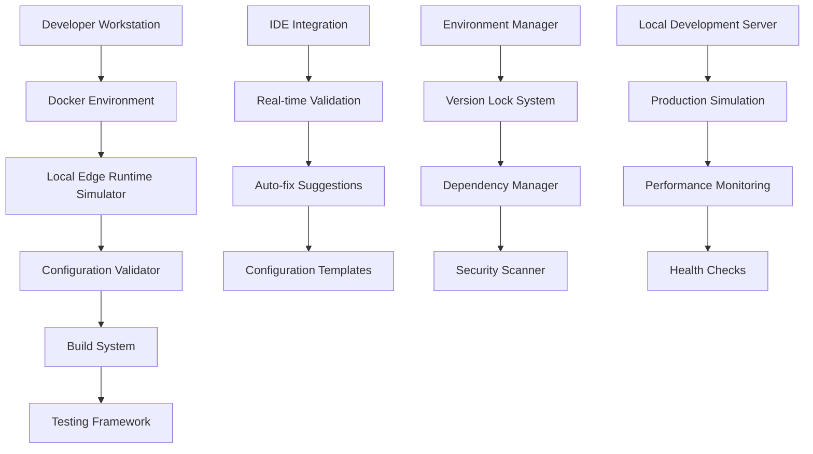

# Development Environment Standardization Design

## Overview

The Development Environment Standardization System ensures that all developers work with consistent environments that mirror Vercel's production runtime, enabling early detection of deployment issues and maintaining environment parity throughout the development lifecycle.

## Key Principles

1. **Environment Parity**: Development environments should closely mirror production
2. **Fail-Fast Development**: Issues should be caught as early as possible
3. **Zero-Configuration Setup**: Developers should be productive immediately
4. **Consistency Enforcement**: All team members use identical tooling versions
5. **Edge Runtime Simulation**: Local development should simulate Vercel Edge Runtime

## Architecture Overview



## 1. Docker-Based Development Environment

### Container Architecture

**Purpose**: Provide consistent, isolated development environment that matches production specifications.

### Dockerfile Structure

```dockerfile
# Development Environment Container
FROM node:18-alpine

# Set environment variables
ENV NODE_ENV=development
ENV ENVIRONMENT=local
ENV VERCEL_ENV=development

# Install system dependencies
RUN apk add --no-cache \
    git \
    bash \
    curl \
    jq \
    python3 \
    make \
    g++

# Create application directory
WORKDIR /app

# Install global tools
RUN npm install -g \
    @vercel/cli@latest \
    typescript@5.8.2 \
    @types/node@22.14.0 \
    husky@8.0.3

# Copy package files first for better caching
COPY package*.json ./
COPY tsconfig.json ./
COPY vite.config.ts ./

# Install dependencies
RUN npm ci --frozen-lockfile

# Copy application code
COPY . .

# Set up git hooks
RUN npm run prepare

# Create development user
RUN addgroup -g 1000 developer && \
    adduser -D -s /bin/bash -u 1000 -G developer developer && \
    chown -R developer:developer /app

USER developer

# Expose development ports
EXPOSE 3000 5173 4173 8080

# Set up health check
HEALTHCHECK --interval=30s --timeout=10s --start-period=5s --retries=3 \
    CMD curl -f http://localhost:3000/api/health || exit 1

# Default command
CMD ["npm", "run", "dev"]
```

### Docker Compose Configuration

```yaml
version: '3.8'

services:
  app:
    build:
      context: .
      dockerfile: Dockerfile.dev
    ports:
      - "3000:3000"
      - "5173:5173"
      - "4173:4173"
    volumes:
      - .:/app
      - /app/node_modules
      - /app/.cache
    environment:
      - NODE_ENV=development
      - CHOKIDAR_USEPOLLING=true
    stdin_open: true
    tty: true

  edge-simulator:
    build:
      context: .
      dockerfile: Dockerfile.edge-simulator
    ports:
      - "8080:8080"
    volumes:
      - ./api:/app/api:ro
    environment:
      - EDGE_RUNTIME_MODE=development
    depends_on:
      - app

  validator:
    build:
      context: .
      dockerfile: Dockerfile.validator
    volumes:
      - .:/workspace
    command: ["npm", "run", "validate:watch"]
    depends_on:
      - app

volumes:
  node_modules:
  cache:
```

## 2. Local Edge Runtime Simulator

### Edge Runtime Environment Simulation

**Purpose**: Provide accurate local testing of Vercel Edge Runtime constraints and APIs.

### Simulator Architecture

```typescript
// Local Edge Runtime Simulator
interface EdgeRuntimeSimulator {
  // Runtime environment setup
  setupEnvironment(): void;
  
  // API function testing
  testAPIFunction(functionPath: string): Promise<TestResult>;
  
  // Compatibility validation
  validateCompatibility(code: string): CompatibilityReport;
  
  // Performance simulation
  simulatePerformance(request: Request): Promise<PerformanceMetrics>;
}

class LocalEdgeRuntimeSimulator implements EdgeRuntimeSimulator {
  private restrictedAPIs = [
    'process.uptime',
    'process.memoryUsage',
    'process.cpuUsage',
    'fs.readFile',
    'fs.writeFile',
    'child_process.exec'
  ];

  private allowedAPIs = [
    'fetch',
    'Response',
    'Request',
    'Headers',
    'URL',
    'URLSearchParams',
    'TextEncoder',
    'TextDecoder',
    'crypto'
  ];

  setupEnvironment(): void {
    // Mock restricted Node.js APIs
    this.mockRestrictedAPIs();
    
    // Set up Web APIs
    this.setupWebAPIs();
    
    // Configure runtime constraints
    this.setupRuntimeConstraints();
  }

  private mockRestrictedAPIs(): void {
    // Override process object to simulate Edge Runtime restrictions
    const originalProcess = global.process;
    
    global.process = new Proxy(originalProcess, {
      get(target, prop) {
        if (prop === 'uptime') {
          throw new Error('process.uptime is not available in Edge Runtime');
        }
        if (prop === 'memoryUsage') {
          throw new Error('process.memoryUsage is not available in Edge Runtime');
        }
        return Reflect.get(target, prop);
      }
    });
  }

  async testAPIFunction(functionPath: string): Promise<TestResult> {
    try {
      const module = await import(functionPath);
      const handler = module.default;
      
      // Test with mock request
      const testRequest = new Request('http://localhost:3000/test');
      const response = await handler(testRequest);
      
      return {
        success: true,
        response,
        errors: [],
        warnings: this.analyzeCompatibility(functionPath)
      };
    } catch (error) {
      return {
        success: false,
        error: error.message,
        compatibility: this.validateCompatibility(functionPath)
      };
    }
  }
}
```

### Edge Runtime Compatibility Checker

```typescript
interface CompatibilityReport {
  compatible: boolean;
  issues: CompatibilityIssue[];
  recommendations: string[];
  severity: 'CRITICAL' | 'HIGH' | 'MEDIUM' | 'LOW';
}

interface CompatibilityIssue {
  type: 'API_USAGE' | 'IMPORT' | 'DEPENDENCY' | 'CONFIGURATION';
  message: string;
  location: string;
  fix?: string;
}

class EdgeCompatibilityChecker {
  private patterns = {
    restrictedAPIs: [
      /process\.uptime\(\)/g,
      /process\.memoryUsage\(\)/g,
      /process\.cpuUsage\(\)/g,
      /require\(['"]fs['"]\)/g,
      /import.*['"]fs['"]/g,
      /Buffer\.from\(/g // Edge Runtime has limited Buffer support
    ],
    
    unsafePatterns: [
      /process\.env\.(?!\?)/g, // Direct process.env access without optional chaining
      /global\.(?!fetch|Response|Request)/g, // Direct global access to non-web APIs
      /setTimeout.*[5-9]\d{4,}/g // Very long timeouts (>50s)
    ],
    
    importIssues: [
      /from ['"]\..*\.ts['"]/g, // TypeScript extensions in imports
      /import.*['"]node:/g // Node.js built-in imports
    ]
  };

  validateCompatibility(filePath: string): CompatibilityReport {
    const content = fs.readFileSync(filePath, 'utf8');
    const issues: CompatibilityIssue[] = [];

    // Check for restricted APIs
    for (const pattern of this.patterns.restrictedAPIs) {
      const matches = content.match(pattern);
      if (matches) {
        issues.push({
          type: 'API_USAGE',
          message: `Restricted API usage: ${matches[0]}`,
          location: this.getLineNumber(content, pattern),
          fix: this.getSuggestedFix(matches[0])
        });
      }
    }

    // Check for unsafe patterns
    for (const pattern of this.patterns.unsafePatterns) {
      const matches = content.match(pattern);
      if (matches) {
        issues.push({
          type: 'API_USAGE',
          message: `Unsafe API usage: ${matches[0]}`,
          location: this.getLineNumber(content, pattern),
          fix: 'Use optional chaining or check for availability'
        });
      }
    }

    // Check for import issues
    for (const pattern of this.patterns.importIssues) {
      const matches = content.match(pattern);
      if (matches) {
        issues.push({
          type: 'IMPORT',
          message: `Import issue: ${matches[0]}`,
          location: this.getLineNumber(content, pattern),
          fix: 'Remove file extensions from imports'
        });
      }
    }

    const severity = this.calculateSeverity(issues);
    
    return {
      compatible: issues.length === 0,
      issues,
      recommendations: this.generateRecommendations(issues),
      severity
    };
  }

  private getSuggestedFix(apiUsage: string): string {
    const fixes: Record<string, string> = {
      'process.uptime()': 'Use Date.now() - startTime for uptime calculation',
      'process.memoryUsage()': 'Edge Runtime manages memory automatically',
      'process.cpuUsage()': 'CPU usage not available in Edge Runtime',
      'require(\'fs\')': 'Use fetch() or external storage instead of file system',
      'Buffer.from(': 'Use TextEncoder/TextDecoder for string/binary conversion'
    };
    
    return fixes[apiUsage] || 'Replace with Edge Runtime compatible alternative';
  }
}
```

## 3. Version Lock & Dependency Management

### Dependency Consistency System

**Purpose**: Ensure all developers use identical dependency versions that match production.

### Version Lock Configuration

```json
{
  "name": "@mtc-tracker/dev-environment",
  "version": "1.0.0",
  "engines": {
    "node": "18.17.0",
    "npm": "9.6.7"
  },
  "devDependencies": {
    "typescript": "5.8.2",
    "@types/node": "22.14.0",
    "vite": "6.2.0",
    "vitest": "2.1.8",
    "@vercel/cli": "37.0.0"
  },
  "peerDependencies": {
    "react": ">=18.0.0 <20.0.0",
    "react-dom": ">=18.0.0 <20.0.0"
  },
  "volta": {
    "node": "18.17.0",
    "npm": "9.6.7"
  }
}
```

### Dependency Security Scanner

```typescript
interface SecurityScanResult {
  vulnerabilities: Vulnerability[];
  outdatedPackages: OutdatedPackage[];
  licenseIssues: LicenseIssue[];
  recommendations: SecurityRecommendation[];
}

class DependencySecurityScanner {
  async scanDependencies(): Promise<SecurityScanResult> {
    const packageJson = JSON.parse(fs.readFileSync('package.json', 'utf8'));
    const lockfile = JSON.parse(fs.readFileSync('package-lock.json', 'utf8'));

    return {
      vulnerabilities: await this.checkVulnerabilities(lockfile),
      outdatedPackages: await this.checkOutdatedPackages(packageJson),
      licenseIssues: await this.checkLicenses(lockfile),
      recommendations: await this.generateRecommendations(packageJson)
    };
  }

  private async checkVulnerabilities(lockfile: any): Promise<Vulnerability[]> {
    // Use npm audit API or Snyk API for vulnerability checking
    const auditResult = await this.runNpmAudit();
    return auditResult.vulnerabilities.map(vuln => ({
      package: vuln.module_name,
      severity: vuln.severity,
      description: vuln.title,
      fix: vuln.recommendation
    }));
  }

  private async checkEdgeRuntimeCompatibility(packageName: string): Promise<boolean> {
    // Check package compatibility with Edge Runtime
    const packageInfo = await this.getPackageInfo(packageName);
    return this.isEdgeRuntimeCompatible(packageInfo);
  }
}
```

## 4. IDE Integration & Real-time Validation

### VSCode Extension Configuration

```json
{
  "name": "mtc-vercel-validator",
  "displayName": "MTC Vercel Deployment Validator",
  "description": "Real-time validation for Vercel deployment compatibility",
  "version": "1.0.0",
  "engines": {
    "vscode": "^1.74.0"
  },
  "categories": ["Other"],
  "activationEvents": [
    "onLanguage:typescript",
    "onLanguage:javascript",
    "workspaceContains:vercel.json"
  ],
  "contributes": {
    "commands": [
      {
        "command": "mtc-validator.validateConfiguration",
        "title": "Validate Vercel Configuration"
      },
      {
        "command": "mtc-validator.checkEdgeCompatibility",
        "title": "Check Edge Runtime Compatibility"
      },
      {
        "command": "mtc-validator.applyAutoFixes",
        "title": "Apply Auto-fixes"
      }
    ],
    "configuration": {
      "title": "MTC Vercel Validator",
      "properties": {
        "mtc-validator.enableRealTimeValidation": {
          "type": "boolean",
          "default": true,
          "description": "Enable real-time validation"
        },
        "mtc-validator.edgeRuntimeStrict": {
          "type": "boolean",
          "default": true,
          "description": "Strict Edge Runtime compatibility checking"
        }
      }
    }
  }
}
```

### Real-time Validation System

```typescript
class IDEValidator {
  private diagnosticCollection: vscode.DiagnosticCollection;
  private edgeSimulator: EdgeRuntimeSimulator;

  constructor() {
    this.diagnosticCollection = vscode.languages.createDiagnosticCollection('mtc-validator');
    this.edgeSimulator = new LocalEdgeRuntimeSimulator();
  }

  async validateDocument(document: vscode.TextDocument): Promise<void> {
    if (!this.isRelevantFile(document.fileName)) return;

    const diagnostics: vscode.Diagnostic[] = [];
    const content = document.getText();

    // Configuration validation
    if (this.isConfigFile(document.fileName)) {
      const configIssues = await this.validateConfiguration(document.fileName);
      diagnostics.push(...this.convertToDiagnostics(configIssues));
    }

    // Edge Runtime compatibility check
    if (this.isAPIFunction(document.fileName)) {
      const compatibilityIssues = await this.checkEdgeCompatibility(content);
      diagnostics.push(...this.convertToDiagnostics(compatibilityIssues));
    }

    // TypeScript import validation
    if (document.languageId === 'typescript') {
      const importIssues = this.validateImports(content);
      diagnostics.push(...this.convertToDiagnostics(importIssues));
    }

    this.diagnosticCollection.set(document.uri, diagnostics);
  }

  private async checkEdgeCompatibility(content: string): Promise<ValidationIssue[]> {
    const checker = new EdgeCompatibilityChecker();
    const report = await checker.validateCompatibility(content);
    
    return report.issues.map(issue => ({
      message: issue.message,
      severity: this.mapSeverity(issue.severity),
      fix: issue.fix,
      location: issue.location
    }));
  }

  async provideCodeActions(
    document: vscode.TextDocument,
    range: vscode.Range,
    context: vscode.CodeActionContext
  ): Promise<vscode.CodeAction[]> {
    const actions: vscode.CodeAction[] = [];

    for (const diagnostic of context.diagnostics) {
      if (diagnostic.source === 'mtc-validator') {
        const fix = await this.generateAutoFix(document, diagnostic);
        if (fix) {
          actions.push(fix);
        }
      }
    }

    return actions;
  }

  private async generateAutoFix(
    document: vscode.TextDocument,
    diagnostic: vscode.Diagnostic
  ): Promise<vscode.CodeAction | null> {
    const action = new vscode.CodeAction(
      `Fix: ${diagnostic.message}`,
      vscode.CodeActionKind.QuickFix
    );

    // Generate automatic fixes based on diagnostic type
    const edit = new vscode.WorkspaceEdit();
    const fixText = this.getFixText(diagnostic.message);
    
    if (fixText) {
      edit.replace(document.uri, diagnostic.range, fixText);
      action.edit = edit;
    }

    return action;
  }
}
```

## 5. Local Development Server with Production Simulation

### Development Server Configuration

```typescript
interface DevelopmentServerConfig {
  port: number;
  edgeRuntimeSimulation: boolean;
  productionModeSimulation: boolean;
  performanceMonitoring: boolean;
  configValidation: boolean;
}

class DevelopmentServer {
  private config: DevelopmentServerConfig;
  private edgeSimulator: EdgeRuntimeSimulator;
  private validator: ConfigurationValidator;

  constructor(config: DevelopmentServerConfig) {
    this.config = config;
    this.edgeSimulator = new LocalEdgeRuntimeSimulator();
    this.validator = new ConfigurationValidator();
  }

  async start(): Promise<void> {
    // Pre-startup validation
    await this.validateEnvironment();
    
    // Set up middleware
    const app = express();
    app.use(this.configValidationMiddleware());
    app.use(this.edgeRuntimeMiddleware());
    app.use(this.performanceMonitoringMiddleware());
    
    // Start server
    app.listen(this.config.port, () => {
      console.log(`Development server running on port ${this.config.port}`);
      this.startHealthMonitoring();
    });
  }

  private configValidationMiddleware(): express.RequestHandler {
    return async (req, res, next) => {
      if (req.path.startsWith('/api/')) {
        const functionPath = this.mapToFunctionFile(req.path);
        const isValid = await this.validator.validateAPIFunction(functionPath);
        
        if (!isValid) {
          return res.status(500).json({
            error: 'Configuration validation failed',
            details: 'Check console for validation errors'
          });
        }
      }
      next();
    };
  }

  private edgeRuntimeMiddleware(): express.RequestHandler {
    return async (req, res, next) => {
      if (this.config.edgeRuntimeSimulation && req.path.startsWith('/api/')) {
        try {
          const result = await this.edgeSimulator.testAPIFunction(
            this.mapToFunctionFile(req.path)
          );
          
          if (!result.success) {
            return res.status(500).json({
              error: 'Edge Runtime compatibility error',
              details: result.error
            });
          }
        } catch (error) {
          return res.status(500).json({
            error: 'Edge Runtime simulation failed',
            details: error.message
          });
        }
      }
      next();
    };
  }
}
```

## 6. Automated Setup & Onboarding

### One-Command Setup Script

```bash
#!/bin/bash
# setup-dev-environment.sh

set -e

echo "🚀 Setting up MTC Bus Tracker development environment..."

# Check prerequisites
check_prerequisites() {
    echo "Checking prerequisites..."
    
    if ! command -v docker &> /dev/null; then
        echo "❌ Docker is required but not installed."
        exit 1
    fi
    
    if ! command -v node &> /dev/null; then
        echo "❌ Node.js is required but not installed."
        exit 1
    fi
    
    NODE_VERSION=$(node --version | cut -c 2-)
    REQUIRED_VERSION="18.17.0"
    
    if ! npx semver -r ">=$REQUIRED_VERSION" "$NODE_VERSION" &> /dev/null; then
        echo "❌ Node.js version $REQUIRED_VERSION or higher is required. Found: $NODE_VERSION"
        exit 1
    fi
    
    echo "✅ Prerequisites check passed"
}

# Install development dependencies
install_dependencies() {
    echo "Installing dependencies..."
    
    # Install global tools
    npm install -g @vercel/cli@latest husky@8.0.3
    
    # Install project dependencies
    npm ci --frozen-lockfile
    
    # Set up git hooks
    npm run prepare
    
    echo "✅ Dependencies installed"
}

# Set up Docker environment
setup_docker() {
    echo "Setting up Docker development environment..."
    
    # Build development containers
    docker-compose build
    
    # Start services in background
    docker-compose up -d
    
    # Wait for services to be ready
    echo "Waiting for services to start..."
    sleep 30
    
    # Health check
    if docker-compose exec app curl -f http://localhost:3000/api/health &> /dev/null; then
        echo "✅ Development environment is ready"
    else
        echo "⚠️  Development environment started but health check failed"
    fi
}

# Configure IDE
setup_ide() {
    echo "Setting up IDE configuration..."
    
    # Create VSCode settings
    mkdir -p .vscode
    cat > .vscode/settings.json << 'EOF'
{
    "typescript.preferences.includePackageJsonAutoImports": "off",
    "typescript.preferences.includePackageJsonAutoImports": false,
    "typescript.suggest.includePackageJsonAutoImports": false,
    "editor.codeActionsOnSave": {
        "source.fixAll": true
    },
    "editor.formatOnSave": true,
    "files.associations": {
        "*.json": "jsonc"
    },
    "mtc-validator.enableRealTimeValidation": true,
    "mtc-validator.edgeRuntimeStrict": true
}
EOF

    # Create recommended extensions
    cat > .vscode/extensions.json << 'EOF'
{
    "recommendations": [
        "ms-vscode.vscode-typescript-next",
        "bradlc.vscode-tailwindcss",
        "ms-vscode.vscode-json",
        "mtc-tracker.vercel-validator"
    ]
}
EOF
    
    echo "✅ IDE configuration created"
}

# Run initial validation
run_validation() {
    echo "Running initial validation..."
    
    # Configuration validation
    npm run validate:config
    
    # Edge Runtime compatibility check
    npm run validate:edge-runtime
    
    # Build test
    npm run build
    
    echo "✅ Initial validation completed"
}

# Display setup summary
show_summary() {
    echo ""
    echo "🎉 Development environment setup complete!"
    echo ""
    echo "Available commands:"
    echo "  npm run dev                 - Start development server"
    echo "  npm run validate           - Run all validations"
    echo "  npm run edge:simulate      - Test Edge Runtime compatibility"
    echo "  npm run docker:up          - Start Docker environment"
    echo "  npm run docker:down        - Stop Docker environment"
    echo ""
    echo "IDE Integration:"
    echo "  - Install recommended VSCode extensions"
    echo "  - Real-time validation enabled"
    echo "  - Auto-fix suggestions available"
    echo ""
    echo "Getting started:"
    echo "  1. npm run dev (or docker-compose up for containerized)"
    echo "  2. Open http://localhost:3000"
    echo "  3. Start coding! 🚀"
}

# Main execution
main() {
    check_prerequisites
    install_dependencies
    setup_docker
    setup_ide
    run_validation
    show_summary
}

main "$@"
```

## 7. Performance Monitoring & Optimization

### Development Performance Monitoring

```typescript
interface PerformanceMetrics {
  buildTime: number;
  hotReloadTime: number;
  validationTime: number;
  memoryUsage: number;
  cpuUsage: number;
}

class DevelopmentPerformanceMonitor {
  private metrics: PerformanceMetrics[] = [];
  private alertThresholds = {
    buildTime: 30000, // 30 seconds
    hotReloadTime: 5000, // 5 seconds
    validationTime: 1000, // 1 second
    memoryUsage: 1000000000, // 1GB
    cpuUsage: 80 // 80%
  };

  startMonitoring(): void {
    setInterval(() => {
      this.collectMetrics();
    }, 30000); // Every 30 seconds
  }

  private collectMetrics(): void {
    const currentMetrics: PerformanceMetrics = {
      buildTime: this.measureBuildTime(),
      hotReloadTime: this.measureHotReloadTime(),
      validationTime: this.measureValidationTime(),
      memoryUsage: process.memoryUsage().heapUsed,
      cpuUsage: this.getCPUUsage()
    };

    this.metrics.push(currentMetrics);
    this.checkThresholds(currentMetrics);
  }

  private checkThresholds(metrics: PerformanceMetrics): void {
    Object.entries(this.alertThresholds).forEach(([key, threshold]) => {
      if (metrics[key as keyof PerformanceMetrics] > threshold) {
        this.triggerPerformanceAlert(key, metrics[key as keyof PerformanceMetrics], threshold);
      }
    });
  }

  private triggerPerformanceAlert(metric: string, value: number, threshold: number): void {
    console.warn(`⚠️  Performance Alert: ${metric} (${value}) exceeded threshold (${threshold})`);
    
    // Suggest optimizations
    const suggestions = this.getOptimizationSuggestions(metric);
    console.log(`💡 Suggestions: ${suggestions.join(', ')}`);
  }

  private getOptimizationSuggestions(metric: string): string[] {
    const suggestions: Record<string, string[]> = {
      buildTime: [
        'Enable build caching',
        'Reduce bundle size',
        'Optimize dependencies'
      ],
      hotReloadTime: [
        'Use polling for file watching',
        'Exclude large directories from watching',
        'Optimize webpack configuration'
      ],
      validationTime: [
        'Cache validation results',
        'Reduce validation scope',
        'Parallel validation execution'
      ]
    };

    return suggestions[metric] || ['Review system resources'];
  }
}
```

## 8. Testing & Validation Framework

### Comprehensive Testing Suite

```typescript
// Development Environment Test Suite
describe('Development Environment', () => {
  let devServer: DevelopmentServer;
  let edgeSimulator: EdgeRuntimeSimulator;

  beforeAll(async () => {
    devServer = new DevelopmentServer(testConfig);
    edgeSimulator = new LocalEdgeRuntimeSimulator();
    await devServer.start();
  });

  describe('Environment Parity', () => {
    test('should match production Node.js version', () => {
      const nodeVersion = process.version;
      expect(nodeVersion).toMatch(/^v18\./);
    });

    test('should have identical dependency versions', async () => {
      const lockfile = JSON.parse(fs.readFileSync('package-lock.json', 'utf8'));
      const productionDeps = await getProductionDependencies();
      
      // Compare critical dependencies
      expect(lockfile.dependencies.react.version).toBe(productionDeps.react);
      expect(lockfile.dependencies.typescript.version).toBe(productionDeps.typescript);
    });
  });

  describe('Edge Runtime Simulation', () => {
    test('should reject Node.js APIs', async () => {
      const testCode = `
        export default async function handler() {
          return new Response(JSON.stringify({ uptime: process.uptime() }));
        }
      `;

      await expect(edgeSimulator.validateCode(testCode)).rejects.toThrow('process.uptime is not available');
    });

    test('should support Web APIs', async () => {
      const testCode = `
        export default async function handler(request) {
          const response = await fetch('https://api.example.com');
          return new Response(JSON.stringify({ status: 'ok' }));
        }
      `;

      const result = await edgeSimulator.validateCode(testCode);
      expect(result.success).toBe(true);
    });
  });

  describe('Configuration Validation', () => {
    test('should detect critical vercelignore issues', async () => {
      const badConfig = 'dist\npublic\n';
      fs.writeFileSync('.vercelignore', badConfig);

      const validator = new ConfigurationValidator();
      const result = await validator.validate();

      expect(result.errors).toContain('Critical directories excluded from deployment');
    });

    test('should detect TypeScript import issues', async () => {
      const badImport = "import { utils } from './utils.ts';";
      const result = await validateImports(badImport);

      expect(result.issues).toContain('TypeScript extensions in imports');
    });
  });

  describe('Performance Benchmarks', () => {
    test('build time should be under 30 seconds', async () => {
      const startTime = Date.now();
      await execPromise('npm run build');
      const buildTime = Date.now() - startTime;

      expect(buildTime).toBeLessThan(30000);
    });

    test('validation should complete under 5 seconds', async () => {
      const startTime = Date.now();
      await execPromise('npm run validate');
      const validationTime = Date.now() - startTime;

      expect(validationTime).toBeLessThan(5000);
    });
  });
});
```

## 9. Documentation & Training Materials

### Developer Onboarding Checklist

```markdown
# Developer Onboarding Checklist

## Environment Setup
- [ ] Install Node.js 18.17.0+
- [ ] Install Docker and Docker Compose
- [ ] Clone repository
- [ ] Run `./setup-dev-environment.sh`
- [ ] Verify setup with `npm run validate`

## IDE Configuration
- [ ] Install recommended VSCode extensions
- [ ] Configure settings for real-time validation
- [ ] Test auto-fix functionality
- [ ] Set up debugging configuration

## Development Workflow
- [ ] Understand pre-commit hooks
- [ ] Learn about Edge Runtime constraints
- [ ] Practice with configuration validation
- [ ] Test local deployment simulation

## Testing & Quality
- [ ] Run test suite locally
- [ ] Understand Edge Runtime testing
- [ ] Learn performance monitoring
- [ ] Practice with rollback procedures

## Documentation
- [ ] Read architecture documentation
- [ ] Understand deployment pipeline
- [ ] Review troubleshooting guide
- [ ] Complete security training
```

### Best Practices Guide

```markdown
# Development Best Practices

## Edge Runtime Development
1. **Avoid Node.js APIs**: Use Web APIs instead
2. **Safe Environment Access**: Use optional chaining for process.env
3. **No File System**: Use external storage or fetch APIs
4. **Memory Management**: Avoid large in-memory storage
5. **Performance**: Optimize for cold starts

## Configuration Management
1. **Use Templates**: Start with provided configuration templates
2. **Validate Early**: Run validation before committing
3. **Document Changes**: Explain configuration modifications
4. **Test Locally**: Verify changes in development environment

## Quality Assurance
1. **Pre-commit Validation**: Always run checks before committing
2. **Test Edge Compatibility**: Use local Edge Runtime simulator
3. **Performance Testing**: Monitor build and runtime performance
4. **Security Scanning**: Regular dependency audits
```

This development environment standardization system ensures that all developers work with consistent, production-like environments that catch deployment issues early and maintain high code quality throughout the development lifecycle.