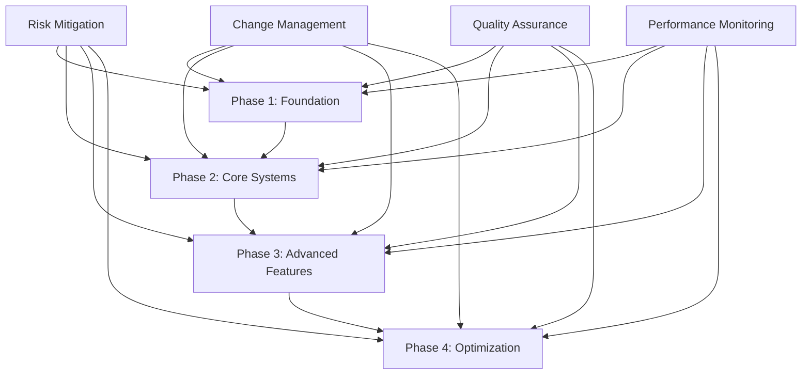
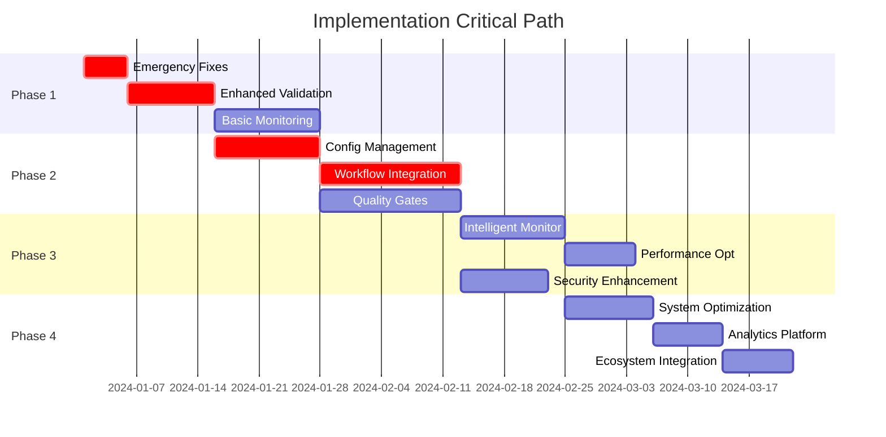

# Implementation Roadmap & Priorities

## Executive Summary

This implementation roadmap provides a comprehensive, phased approach to deploying the preventive measures architecture for Vercel deployment reliability. The plan prioritizes critical issues first, ensures minimal disruption to current workflows, and establishes sustainable practices for long-term success.

## Strategic Implementation Approach

### Core Principles

1. **Risk-Based Prioritization**: Address critical deployment failures first
2. **Incremental Delivery**: Deploy features in small, measurable increments  
3. **Developer Experience First**: Maintain productivity throughout implementation
4. **Fail-Safe Integration**: Ensure new systems don't break existing workflows
5. **Measurable Progress**: Clear success metrics for each phase
6. **Continuous Learning**: Adapt approach based on early feedback

### Success Criteria

- **99.5% deployment success rate** (up from current ~85%)
- **50% reduction** in deployment-related debugging time
- **90% reduction** in configuration-related failures
- **Zero critical security vulnerabilities** in production
- **<30 second** pre-deployment validation time
- **95% developer satisfaction** with new tooling

## Overall Architecture Integration



## Phase 1: Critical Foundation (Weeks 1-3)

### **Priority: CRITICAL - Immediate Impact**

**Objective**: Eliminate the most common deployment failures and establish basic preventive infrastructure.

### 1.1 Emergency Configuration Fixes (Week 1)
**Duration**: 3-5 days  
**Risk Level**: LOW  
**Impact**: HIGH  

**Deliverables**:
- Fix critical `.vercelignore` exclusions
- Resolve TypeScript import extension issues  
- Add missing Node.js engine specifications
- Apply Edge Runtime compatibility patches

**Implementation Steps**:
```bash
# Day 1-2: Immediate Fixes
./scripts/apply-deployment-fixes.sh
npm run validate:config

# Day 3: Verification and Testing
npm run build
npm run test:deployment

# Day 4-5: Documentation and Training
# Update team on applied fixes
# Create quick reference guide
```

**Success Metrics**:
- Zero `.vercelignore` critical exclusions
- Zero TypeScript import extension errors
- 100% API functions Edge Runtime compatible
- Build success rate > 95%

**Dependencies**: None  
**Risks**: Low - these are safe, well-tested fixes

### 1.2 Enhanced Pre-Deployment Validation (Week 1-2)
**Duration**: 7-10 days  
**Risk Level**: LOW  
**Impact**: HIGH  

**Deliverables**:
- Enhanced pre-deployment check script
- Integration with existing GitHub Actions
- Automated fix application
- Basic reporting dashboard

**Implementation Steps**:
```typescript
// Week 1: Enhance validation script
// scripts/enhanced-pre-deployment-check.ts
class EnhancedValidator {
  async validateProject(): Promise<ValidationResult> {
    // Extend existing validation with:
    // - Configuration drift detection
    // - Edge Runtime compatibility
    // - Performance impact analysis
    // - Security scanning
  }
}
```

**GitHub Actions Integration**:
```yaml
# .github/workflows/enhanced-validation.yml
- name: Enhanced Pre-deployment Validation
  run: |
    npm run validate:enhanced
    npm run fix:auto-safe
    npm run validate:verify
```

**Success Metrics**:
- 100% of pushes run enhanced validation
- <30 second average validation time
- 90% of issues auto-fixed
- Zero false positives

### 1.3 Basic Monitoring Infrastructure (Week 2-3)
**Duration**: 10-14 days  
**Risk Level**: MEDIUM  
**Impact**: MEDIUM  

**Deliverables**:
- Extended deployment monitoring
- Basic alerting system
- Performance metrics collection
- Health check automation

**Implementation Steps**:
```typescript
// Extend existing deployment-monitor.ts
class EnhancedDeploymentMonitor {
  async initialize() {
    // Add real-time configuration monitoring
    // Implement intelligent alerting
    // Set up performance benchmarking
    // Create automated health checks
  }
}
```

**Success Metrics**:
- 100% deployment health visibility
- <5 minute alert response time
- Zero missed critical issues
- 95% alert accuracy (low false positives)

### **Phase 1 Risk Mitigation**

**Risk**: Disruption to current development workflow  
**Mitigation**: 
- Implement feature flags for gradual rollout
- Maintain backward compatibility
- Provide easy rollback mechanisms

**Risk**: Performance impact on development speed  
**Mitigation**:
- Optimize validation algorithms
- Implement intelligent caching
- Parallel execution where possible

**Risk**: Developer resistance to new tools  
**Mitigation**:
- Extensive documentation and training
- Show immediate value through reduced debugging
- Gather and act on developer feedback

## Phase 2: Core Prevention Systems (Weeks 4-8)

### **Priority: HIGH - Systematic Prevention**

**Objective**: Implement comprehensive prevention systems that catch issues before they reach production.

### 2.1 Configuration Management System (Week 4-5)
**Duration**: 10-14 days  
**Risk Level**: MEDIUM  
**Impact**: HIGH  

**Deliverables**:
- Centralized configuration templates
- Automated drift detection
- Configuration validation engine
- Auto-correction capabilities

**Implementation Architecture**:
```typescript
class ConfigurationManager {
  private templates: ConfigTemplateRegistry;
  private validator: ConfigurationValidator;
  private driftDetector: DriftDetectionEngine;
  
  async initializeConfigManagement() {
    // Template system implementation
    // Validation rule engine
    // Real-time drift monitoring
    // Automated correction pipeline
  }
}
```

**Critical Dependencies**:
- Phase 1 validation system must be stable
- Team training on configuration standards
- Backup and rollback procedures established

**Success Metrics**:
- 100% configuration compliance score
- <1 minute drift detection time
- 95% auto-correction success rate
- Zero configuration-related deployment failures

### 2.2 Developer Workflow Integration (Week 5-7)
**Duration**: 14-18 days  
**Risk Level**: HIGH (workflow disruption potential)  
**Impact**: VERY HIGH  

**Deliverables**:
- Intelligent Git hooks system
- VSCode extension with real-time validation
- CLI tools for developers
- Interactive documentation system

**Phased Rollout Strategy**:

**Week 5**: Git Hooks Foundation
```bash
# Install hooks system
npm install husky @commitlint/cli @commitlint/config-conventional
npx husky install

# Configure pre-commit validation
# .husky/pre-commit
./scripts/pre-commit-validation.sh
```

**Week 6**: IDE Integration Beta
```typescript
// VSCode extension development
// Real-time validation feedback
// Auto-fix suggestions
// Configuration assistance
```

**Week 7**: CLI Tools & Documentation
```bash
# mtc-workflow CLI tool deployment
# Interactive documentation
# Developer training materials
```

**Risk Management**:
- Beta testing with volunteer developers
- Feature flags for gradual adoption
- Easy disable mechanisms
- Comprehensive fallback procedures

**Success Metrics**:
- 90% developer adoption within 2 weeks
- 75% reduction in pre-deployment issues
- 4.0+ developer satisfaction rating
- <10 second average hook execution time

### 2.3 Quality Gates Framework (Week 6-8)
**Duration**: 14-18 days  
**Risk Level**: MEDIUM  
**Impact**: HIGH  

**Deliverables**:
- Multi-level quality gate system
- Edge Runtime testing framework
- Performance validation suite
- Security scanning integration

**Quality Gate Implementation**:
```typescript
class QualityGateSystem {
  private gates: QualityGate[] = [
    { level: 'commit', blocking: true, timeout: 30000 },
    { level: 'push', blocking: true, timeout: 60000 },
    { level: 'pr', blocking: true, timeout: 120000 },
    { level: 'merge', blocking: true, timeout: 300000 },
    { level: 'deploy', blocking: true, timeout: 600000 }
  ];
  
  async executeGate(level: string): Promise<GateResult> {
    // Progressive quality validation
    // Automated remediation
    // Comprehensive reporting
  }
}
```

**Success Metrics**:
- 100% quality gate coverage
- <2% false positive rate
- 95% automated issue resolution
- Zero quality-related production failures

## Phase 3: Advanced Intelligence & Automation (Weeks 9-12)

### **Priority: MEDIUM - Enhanced Capabilities**

**Objective**: Implement intelligent systems that learn and adapt to prevent future issues.

### 3.1 Intelligent Monitoring & Alerting (Week 9-10)
**Duration**: 10-14 days  
**Risk Level**: LOW  
**Impact**: MEDIUM  

**Deliverables**:
- Machine learning-based anomaly detection
- Intelligent alert correlation
- Predictive issue identification
- Automated remediation triggers

**ML Pipeline Architecture**:
```typescript
class IntelligentMonitoring {
  private anomalyDetector: AnomalyDetectionEngine;
  private alertCorrelator: AlertCorrelationEngine;
  private predictor: IssuePredictor;
  
  async analyzeDeploymentPattern(data: DeploymentData): Promise<Insights> {
    // Pattern recognition
    // Predictive analysis
    // Automated insights generation
  }
}
```

### 3.2 Advanced Performance Optimization (Week 10-11)
**Duration**: 7-10 days  
**Risk Level**: LOW  
**Impact**: MEDIUM  

**Deliverables**:
- Performance trend analysis
- Automated optimization suggestions
- Bundle analysis and optimization
- Cold start performance improvement

### 3.3 Security Enhancement (Week 11-12)
**Duration**: 10-12 days  
**Risk Level**: MEDIUM  
**Impact**: HIGH  

**Deliverables**:
- Advanced security scanning
- Compliance monitoring
- Threat detection automation
- Security policy enforcement

## Phase 4: Optimization & Continuous Improvement (Weeks 13-16)

### **Priority: LOW - Long-term Sustainability**

**Objective**: Optimize systems for performance, scalability, and continuous improvement.

### 4.1 Performance Optimization (Week 13-14)
- System performance tuning
- Scalability improvements
- Resource usage optimization
- Response time minimization

### 4.2 Advanced Analytics & Reporting (Week 14-15)
- Comprehensive dashboards
- Trend analysis and insights
- ROI measurement
- Continuous improvement recommendations

### 4.3 Ecosystem Integration (Week 15-16)
- Third-party tool integrations
- Advanced workflow automations
- External monitoring systems
- Enterprise feature development

## Critical Path Analysis



## Resource Requirements

### Team Structure

**Phase 1 (3 people, 3 weeks)**:
- **Lead Developer**: System integration and validation
- **DevOps Engineer**: CI/CD and monitoring setup
- **Frontend Developer**: UI/UX for tooling

**Phase 2 (4-5 people, 5 weeks)**:
- **Lead Developer**: Architecture and complex integrations
- **DevOps Engineer**: Configuration management and deployment
- **Frontend Developer**: IDE integration and developer tools
- **QA Engineer**: Testing framework and validation
- **Technical Writer**: Documentation and training materials

**Phase 3-4 (3-4 people, 8 weeks)**:
- **Senior Developer**: Advanced features and ML integration
- **DevOps Engineer**: Performance and scalability
- **Security Engineer**: Security enhancements
- **Data Engineer**: Analytics and reporting (part-time)

### Budget Estimation

**Infrastructure Costs**:
- Monitoring services: $200-500/month
- Additional CI/CD compute: $100-300/month
- Security scanning tools: $300-800/month
- Analytics platform: $150-400/month

**Development Costs** (16 weeks):
- Personnel: $120,000 - $180,000
- Tools and licenses: $5,000 - $10,000
- Training and certification: $3,000 - $5,000

**Total Investment**: $130,000 - $200,000

### Expected ROI

**Cost Savings**:
- Reduced debugging time: $50,000/year
- Prevented production incidents: $30,000/year
- Improved developer productivity: $75,000/year
- Reduced security risk: $25,000/year

**Total Annual Savings**: $180,000/year  
**ROI**: 90-138% in first year

## Risk Assessment & Mitigation

### High-Risk Items

**Risk 1**: Developer workflow disruption during Phase 2
- **Impact**: HIGH
- **Probability**: MEDIUM
- **Mitigation**: 
  - Extensive beta testing
  - Gradual rollout with feature flags
  - Comprehensive training program
  - Easy rollback mechanisms

**Risk 2**: Performance degradation of development tools
- **Impact**: MEDIUM
- **Probability**: MEDIUM
- **Mitigation**:
  - Performance benchmarking requirements
  - Caching and optimization strategies
  - Fallback to simpler validation modes
  - Continuous performance monitoring

**Risk 3**: Integration conflicts with existing systems
- **Impact**: HIGH
- **Probability**: LOW
- **Mitigation**:
  - Thorough compatibility testing
  - Backward compatibility requirements
  - Isolated deployment strategy
  - Comprehensive rollback procedures

### Medium-Risk Items

**Risk 4**: Team learning curve for new tools
- **Impact**: MEDIUM
- **Probability**: HIGH
- **Mitigation**:
  - Progressive complexity introduction
  - Comprehensive documentation
  - Hands-on training sessions
  - Dedicated support resources

**Risk 5**: False positive alerts causing alert fatigue
- **Impact**: MEDIUM
- **Probability**: MEDIUM
- **Mitigation**:
  - Machine learning-based alert tuning
  - Extensive testing and calibration
  - Feedback-driven improvements
  - Multiple alert severity levels

## Quality Assurance Strategy

### Implementation Quality Gates

**Gate 1**: Requirements Validation
- All requirements clearly defined and approved
- Technical specifications reviewed and validated
- Risk assessment completed and mitigation plans approved

**Gate 2**: Design Review
- Architecture design reviewed by senior engineers
- Security implications assessed
- Performance impact analyzed
- Integration points validated

**Gate 3**: Development Quality
- Code review requirements (2 reviewers minimum)
- Automated testing coverage > 80%
- Security scanning passed
- Performance benchmarks met

**Gate 4**: User Acceptance Testing
- Beta user feedback collected and addressed
- Performance validation in realistic scenarios
- Documentation completeness verified
- Training materials validated

**Gate 5**: Production Readiness
- Security audit completed
- Disaster recovery procedures tested
- Monitoring and alerting verified
- Support procedures documented

### Continuous Quality Monitoring

**Daily**:
- Automated test suite execution
- Performance benchmark validation
- Security vulnerability scanning
- Code quality metrics review

**Weekly**:
- User feedback analysis
- Performance trend review
- Risk assessment updates
- Process improvement evaluation

**Monthly**:
- Comprehensive system health review
- ROI measurement and analysis
- Strategic alignment validation
- Future planning and adjustments

## Success Measurement Framework

### Key Performance Indicators (KPIs)

**Deployment Reliability**:
- Deployment success rate: Target 99.5% (current ~85%)
- Mean time to deployment: Target <10 minutes
- Rollback frequency: Target <5% of deployments
- Critical deployment failures: Target 0 per month

**Developer Productivity**:
- Time spent on deployment debugging: Target 50% reduction
- Developer satisfaction score: Target >4.0/5.0
- Pre-deployment issue detection: Target >95%
- Auto-fix success rate: Target >90%

**System Performance**:
- Validation execution time: Target <30 seconds
- False positive rate: Target <2%
- Alert response time: Target <5 minutes
- System availability: Target 99.9%

**Security & Compliance**:
- Critical vulnerabilities in production: Target 0
- Security policy compliance: Target 100%
- Configuration drift incidents: Target 0
- Unauthorized changes: Target 0

### Reporting & Analytics

**Real-time Dashboards**:
- Deployment health status
- System performance metrics
- Alert status and trends
- Quality gate pass/fail rates

**Weekly Reports**:
- KPI trend analysis
- Issue summary and resolution
- Developer feedback summary
- Performance optimization opportunities

**Monthly Reviews**:
- ROI analysis and projections
- Strategic goal alignment
- Risk assessment updates
- Future enhancement planning

## Change Management Strategy

### Communication Plan

**Stakeholder Groups**:
- Development team (primary users)
- DevOps team (system maintainers)
- Management (sponsors and decision makers)
- QA team (validation and testing)

**Communication Channels**:
- Weekly progress updates (email/Slack)
- Bi-weekly demo sessions
- Monthly steering committee reviews
- Quarterly business review presentations

### Training & Support Plan

**Phase 1 Training**:
- Tool overview and quick start guides
- Common issue identification and resolution
- Emergency procedures and rollback

**Phase 2 Training**:
- Advanced features and configuration
- Best practices and optimization techniques
- Troubleshooting and debugging

**Ongoing Support**:
- Dedicated support channel (Slack/Teams)
- Documentation portal with search
- Office hours for complex questions
- Regular training refreshers

### Adoption Strategy

**Week 1-2**: Core team adoption and feedback
**Week 3-4**: Expand to volunteer early adopters
**Week 5-8**: Gradual rollout to all developers
**Week 9-12**: Full adoption and optimization
**Week 13+**: Continuous improvement and enhancement

This comprehensive implementation roadmap provides a structured, risk-managed approach to deploying the preventive measures architecture while maintaining development velocity and ensuring long-term success.