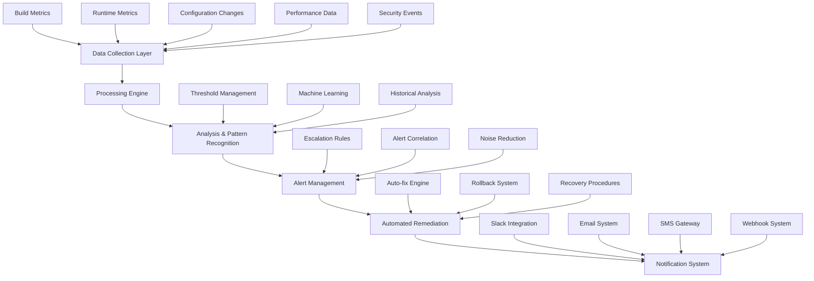

# Monitoring & Alerting Infrastructure Design

## Overview

The Monitoring & Alerting Infrastructure provides comprehensive, multi-layered observability for the Vercel deployment system, enabling proactive issue detection, automated remediation, and continuous performance optimization.

## Architecture Principles

1. **Proactive Detection**: Identify issues before they cause failures
2. **Multi-Layer Monitoring**: Coverage from development to production
3. **Intelligent Alerting**: Context-aware notifications with minimal noise
4. **Automated Remediation**: Self-healing capabilities where possible
5. **Continuous Learning**: Adaptive thresholds and pattern recognition

## System Architecture



## 1. Data Collection Layer

### Multi-Source Data Ingestion

**Purpose**: Comprehensive data collection from all system components for complete observability.

### Data Sources Architecture

```typescript
interface DataSource {
  id: string;
  name: string;
  type: DataSourceType;
  enabled: boolean;
  config: DataSourceConfig;
  healthCheck: () => Promise<boolean>;
  collect: () => Promise<DataPoint[]>;
}

enum DataSourceType {
  BUILD_METRICS = 'build_metrics',
  RUNTIME_METRICS = 'runtime_metrics', 
  CONFIGURATION_CHANGES = 'configuration_changes',
  PERFORMANCE_DATA = 'performance_data',
  SECURITY_EVENTS = 'security_events',
  USER_BEHAVIOR = 'user_behavior'
}

interface DataPoint {
  timestamp: number;
  source: string;
  metric: string;
  value: number | string | boolean;
  labels: Record<string, string>;
  metadata: Record<string, any>;
}

class DataCollectionEngine {
  private dataSources: Map<string, DataSource> = new Map();
  private collector: DataCollector;
  private storage: MetricsStorage;

  async initialize(): Promise<void> {
    await this.registerDataSources();
    await this.startCollection();
  }

  private async registerDataSources(): Promise<void> {
    // Build Metrics Collection
    this.registerDataSource({
      id: 'vercel-build-metrics',
      name: 'Vercel Build Metrics',
      type: DataSourceType.BUILD_METRICS,
      enabled: true,
      config: {
        pollInterval: 30000,
        batchSize: 100
      },
      healthCheck: async () => this.checkVercelAPIHealth(),
      collect: async () => this.collectBuildMetrics()
    });

    // Runtime Performance Collection
    this.registerDataSource({
      id: 'runtime-performance',
      name: 'Runtime Performance Metrics',
      type: DataSourceType.RUNTIME_METRICS,
      enabled: true,
      config: {
        endpoints: ['/api/health', '/api/status', '/api/metrics'],
        pollInterval: 60000
      },
      healthCheck: async () => this.checkEndpointHealth(),
      collect: async () => this.collectRuntimeMetrics()
    });

    // Configuration Change Tracking
    this.registerDataSource({
      id: 'config-changes',
      name: 'Configuration Changes',
      type: DataSourceType.CONFIGURATION_CHANGES,
      enabled: true,
      config: {
        watchFiles: [
          'vercel.json',
          '.vercelignore', 
          'package.json',
          'tsconfig.json'
        ]
      },
      healthCheck: async () => true,
      collect: async () => this.collectConfigChanges()
    });
  }

  private async collectBuildMetrics(): Promise<DataPoint[]> {
    const deployments = await this.getRecentDeployments();
    const dataPoints: DataPoint[] = [];

    for (const deployment of deployments) {
      const buildTime = deployment.createdAt - deployment.buildStart;
      const status = deployment.state;

      dataPoints.push({
        timestamp: deployment.createdAt,
        source: 'vercel-build',
        metric: 'build_duration_ms',
        value: buildTime,
        labels: {
          deployment_id: deployment.id,
          status,
          branch: deployment.meta.githubCommitRef
        },
        metadata: {
          commit: deployment.meta.githubCommitSha,
          author: deployment.meta.githubCommitAuthorName
        }
      });

      // Build success/failure tracking
      dataPoints.push({
        timestamp: deployment.createdAt,
        source: 'vercel-build',
        metric: 'build_result',
        value: status === 'READY' ? 1 : 0,
        labels: {
          deployment_id: deployment.id,
          branch: deployment.meta.githubCommitRef
        },
        metadata: {
          error: status !== 'READY' ? deployment.error : null
        }
      });
    }

    return dataPoints;
  }

  private async collectRuntimeMetrics(): Promise<DataPoint[]> {
    const dataPoints: DataPoint[] = [];
    const endpoints = this.dataSources.get('runtime-performance')?.config.endpoints || [];

    for (const endpoint of endpoints) {
      try {
        const startTime = Date.now();
        const response = await fetch(`${this.baseURL}${endpoint}`, {
          headers: { 'User-Agent': 'MTC-Monitor/2.0' }
        });
        const responseTime = Date.now() - startTime;

        dataPoints.push({
          timestamp: Date.now(),
          source: 'runtime-performance',
          metric: 'response_time_ms',
          value: responseTime,
          labels: {
            endpoint,
            status_code: response.status.toString(),
            method: 'GET'
          },
          metadata: {
            headers: Object.fromEntries(response.headers.entries())
          }
        });

        // Response status tracking
        dataPoints.push({
          timestamp: Date.now(),
          source: 'runtime-performance', 
          metric: 'endpoint_availability',
          value: response.ok ? 1 : 0,
          labels: {
            endpoint,
            status_code: response.status.toString()
          },
          metadata: {}
        });

        // Extract application-specific metrics from health endpoint
        if (endpoint === '/api/health' && response.ok) {
          const healthData = await response.json();
          
          if (healthData.metrics) {
            Object.entries(healthData.metrics).forEach(([key, value]) => {
              dataPoints.push({
                timestamp: Date.now(),
                source: 'application-health',
                metric: key,
                value: value as number,
                labels: { source: 'health_endpoint' },
                metadata: {}
              });
            });
          }
        }
      } catch (error) {
        dataPoints.push({
          timestamp: Date.now(),
          source: 'runtime-performance',
          metric: 'endpoint_error',
          value: 1,
          labels: {
            endpoint,
            error_type: error.name
          },
          metadata: {
            error_message: error.message
          }
        });
      }
    }

    return dataPoints;
  }
}
```

## 2. Analysis & Pattern Recognition Engine

### Intelligent Threshold Management

**Purpose**: Dynamic threshold adjustment based on historical data and system behavior patterns.

```typescript
interface ThresholdRule {
  metric: string;
  condition: ThresholdCondition;
  severity: AlertSeverity;
  adaptive: boolean;
  baselineWindow: number; // milliseconds
  sensitivityFactor: number;
}

interface ThresholdCondition {
  operator: 'gt' | 'lt' | 'gte' | 'lte' | 'eq' | 'ne';
  value: number;
  windowSize?: number;
  aggregation?: 'avg' | 'sum' | 'max' | 'min' | 'p95' | 'p99';
}

class IntelligentThresholdManager {
  private rules: Map<string, ThresholdRule[]> = new Map();
  private baselines: Map<string, MetricBaseline> = new Map();
  private mlEngine: MachineLearningEngine;

  constructor() {
    this.mlEngine = new MachineLearningEngine();
    this.initializeDefaultRules();
  }

  private initializeDefaultRules(): void {
    // Build-related thresholds
    this.addThresholdRule({
      metric: 'build_duration_ms',
      condition: {
        operator: 'gt',
        value: 300000, // 5 minutes
        windowSize: 300000, // 5 minute window
        aggregation: 'avg'
      },
      severity: AlertSeverity.HIGH,
      adaptive: true,
      baselineWindow: 7 * 24 * 60 * 60 * 1000, // 7 days
      sensitivityFactor: 1.5
    });

    // Response time thresholds
    this.addThresholdRule({
      metric: 'response_time_ms',
      condition: {
        operator: 'gt',
        value: 2000, // 2 seconds
        windowSize: 60000, // 1 minute window
        aggregation: 'p95'
      },
      severity: AlertSeverity.MEDIUM,
      adaptive: true,
      baselineWindow: 24 * 60 * 60 * 1000, // 24 hours
      sensitivityFactor: 2.0
    });

    // Error rate thresholds
    this.addThresholdRule({
      metric: 'endpoint_availability',
      condition: {
        operator: 'lt',
        value: 0.95, // 95% availability
        windowSize: 300000, // 5 minute window
        aggregation: 'avg'
      },
      severity: AlertSeverity.CRITICAL,
      adaptive: false,
      baselineWindow: 0,
      sensitivityFactor: 1.0
    });

    // Configuration change detection
    this.addThresholdRule({
      metric: 'config_changes',
      condition: {
        operator: 'gt',
        value: 0,
        windowSize: 60000 // 1 minute
      },
      severity: AlertSeverity.MEDIUM,
      adaptive: false,
      baselineWindow: 0,
      sensitivityFactor: 1.0
    });
  }

  async evaluateThresholds(dataPoints: DataPoint[]): Promise<Alert[]> {
    const alerts: Alert[] = [];
    const groupedData = this.groupDataByMetric(dataPoints);

    for (const [metric, points] of groupedData.entries()) {
      const rules = this.rules.get(metric) || [];
      
      for (const rule of rules) {
        const threshold = await this.calculateDynamicThreshold(rule, points);
        const violation = this.checkThresholdViolation(points, rule, threshold);
        
        if (violation) {
          alerts.push({
            id: `${metric}_${rule.condition.operator}_${Date.now()}`,
            metric,
            severity: rule.severity,
            message: this.generateAlertMessage(metric, rule, threshold, violation),
            timestamp: Date.now(),
            labels: violation.labels,
            metadata: {
              rule: rule,
              threshold: threshold,
              violationData: violation
            }
          });
        }
      }
    }

    return alerts;
  }

  private async calculateDynamicThreshold(
    rule: ThresholdRule,
    recentData: DataPoint[]
  ): Promise<number> {
    if (!rule.adaptive) {
      return rule.condition.value;
    }

    const baseline = await this.getMetricBaseline(rule.metric, rule.baselineWindow);
    if (!baseline) {
      return rule.condition.value;
    }

    // Calculate adaptive threshold based on historical patterns
    const historicalMean = baseline.mean;
    const historicalStdDev = baseline.standardDeviation;
    const trend = baseline.trend;

    // Adjust threshold based on trend and variability
    let adaptiveThreshold = historicalMean + (historicalStdDev * rule.sensitivityFactor);
    
    // Consider trend direction
    if (trend > 0.1) { // Increasing trend
      adaptiveThreshold *= 1.2; // Allow for growth
    } else if (trend < -0.1) { // Decreasing trend
      adaptiveThreshold *= 0.9; // Tighten threshold
    }

    // Ensure minimum threshold
    return Math.max(adaptiveThreshold, rule.condition.value * 0.5);
  }

  private async getMetricBaseline(metric: string, windowMs: number): Promise<MetricBaseline | null> {
    const cached = this.baselines.get(metric);
    if (cached && cached.calculatedAt > Date.now() - 3600000) { // 1 hour cache
      return cached;
    }

    const historicalData = await this.storage.getMetricData(
      metric, 
      Date.now() - windowMs, 
      Date.now()
    );

    if (historicalData.length < 10) {
      return null; // Insufficient data
    }

    const values = historicalData.map(d => d.value as number);
    const baseline: MetricBaseline = {
      metric,
      mean: this.calculateMean(values),
      standardDeviation: this.calculateStdDev(values),
      trend: this.calculateTrend(historicalData),
      calculatedAt: Date.now(),
      sampleSize: values.length
    };

    this.baselines.set(metric, baseline);
    return baseline;
  }
}
```

### Pattern Recognition & Anomaly Detection

```typescript
interface AnomalyPattern {
  type: 'spike' | 'drop' | 'trend_change' | 'periodicity_break' | 'correlation_break';
  severity: AlertSeverity;
  confidence: number;
  description: string;
  affectedMetrics: string[];
  timeWindow: { start: number; end: number };
  metadata: Record<string, any>;
}

class AnomalyDetectionEngine {
  private patternModels: Map<string, PatternModel> = new Map();
  private correlationMatrix: CorrelationMatrix;
  
  constructor() {
    this.correlationMatrix = new CorrelationMatrix();
    this.initializePatternModels();
  }

  async detectAnomalies(dataPoints: DataPoint[]): Promise<AnomalyPattern[]> {
    const anomalies: AnomalyPattern[] = [];
    
    // Statistical anomaly detection
    const statisticalAnomalies = await this.detectStatisticalAnomalies(dataPoints);
    anomalies.push(...statisticalAnomalies);
    
    // Pattern-based anomaly detection
    const patternAnomalies = await this.detectPatternAnomalies(dataPoints);
    anomalies.push(...patternAnomalies);
    
    // Correlation-based anomaly detection
    const correlationAnomalies = await this.detectCorrelationAnomalies(dataPoints);
    anomalies.push(...correlationAnomalies);
    
    return this.rankAndFilterAnomalies(anomalies);
  }

  private async detectStatisticalAnomalies(dataPoints: DataPoint[]): Promise<AnomalyPattern[]> {
    const anomalies: AnomalyPattern[] = [];
    const groupedData = this.groupDataByMetric(dataPoints);

    for (const [metric, points] of groupedData.entries()) {
      const values = points.map(p => p.value as number);
      
      // Z-score based detection
      const zScoreAnomalies = this.detectZScoreAnomalies(metric, values, points);
      anomalies.push(...zScoreAnomalies);
      
      // Isolation Forest based detection
      const isolationAnomalies = await this.detectIsolationAnomalies(metric, values, points);
      anomalies.push(...isolationAnomalies);
    }

    return anomalies;
  }

  private detectZScoreAnomalies(
    metric: string,
    values: number[],
    points: DataPoint[]
  ): AnomalyPattern[] {
    const anomalies: AnomalyPattern[] = [];
    const mean = this.calculateMean(values);
    const stdDev = this.calculateStdDev(values);
    
    const threshold = 3; // 3 standard deviations
    
    points.forEach((point, index) => {
      const value = point.value as number;
      const zScore = Math.abs((value - mean) / stdDev);
      
      if (zScore > threshold) {
        anomalies.push({
          type: value > mean ? 'spike' : 'drop',
          severity: zScore > 4 ? AlertSeverity.CRITICAL : AlertSeverity.HIGH,
          confidence: Math.min(zScore / threshold, 1.0),
          description: `Statistical anomaly detected in ${metric}: value ${value} is ${zScore.toFixed(2)} standard deviations from mean`,
          affectedMetrics: [metric],
          timeWindow: {
            start: point.timestamp - 300000, // 5 minutes before
            end: point.timestamp + 300000   // 5 minutes after
          },
          metadata: {
            zScore,
            mean,
            stdDev,
            value,
            threshold
          }
        });
      }
    });
    
    return anomalies;
  }

  private async detectPatternAnomalies(dataPoints: DataPoint[]): Promise<AnomalyPattern[]> {
    const anomalies: AnomalyPattern[] = [];
    
    // Deployment pattern analysis
    const deploymentAnomalies = await this.analyzeDeploymentPatterns(dataPoints);
    anomalies.push(...deploymentAnomalies);
    
    // Performance pattern analysis
    const performanceAnomalies = await this.analyzePerformancePatterns(dataPoints);
    anomalies.push(...performanceAnomalies);
    
    // Error pattern analysis
    const errorAnomalies = await this.analyzeErrorPatterns(dataPoints);
    anomalies.push(...errorAnomalies);
    
    return anomalies;
  }

  private async analyzeDeploymentPatterns(dataPoints: DataPoint[]): Promise<AnomalyPattern[]> {
    const anomalies: AnomalyPattern[] = [];
    const deploymentData = dataPoints.filter(p => p.source === 'vercel-build');
    
    if (deploymentData.length === 0) return anomalies;
    
    // Analyze build failure patterns
    const failureRate = this.calculateFailureRate(deploymentData);
    if (failureRate > 0.2) { // More than 20% failures
      anomalies.push({
        type: 'trend_change',
        severity: failureRate > 0.5 ? AlertSeverity.CRITICAL : AlertSeverity.HIGH,
        confidence: Math.min(failureRate * 2, 1.0),
        description: `High deployment failure rate detected: ${(failureRate * 100).toFixed(1)}%`,
        affectedMetrics: ['build_result'],
        timeWindow: {
          start: Math.min(...deploymentData.map(d => d.timestamp)),
          end: Math.max(...deploymentData.map(d => d.timestamp))
        },
        metadata: {
          failureRate,
          totalDeployments: deploymentData.length,
          failedDeployments: deploymentData.filter(d => d.value === 0).length
        }
      });
    }
    
    // Analyze build time degradation
    const buildTimes = deploymentData
      .filter(d => d.metric === 'build_duration_ms')
      .map(d => d.value as number);
    
    if (buildTimes.length > 5) {
      const recentAvg = this.calculateMean(buildTimes.slice(-5));
      const historicalAvg = this.calculateMean(buildTimes.slice(0, -5));
      
      if (recentAvg > historicalAvg * 1.5) { // 50% increase in build time
        anomalies.push({
          type: 'trend_change',
          severity: recentAvg > historicalAvg * 2 ? AlertSeverity.HIGH : AlertSeverity.MEDIUM,
          confidence: Math.min((recentAvg / historicalAvg - 1), 1.0),
          description: `Build time degradation detected: average increased from ${Math.round(historicalAvg/1000)}s to ${Math.round(recentAvg/1000)}s`,
          affectedMetrics: ['build_duration_ms'],
          timeWindow: {
            start: deploymentData[deploymentData.length - 5].timestamp,
            end: deploymentData[deploymentData.length - 1].timestamp
          },
          metadata: {
            recentAvg,
            historicalAvg,
            degradationPercent: ((recentAvg / historicalAvg - 1) * 100)
          }
        });
      }
    }
    
    return anomalies;
  }
}
```

## 3. Alert Management System

### Intelligent Alert Processing

**Purpose**: Context-aware alert processing with noise reduction and intelligent correlation.

```typescript
interface Alert {
  id: string;
  metric: string;
  severity: AlertSeverity;
  message: string;
  timestamp: number;
  labels: Record<string, string>;
  metadata: Record<string, any>;
  fingerprint?: string;
  correlatedAlerts?: string[];
  suppressedUntil?: number;
}

enum AlertSeverity {
  CRITICAL = 'CRITICAL',
  HIGH = 'HIGH', 
  MEDIUM = 'MEDIUM',
  LOW = 'LOW'
}

class AlertManager {
  private alerts: Map<string, Alert> = new Map();
  private suppressionRules: SuppressionRule[] = [];
  private correlationRules: CorrelationRule[] = [];
  private escalationRules: EscalationRule[] = [];

  constructor() {
    this.initializeSuppressionRules();
    this.initializeCorrelationRules();
    this.initializeEscalationRules();
  }

  async processAlerts(rawAlerts: Alert[]): Promise<ProcessedAlert[]> {
    const processedAlerts: ProcessedAlert[] = [];

    for (const alert of rawAlerts) {
      // Generate fingerprint for deduplication
      alert.fingerprint = this.generateFingerprint(alert);
      
      // Check if alert should be suppressed
      if (this.shouldSuppressAlert(alert)) {
        continue;
      }
      
      // Check for existing similar alerts
      const existingAlert = this.findSimilarAlert(alert);
      if (existingAlert) {
        await this.updateExistingAlert(existingAlert, alert);
        continue;
      }
      
      // Store new alert
      this.alerts.set(alert.id, alert);
      
      // Find correlated alerts
      const correlatedAlerts = this.findCorrelatedAlerts(alert);
      if (correlatedAlerts.length > 0) {
        alert.correlatedAlerts = correlatedAlerts.map(a => a.id);
      }
      
      // Create processed alert
      const processedAlert: ProcessedAlert = {
        ...alert,
        processingTime: Date.now(),
        shouldEscalate: await this.shouldEscalate(alert),
        recommendedActions: await this.getRecommendedActions(alert),
        context: await this.enrichAlertContext(alert)
      };
      
      processedAlerts.push(processedAlert);
    }

    return this.prioritizeAlerts(processedAlerts);
  }

  private generateFingerprint(alert: Alert): string {
    const key = [
      alert.metric,
      alert.severity,
      JSON.stringify(alert.labels),
      alert.message.replace(/\d+/g, 'N') // Replace numbers for grouping
    ].join('|');
    
    return this.hash(key);
  }

  private shouldSuppressAlert(alert: Alert): boolean {
    for (const rule of this.suppressionRules) {
      if (this.matchesSuppressionRule(alert, rule)) {
        // Check if suppression period is still active
        const suppressedUntil = this.getSuppressionEndTime(alert, rule);
        if (Date.now() < suppressedUntil) {
          alert.suppressedUntil = suppressedUntil;
          return true;
        }
      }
    }
    return false;
  }

  private initializeSuppressionRules(): void {
    this.suppressionRules = [
      {
        name: 'Build Failure Burst',
        condition: {
          metric: 'build_result',
          severity: AlertSeverity.HIGH,
          timeWindow: 300000, // 5 minutes
          threshold: 3 // Suppress after 3 similar alerts
        },
        suppressionDuration: 1800000, // 30 minutes
        escalateAfter: 3600000 // Escalate if continues for 1 hour
      },
      {
        name: 'Performance Degradation Flapping',
        condition: {
          metric: 'response_time_ms',
          timeWindow: 600000, // 10 minutes
          threshold: 5 // Suppress after 5 similar alerts
        },
        suppressionDuration: 900000, // 15 minutes
        escalateAfter: 1800000 // Escalate if continues for 30 minutes
      },
      {
        name: 'Configuration Change Noise',
        condition: {
          metric: 'config_changes',
          severity: AlertSeverity.LOW,
          timeWindow: 60000, // 1 minute
          threshold: 1 // Suppress duplicate config change alerts
        },
        suppressionDuration: 3600000, // 1 hour
        escalateAfter: null // Don't escalate config change alerts
      }
    ];
  }

  private findCorrelatedAlerts(alert: Alert): Alert[] {
    const correlatedAlerts: Alert[] = [];
    const timeWindow = 300000; // 5 minutes

    for (const rule of this.correlationRules) {
      if (this.matchesCorrelationRule(alert, rule)) {
        const candidateAlerts = Array.from(this.alerts.values()).filter(a => {
          return Math.abs(a.timestamp - alert.timestamp) <= timeWindow &&
                 rule.correlatedMetrics.includes(a.metric);
        });
        
        correlatedAlerts.push(...candidateAlerts);
      }
    }

    return correlatedAlerts;
  }

  private async getRecommendedActions(alert: Alert): Promise<RecommendedAction[]> {
    const actions: RecommendedAction[] = [];

    // Build failure recommendations
    if (alert.metric === 'build_result' && alert.metadata?.error) {
      actions.push({
        type: 'automated',
        description: 'Run configuration validation',
        command: 'npm run validate:config',
        priority: 1
      });
      
      actions.push({
        type: 'automated',
        description: 'Apply known fixes',
        command: 'npm run fix:deployment-issues',
        priority: 2
      });
    }

    // Performance issue recommendations
    if (alert.metric === 'response_time_ms') {
      actions.push({
        type: 'investigation',
        description: 'Check application logs for errors',
        command: 'vercel logs --limit 100',
        priority: 1
      });
      
      actions.push({
        type: 'automated',
        description: 'Restart Edge Functions',
        command: 'vercel env pull && vercel redeploy',
        priority: 2
      });
    }

    // Configuration change recommendations
    if (alert.metric === 'config_changes') {
      actions.push({
        type: 'validation',
        description: 'Validate configuration changes',
        command: 'npm run validate:config',
        priority: 1
      });
      
      actions.push({
        type: 'rollback',
        description: 'Rollback configuration if needed',
        command: 'git checkout HEAD~1 -- vercel.json .vercelignore',
        priority: 3
      });
    }

    return actions.sort((a, b) => a.priority - b.priority);
  }

  private async enrichAlertContext(alert: Alert): Promise<AlertContext> {
    const context: AlertContext = {
      recentDeployments: await this.getRecentDeployments(5),
      systemHealth: await this.getSystemHealthSnapshot(),
      relatedLogs: await this.getRelatedLogs(alert, 300000), // 5 minutes
      performanceSnapshot: await this.getPerformanceSnapshot(),
      configurationState: await this.getCurrentConfigurationState()
    };

    return context;
  }
}
```

## 4. Automated Remediation System

### Self-Healing Capabilities

**Purpose**: Automatic issue resolution for known problems without human intervention.

```typescript
interface RemediationAction {
  id: string;
  name: string;
  description: string;
  triggers: RemediationTrigger[];
  preconditions: RemediationPrecondition[];
  steps: RemediationStep[];
  rollbackSteps: RemediationStep[];
  riskLevel: 'LOW' | 'MEDIUM' | 'HIGH';
  maxAttempts: number;
  cooldownPeriod: number;
}

interface RemediationTrigger {
  alertPattern: AlertPattern;
  minSeverity: AlertSeverity;
  maxOccurrences?: number;
  timeWindow?: number;
}

class AutomatedRemediationEngine {
  private remediationActions: Map<string, RemediationAction> = new Map();
  private executionHistory: Map<string, RemediationExecution[]> = new Map();
  private circuitBreakers: Map<string, CircuitBreaker> = new Map();

  constructor() {
    this.initializeRemediationActions();
  }

  private initializeRemediationActions(): void {
    // Configuration Fix Actions
    this.registerRemediationAction({
      id: 'fix-vercelignore-exclusions',
      name: 'Fix Critical .vercelignore Exclusions',
      description: 'Remove dist and public directories from .vercelignore',
      triggers: [{
        alertPattern: {
          metric: 'build_result',
          labels: { error_type: 'missing_dist' }
        },
        minSeverity: AlertSeverity.CRITICAL
      }],
      preconditions: [{
        type: 'file_exists',
        path: '.vercelignore'
      }],
      steps: [
        {
          type: 'backup_file',
          params: { file: '.vercelignore' }
        },
        {
          type: 'modify_file',
          params: {
            file: '.vercelignore',
            action: 'remove_lines',
            patterns: ['^dist$', '^public$']
          }
        },
        {
          type: 'validate_config',
          params: { config: 'vercel' }
        },
        {
          type: 'commit_changes',
          params: {
            message: 'fix: remove critical directories from .vercelignore',
            files: ['.vercelignore']
          }
        }
      ],
      rollbackSteps: [
        {
          type: 'restore_file',
          params: { file: '.vercelignore' }
        }
      ],
      riskLevel: 'LOW',
      maxAttempts: 3,
      cooldownPeriod: 3600000 // 1 hour
    });

    // Edge Runtime Compatibility Actions
    this.registerRemediationAction({
      id: 'fix-edge-runtime-compatibility',
      name: 'Fix Edge Runtime Compatibility Issues',
      description: 'Replace incompatible Node.js APIs in API functions',
      triggers: [{
        alertPattern: {
          metric: 'build_result',
          labels: { error_type: 'edge_runtime_incompatible' }
        },
        minSeverity: AlertSeverity.HIGH
      }],
      preconditions: [{
        type: 'directory_exists',
        path: 'api'
      }],
      steps: [
        {
          type: 'backup_directory',
          params: { directory: 'api' }
        },
        {
          type: 'scan_and_replace',
          params: {
            directory: 'api',
            replacements: {
              'process.uptime()': 'Math.floor((Date.now() - startTime) / 1000)',
              'process.memoryUsage()': '{ rss: 0, heapUsed: 0, heapTotal: 0, external: 0 }',
              'process.env.': 'process?.env?.'
            }
          }
        },
        {
          type: 'validate_edge_compatibility',
          params: { directory: 'api' }
        },
        {
          type: 'commit_changes',
          params: {
            message: 'fix: replace Node.js APIs with Edge Runtime compatible alternatives',
            files: ['api/']
          }
        }
      ],
      rollbackSteps: [
        {
          type: 'restore_directory',
          params: { directory: 'api' }
        }
      ],
      riskLevel: 'MEDIUM',
      maxAttempts: 2,
      cooldownPeriod: 7200000 // 2 hours
    });

    // Performance Recovery Actions
    this.registerRemediationAction({
      id: 'restart-edge-functions',
      name: 'Restart Edge Functions',
      description: 'Redeploy to restart Edge Functions and clear memory leaks',
      triggers: [{
        alertPattern: {
          metric: 'response_time_ms',
          condition: { operator: 'gt', value: 5000 }
        },
        minSeverity: AlertSeverity.HIGH,
        maxOccurrences: 3,
        timeWindow: 900000 // 15 minutes
      }],
      preconditions: [{
        type: 'deployment_healthy',
        maxAge: 3600000 // Within last hour
      }],
      steps: [
        {
          type: 'health_check',
          params: { endpoint: '/api/health' }
        },
        {
          type: 'redeploy',
          params: { 
            environment: 'production',
            wait: true
          }
        },
        {
          type: 'verify_deployment',
          params: { 
            timeout: 300000,
            healthEndpoint: '/api/health'
          }
        }
      ],
      rollbackSteps: [
        {
          type: 'rollback_deployment',
          params: { steps: 1 }
        }
      ],
      riskLevel: 'HIGH',
      maxAttempts: 1,
      cooldownPeriod: 3600000 // 1 hour
    });
  }

  async executeRemediation(alert: Alert): Promise<RemediationResult> {
    const applicableActions = this.findApplicableActions(alert);
    
    if (applicableActions.length === 0) {
      return {
        success: false,
        message: 'No applicable remediation actions found',
        actionsExecuted: []
      };
    }

    // Sort by risk level and success rate
    const sortedActions = this.sortActionsByPriority(applicableActions, alert);
    
    for (const action of sortedActions) {
      // Check circuit breaker
      const circuitBreaker = this.circuitBreakers.get(action.id);
      if (circuitBreaker?.isOpen()) {
        continue;
      }

      // Check cooldown period
      if (this.isInCooldown(action, alert)) {
        continue;
      }

      // Execute remediation action
      const result = await this.executeAction(action, alert);
      
      if (result.success) {
        return result;
      } else {
        // Update circuit breaker on failure
        circuitBreaker?.recordFailure();
      }
    }

    return {
      success: false,
      message: 'All applicable remediation actions failed',
      actionsExecuted: []
    };
  }

  private async executeAction(
    action: RemediationAction, 
    alert: Alert
  ): Promise<RemediationResult> {
    const execution: RemediationExecution = {
      id: `${action.id}_${Date.now()}`,
      actionId: action.id,
      alertId: alert.id,
      startTime: Date.now(),
      status: 'RUNNING',
      steps: []
    };

    try {
      // Validate preconditions
      const preconditionsValid = await this.validatePreconditions(action.preconditions);
      if (!preconditionsValid) {
        execution.status = 'FAILED';
        execution.error = 'Preconditions not met';
        return { success: false, message: 'Preconditions not met', actionsExecuted: [execution] };
      }

      // Execute steps
      for (const step of action.steps) {
        const stepResult = await this.executeStep(step, alert, execution);
        execution.steps.push(stepResult);

        if (!stepResult.success) {
          // Execute rollback
          await this.executeRollback(action, execution);
          execution.status = 'FAILED';
          execution.error = stepResult.error;
          return { 
            success: false, 
            message: `Step ${step.type} failed: ${stepResult.error}`,
            actionsExecuted: [execution]
          };
        }
      }

      execution.status = 'SUCCESS';
      execution.endTime = Date.now();
      
      // Record successful execution
      this.recordExecution(execution);
      this.circuitBreakers.get(action.id)?.recordSuccess();

      return {
        success: true,
        message: `Remediation action ${action.name} completed successfully`,
        actionsExecuted: [execution]
      };

    } catch (error) {
      execution.status = 'FAILED';
      execution.error = error.message;
      execution.endTime = Date.now();
      
      await this.executeRollback(action, execution);
      
      return {
        success: false,
        message: `Remediation action failed: ${error.message}`,
        actionsExecuted: [execution]
      };
    }
  }

  private async executeStep(
    step: RemediationStep,
    alert: Alert,
    execution: RemediationExecution
  ): Promise<StepResult> {
    const startTime = Date.now();

    try {
      let result: any;

      switch (step.type) {
        case 'backup_file':
          result = await this.backupFile(step.params.file);
          break;
        
        case 'modify_file':
          result = await this.modifyFile(
            step.params.file,
            step.params.action,
            step.params.patterns
          );
          break;
        
        case 'validate_config':
          result = await this.validateConfiguration(step.params.config);
          break;
        
        case 'commit_changes':
          result = await this.commitChanges(
            step.params.message,
            step.params.files
          );
          break;
        
        case 'redeploy':
          result = await this.redeploy(step.params);
          break;
        
        case 'health_check':
          result = await this.performHealthCheck(step.params.endpoint);
          break;
        
        default:
          throw new Error(`Unknown step type: ${step.type}`);
      }

      return {
        type: step.type,
        success: true,
        duration: Date.now() - startTime,
        result
      };

    } catch (error) {
      return {
        type: step.type,
        success: false,
        duration: Date.now() - startTime,
        error: error.message
      };
    }
  }

  private async executeRollback(
    action: RemediationAction,
    execution: RemediationExecution
  ): Promise<void> {
    console.log(`Executing rollback for ${action.name}`);
    
    for (const rollbackStep of action.rollbackSteps.reverse()) {
      try {
        await this.executeStep(rollbackStep, null, execution);
      } catch (error) {
        console.error(`Rollback step failed: ${error.message}`);
      }
    }
  }
}
```

## 5. Notification & Communication System

### Multi-Channel Notification Engine

```typescript
interface NotificationChannel {
  name: string;
  type: NotificationChannelType;
  enabled: boolean;
  config: ChannelConfig;
  rateLimits: RateLimit[];
  send: (message: NotificationMessage) => Promise<NotificationResult>;
}

enum NotificationChannelType {
  SLACK = 'slack',
  EMAIL = 'email',
  SMS = 'sms',
  WEBHOOK = 'webhook',
  MICROSOFT_TEAMS = 'microsoft_teams',
  DISCORD = 'discord'
}

class NotificationSystem {
  private channels: Map<string, NotificationChannel> = new Map();
  private templates: Map<string, MessageTemplate> = new Map();
  private rateLimiters: Map<string, RateLimiter> = new Map();

  async initialize(): Promise<void> {
    await this.setupChannels();
    await this.loadTemplates();
    this.initializeRateLimiters();
  }

  private async setupChannels(): Promise<void> {
    // Slack Integration
    if (process.env.SLACK_WEBHOOK_URL) {
      this.channels.set('slack-alerts', {
        name: 'Slack Alerts',
        type: NotificationChannelType.SLACK,
        enabled: true,
        config: {
          webhookUrl: process.env.SLACK_WEBHOOK_URL,
          channel: '#alerts',
          username: 'MTC Monitor'
        },
        rateLimits: [
          { period: 60000, maxMessages: 10 }, // 10 per minute
          { period: 3600000, maxMessages: 100 } // 100 per hour
        ],
        send: async (message) => this.sendSlackMessage(message)
      });
    }

    // Email Integration
    if (process.env.SMTP_CONFIG) {
      this.channels.set('email-alerts', {
        name: 'Email Alerts',
        type: NotificationChannelType.EMAIL,
        enabled: true,
        config: JSON.parse(process.env.SMTP_CONFIG),
        rateLimits: [
          { period: 300000, maxMessages: 5 }, // 5 per 5 minutes
          { period: 3600000, maxMessages: 20 } // 20 per hour
        ],
        send: async (message) => this.sendEmailMessage(message)
      });
    }

    // SMS Integration (for critical alerts)
    if (process.env.SMS_CONFIG) {
      this.channels.set('sms-critical', {
        name: 'SMS Critical Alerts',
        type: NotificationChannelType.SMS,
        enabled: true,
        config: JSON.parse(process.env.SMS_CONFIG),
        rateLimits: [
          { period: 900000, maxMessages: 2 }, // 2 per 15 minutes
          { period: 3600000, maxMessages: 5 } // 5 per hour
        ],
        send: async (message) => this.sendSMSMessage(message)
      });
    }

    // Webhook Integration
    if (process.env.WEBHOOK_URL) {
      this.channels.set('webhook-integration', {
        name: 'Webhook Integration',
        type: NotificationChannelType.WEBHOOK,
        enabled: true,
        config: {
          url: process.env.WEBHOOK_URL,
          headers: {
            'Authorization': `Bearer ${process.env.WEBHOOK_TOKEN}`,
            'Content-Type': 'application/json'
          }
        },
        rateLimits: [
          { period: 60000, maxMessages: 30 } // 30 per minute
        ],
        send: async (message) => this.sendWebhookMessage(message)
      });
    }
  }

  async sendNotification(alert: ProcessedAlert): Promise<NotificationResult[]> {
    const results: NotificationResult[] = [];
    const message = await this.formatMessage(alert);
    const channels = this.selectChannels(alert);

    for (const channel of channels) {
      if (!channel.enabled) continue;

      // Check rate limits
      const rateLimiter = this.rateLimiters.get(channel.name);
      if (rateLimiter && !rateLimiter.allowRequest()) {
        results.push({
          channel: channel.name,
          success: false,
          error: 'Rate limit exceeded',
          timestamp: Date.now()
        });
        continue;
      }

      try {
        const result = await channel.send(message);
        results.push({
          channel: channel.name,
          success: result.success,
          messageId: result.messageId,
          timestamp: Date.now()
        });
      } catch (error) {
        results.push({
          channel: channel.name,
          success: false,
          error: error.message,
          timestamp: Date.now()
        });
      }
    }

    return results;
  }

  private async formatMessage(alert: ProcessedAlert): Promise<NotificationMessage> {
    const template = this.getTemplate(alert);
    
    return {
      title: this.renderTemplate(template.title, alert),
      message: this.renderTemplate(template.message, alert),
      severity: alert.severity,
      metadata: {
        alertId: alert.id,
        metric: alert.metric,
        timestamp: alert.timestamp,
        labels: alert.labels,
        recommendedActions: alert.recommendedActions,
        context: alert.context
      },
      attachments: await this.generateAttachments(alert)
    };
  }

  private selectChannels(alert: ProcessedAlert): NotificationChannel[] {
    const channels: NotificationChannel[] = [];

    // Always send to primary channels
    const slackChannel = this.channels.get('slack-alerts');
    if (slackChannel) channels.push(slackChannel);

    // Send to email for HIGH and CRITICAL alerts
    if (alert.severity === AlertSeverity.HIGH || alert.severity === AlertSeverity.CRITICAL) {
      const emailChannel = this.channels.get('email-alerts');
      if (emailChannel) channels.push(emailChannel);
    }

    // Send SMS for CRITICAL alerts only
    if (alert.severity === AlertSeverity.CRITICAL) {
      const smsChannel = this.channels.get('sms-critical');
      if (smsChannel) channels.push(smsChannel);
    }

    // Always send to webhook for external integrations
    const webhookChannel = this.channels.get('webhook-integration');
    if (webhookChannel) channels.push(webhookChannel);

    return channels;
  }

  private async sendSlackMessage(message: NotificationMessage): Promise<NotificationResult> {
    const slackChannel = this.channels.get('slack-alerts');
    const webhookUrl = slackChannel.config.webhookUrl;

    const payload = {
      channel: slackChannel.config.channel,
      username: slackChannel.config.username,
      icon_emoji: this.getSeverityEmoji(message.severity),
      text: message.title,
      attachments: [
        {
          color: this.getSeverityColor(message.severity),
          fields: [
            {
              title: 'Message',
              value: message.message,
              short: false
            },
            {
              title: 'Metric',
              value: message.metadata.metric,
              short: true
            },
            {
              title: 'Severity',
              value: message.severity,
              short: true
            },
            {
              title: 'Time',
              value: new Date(message.metadata.timestamp).toISOString(),
              short: true
            }
          ],
          actions: this.generateSlackActions(message.metadata.recommendedActions)
        }
      ]
    };

    const response = await fetch(webhookUrl, {
      method: 'POST',
      headers: { 'Content-Type': 'application/json' },
      body: JSON.stringify(payload)
    });

    return {
      success: response.ok,
      messageId: response.headers.get('x-slack-message-id'),
      error: response.ok ? null : await response.text()
    };
  }

  private generateSlackActions(actions: RecommendedAction[]): any[] {
    return actions.slice(0, 3).map(action => ({
      type: 'button',
      text: action.description,
      value: action.command,
      style: action.type === 'automated' ? 'primary' : 'default'
    }));
  }

  private getSeverityEmoji(severity: AlertSeverity): string {
    const emojis = {
      [AlertSeverity.CRITICAL]: ':rotating_light:',
      [AlertSeverity.HIGH]: ':warning:',
      [AlertSeverity.MEDIUM]: ':information_source:',
      [AlertSeverity.LOW]: ':memo:'
    };
    return emojis[severity] || ':question:';
  }

  private getSeverityColor(severity: AlertSeverity): string {
    const colors = {
      [AlertSeverity.CRITICAL]: '#FF0000',
      [AlertSeverity.HIGH]: '#FF8C00',
      [AlertSeverity.MEDIUM]: '#FFD700',
      [AlertSeverity.LOW]: '#00CED1'
    };
    return colors[severity] || '#808080';
  }
}
```

## 6. Implementation Strategy & Timeline

### Phase 1: Foundation (Week 1-2)
**Priority: Critical**

1. **Enhanced Data Collection**
   - Extend existing [`deployment-monitor.ts`](scripts/deployment-monitor.ts:1) 
   - Add multi-source data ingestion
   - Implement real-time configuration monitoring
   - Set up baseline metric collection

2. **Intelligent Alerting**
   - Implement smart threshold management
   - Add alert correlation and suppression
   - Create notification routing system
   - Set up escalation framework

### Phase 2: Advanced Analytics (Week 3-4)  
**Priority: High**

1. **Pattern Recognition**
   - Implement anomaly detection algorithms
   - Create correlation analysis engine
   - Add predictive alerting capabilities
   - Set up trend analysis system

2. **Automated Remediation**
   - Develop self-healing capabilities
   - Implement circuit breakers
   - Create rollback automation
   - Add safety mechanisms

### Phase 3: Integration & Optimization (Week 5-6)
**Priority: Medium**

1. **Advanced Integrations**
   - Machine learning-based predictions
   - Advanced notification channels
   - External monitoring system integration
   - Performance optimization

2. **Continuous Improvement**
   - Feedback collection system
   - Alert effectiveness tracking
   - Automated threshold tuning
   - Performance monitoring

This monitoring and alerting infrastructure provides comprehensive observability with intelligent automation, enabling proactive issue prevention and rapid response to deployment problems.