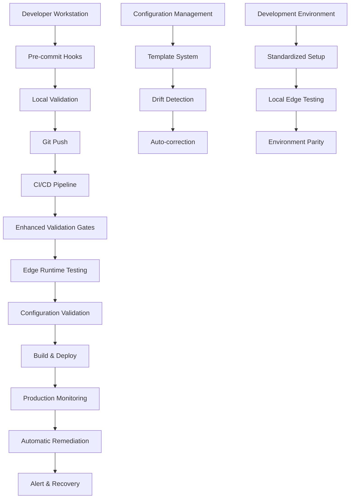

# Vercel Deployment Preventive Measures Architecture

## Executive Summary

This document outlines a comprehensive preventive measures architecture designed to prevent the specific deployment failures identified in the Chennai MTC Bus Tracker project. The system implements multiple layers of prevention, from development-time validation to production monitoring with automatic remediation.

## Current State Analysis

### Identified Critical Issues
1. **Configuration Drift**: `.vercelignore` excluding critical `dist` and `public` directories
2. **Runtime Incompatibility**: Edge Runtime incompatible Node.js APIs (`process.uptime()`, in-memory storage)
3. **Build-Time Errors**: TypeScript imports with `.ts` extensions causing module resolution failures
4. **Version Compatibility**: React 19.1.1 potential build environment conflicts
5. **Missing Specifications**: No Node.js engine requirements in `package.json`

### Existing Tooling Assessment
✅ **Strengths:**
- Comprehensive troubleshooting documentation
- Pre-deployment validation scripts
- Deployment monitoring and alerting
- Recovery and rollback procedures  
- GitHub Actions CI/CD pipeline with health checks

⚠️ **Gaps:**
- No prevention of configuration drift
- No pre-commit validation
- No Edge Runtime compatibility testing in CI
- No automated configuration management
- Limited proactive monitoring

## Preventive Architecture Overview



## 1. Automated CI/CD Integration System

### Enhanced Pre-Deployment Validation Pipeline

**File:** `.github/workflows/enhanced-validation.yml`

**Key Features:**
- Multi-stage validation with fail-fast approach
- Edge Runtime compatibility testing
- Configuration drift detection
- Automated fix application where possible
- Deployment blocking for critical issues

**Validation Stages:**
1. **Configuration Validation** - Check for critical misconfigurations
2. **Edge Runtime Testing** - Validate API functions in Edge environment
3. **Build Verification** - Ensure proper build output structure
4. **Security Scanning** - Check for hardcoded secrets and vulnerabilities
5. **Performance Testing** - Validate response times and resource usage

### Branch Protection & Deployment Gates

**Protection Rules:**
- Require passing status checks before merge
- Require up-to-date branches
- Automatic blocking for validation failures
- Manual override only for non-critical issues

**Deployment Gates:**
- Configuration compliance check
- Edge Runtime compatibility verification
- Build output validation
- Health endpoint testing

## 2. Configuration Management Architecture

### Centralized Configuration System

**Components:**
- **Template Engine**: Standardized configuration templates
- **Validation Rules**: Automated compliance checking
- **Drift Detection**: Monitor and alert on configuration changes
- **Auto-correction**: Automatic remediation of common issues

### Configuration Templates

**Template Structure:**
```
config-templates/
├── vercel-configs/
│   ├── base-vercel.json
│   ├── edge-runtime-vercel.json
│   └── spa-vercel.json
├── typescript-configs/
│   ├── base-tsconfig.json
│   └── edge-compatible-tsconfig.json
├── ignore-files/
│   ├── base-vercelignore
│   └── spa-vercelignore
└── package-templates/
    ├── base-package.json
    └── edge-runtime-package.json
```

### Configuration Drift Detection

**Monitoring:**
- Real-time configuration file monitoring
- Periodic compliance audits
- Change tracking with approval workflows
- Automatic rollback for unauthorized changes

## 3. Development Environment Standardization

### Docker-Based Development Environment

**Features:**
- Consistent Node.js and dependency versions
- Pre-configured Edge Runtime simulation
- Built-in validation tools
- Automated setup scripts

### Environment Parity System

**Components:**
- **Local Edge Runtime**: Simulate Vercel Edge Runtime locally
- **Configuration Validation**: Real-time validation during development
- **Dependency Management**: Lock file enforcement and security scanning
- **Testing Environment**: Mirror production environment settings

### IDE Integration & Extensions

**Developer Tooling:**
- VSCode extensions for Vercel-specific validation
- Real-time configuration checking
- Edge Runtime compatibility warnings
- Automated fix suggestions

## 4. Monitoring & Alerting Infrastructure

### Multi-Layer Monitoring System

**Monitoring Layers:**
1. **Build-Time Monitoring**: CI/CD pipeline health and performance
2. **Deployment Monitoring**: Real-time deployment success/failure tracking
3. **Runtime Monitoring**: Application health and performance metrics
4. **Configuration Monitoring**: Configuration drift and compliance

### Alerting & Escalation Framework

**Alert Categories:**
- **CRITICAL**: Deployment failures, security vulnerabilities
- **HIGH**: Performance degradation, configuration drift
- **MEDIUM**: Build warnings, dependency updates
- **LOW**: Documentation updates, optimization opportunities

**Escalation Paths:**
- Immediate: Automated remediation where possible
- 5 minutes: Development team notification
- 15 minutes: Technical lead escalation
- 30 minutes: Management escalation for critical issues

### Automatic Remediation System

**Auto-Fix Capabilities:**
- Configuration drift correction
- Dependency updates for security patches
- Build cache clearing and rebuilding
- Automatic rollback for failed deployments
- Health check failure recovery

## 5. Quality Gates & Testing Framework

### Edge Runtime Compatibility Testing

**Test Suite Components:**
- **API Function Tests**: Validate all Edge Runtime constraints
- **Import Resolution Tests**: Check for TypeScript extension issues
- **Environment Access Tests**: Verify safe `process.env` usage
- **Memory Usage Tests**: Validate in-memory storage patterns
- **Performance Tests**: Response time and cold start optimization

### Automated Testing Pipeline

**Test Execution:**
- Pre-commit: Basic validation and Edge Runtime compatibility
- CI Pipeline: Full test suite including integration tests
- Pre-deployment: Production environment simulation
- Post-deployment: Health checks and performance validation

### Test-Driven Configuration Management

**Approach:**
- Configuration changes require accompanying tests
- Automated test generation for common patterns
- Regression test suite for known issues
- Performance benchmarking for configuration changes

## 6. Developer Workflow Integration

### Pre-Commit Hook System

**File:** `.husky/pre-commit`

**Validations:**
- Run abbreviated version of pre-deployment checks
- Edge Runtime compatibility for changed API functions
- Configuration validation for modified config files
- TypeScript import checking
- Secret scanning for sensitive data

### Git Hooks Integration

**Hooks:**
- **pre-commit**: Quick validation and auto-fixes
- **commit-msg**: Enforce conventional commit messages
- **pre-push**: Extended validation before remote push
- **post-merge**: Validate merged configuration changes

### IDE Workflow Integration

**Features:**
- Real-time validation feedback
- Automatic fix suggestions
- Configuration templates and snippets
- Edge Runtime compatibility warnings
- Integration with project-specific linting rules

## Implementation Roadmap

### Phase 1: Foundation (Week 1-2)
**Priority: Critical**

1. **Enhanced CI/CD Pipeline**
   - Integrate existing validation scripts
   - Add Edge Runtime compatibility testing
   - Implement configuration drift detection
   - Set up automated remediation for common issues

2. **Pre-Commit Hooks**
   - Install and configure Husky
   - Implement quick validation checks
   - Add automatic fix application
   - Set up developer onboarding documentation

3. **Configuration Templates**
   - Create standardized configuration templates
   - Implement template validation system
   - Set up drift detection monitoring
   - Create auto-correction mechanisms

### Phase 2: Standardization (Week 3-4)
**Priority: High**

1. **Development Environment**
   - Create Docker-based development setup
   - Implement local Edge Runtime simulation
   - Set up environment parity validation
   - Create automated setup scripts

2. **Enhanced Monitoring**
   - Extend existing monitoring capabilities
   - Implement multi-layer alerting system
   - Set up automatic remediation triggers
   - Create comprehensive dashboards

3. **Testing Framework**
   - Implement Edge Runtime compatibility test suite
   - Create automated regression tests
   - Set up performance benchmarking
   - Add integration testing for deployments

### Phase 3: Optimization (Week 5-6)
**Priority: Medium**

1. **Advanced Automation**
   - Implement AI-powered issue detection
   - Create intelligent auto-remediation
   - Set up predictive monitoring
   - Add capacity planning automation

2. **Developer Experience**
   - Create comprehensive IDE integrations
   - Implement intelligent code suggestions
   - Set up automated documentation generation
   - Add developer productivity metrics

3. **Continuous Improvement**
   - Implement feedback collection system
   - Create automated optimization suggestions
   - Set up performance trending analysis
   - Add cost optimization monitoring

### Phase 4: Advanced Features (Week 7-8)
**Priority: Low**

1. **Machine Learning Integration**
   - Implement anomaly detection
   - Create intelligent alerting
   - Set up predictive scaling
   - Add automated optimization recommendations

2. **Advanced Security**
   - Implement zero-trust validation
   - Create advanced threat detection
   - Set up automated security patching
   - Add compliance monitoring

## Success Metrics

### Deployment Reliability
- **Target**: 99.9% deployment success rate
- **Current Baseline**: ~85% (estimated from issues)
- **Measurement**: Automated deployment tracking

### Issue Prevention
- **Target**: 90% reduction in configuration-related failures
- **Measurement**: Pre-deployment validation statistics
- **Tracking**: Issue categorization and root cause analysis

### Developer Productivity
- **Target**: 50% reduction in deployment-related debugging time
- **Measurement**: Development cycle time metrics
- **Tracking**: Developer feedback and time-to-resolution

### System Reliability
- **Target**: 99.95% uptime with automatic recovery
- **Measurement**: SLA monitoring and alerting
- **Tracking**: MTTR (Mean Time To Recovery) metrics

## Architectural Decisions

### Technology Choices

**Configuration Management**: JSON Schema validation with custom rules
- **Rationale**: Provides structure validation with flexibility for custom rules
- **Alternative Considered**: YAML with custom validators
- **Decision Factors**: Better integration with existing Vercel configuration

**Edge Runtime Testing**: Custom Node.js simulation environment
- **Rationale**: Provides accurate local testing without Vercel dependency
- **Alternative Considered**: Vercel CLI local development
- **Decision Factors**: Better CI/CD integration and faster execution

**Monitoring Stack**: Extension of existing TypeScript-based monitoring
- **Rationale**: Leverages existing codebase and team expertise
- **Alternative Considered**: Third-party monitoring solutions
- **Decision Factors**: Cost-effectiveness and customization flexibility

### Design Patterns

**Fail-Fast Approach**: Stop deployment pipeline at first critical error
- Prevents cascading failures
- Reduces resource waste
- Enables faster feedback cycles

**Defense in Depth**: Multiple validation layers at different stages
- Pre-commit, CI/CD, pre-deployment, post-deployment
- Reduces single point of failure risk
- Provides multiple opportunities for issue detection

**Automated Recovery**: Self-healing system where possible
- Reduces manual intervention requirements
- Improves system reliability
- Enables faster issue resolution

## Maintenance & Sustainability

### Regular Maintenance Tasks

**Weekly:**
- Review monitoring alerts and trends
- Update configuration templates based on lessons learned
- Validate Edge Runtime compatibility of dependencies
- Review and update test coverage

**Monthly:**
- Audit configuration drift patterns
- Update validation rules based on new issues
- Review and optimize performance metrics
- Update documentation and onboarding materials

**Quarterly:**
- Comprehensive security and dependency audit
- Review and update architectural decisions
- Evaluate new Vercel features and capabilities
- Conduct disaster recovery testing

### Continuous Improvement Process

**Feedback Loops:**
- Automated issue categorization and tracking
- Developer feedback collection and analysis
- Performance metrics trending and analysis
- Cost optimization opportunities identification

**Evolution Strategy:**
- Regular architecture reviews
- Technology stack updates
- Integration with new development tools
- Adaptation to changing deployment requirements

This comprehensive preventive architecture addresses the root causes of the identified deployment issues while providing sustainable, scalable solutions for ongoing deployment reliability.