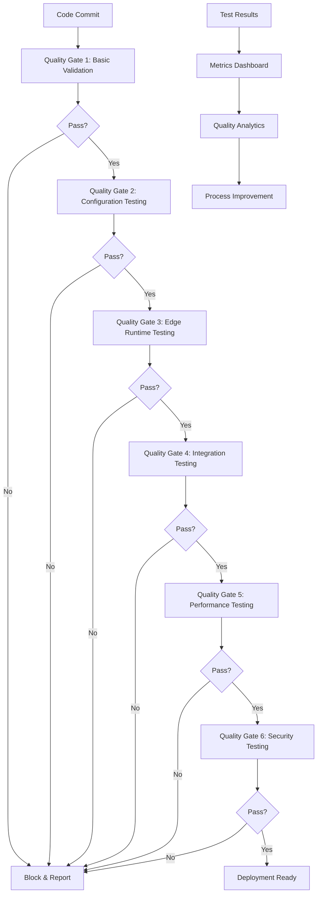

# Quality Gates & Testing Framework Design

## Overview

The Quality Gates & Testing Framework provides comprehensive, automated testing capabilities specifically designed to prevent Vercel deployment failures. It implements multi-layered quality gates that ensure code quality, configuration correctness, and deployment readiness at every stage of the development lifecycle.

## Core Principles

1. **Fail-Fast Testing**: Catch issues at the earliest possible stage
2. **Comprehensive Coverage**: Test all deployment-critical aspects
3. **Vercel-Specific Validation**: Focus on Edge Runtime and deployment constraints
4. **Automated Quality Assurance**: Minimize manual intervention
5. **Performance-Aware Testing**: Ensure tests don't slow development
6. **Progressive Quality Gates**: Increasing rigor as code moves toward production

## Architecture Overview



## 1. Multi-Level Quality Gates System

### Gate Architecture

```typescript
interface QualityGate {
  id: string;
  name: string;
  level: QualityLevel;
  enabled: boolean;
  blocking: boolean;
  timeout: number;
  conditions: GateCondition[];
  tests: TestSuite[];
  onFailure: FailureAction[];
  onSuccess: SuccessAction[];
}

enum QualityLevel {
  COMMIT = 'commit',           // Pre-commit validation
  PUSH = 'push',              // Pre-push validation
  PR = 'pull_request',        // Pull request validation
  MERGE = 'merge',            // Pre-merge validation
  DEPLOY_STAGING = 'deploy_staging',  // Staging deployment
  DEPLOY_PRODUCTION = 'deploy_production' // Production deployment
}

interface GateCondition {
  type: 'coverage' | 'performance' | 'security' | 'configuration' | 'custom';
  threshold: number | string;
  operator: 'gt' | 'gte' | 'lt' | 'lte' | 'eq' | 'contains';
  metric: string;
  required: boolean;
}

class QualityGateEngine {
  private gates: Map<string, QualityGate> = new Map();
  private testRunner: TestRunner;
  private metricsCollector: MetricsCollector;
  private reportGenerator: ReportGenerator;

  constructor() {
    this.testRunner = new TestRunner();
    this.metricsCollector = new MetricsCollector();
    this.reportGenerator = new ReportGenerator();
    this.initializeGates();
  }

  private initializeGates(): void {
    // Gate 1: Basic Validation (Commit Level)
    this.gates.set('basic-validation', {
      id: 'basic-validation',
      name: 'Basic Code Validation',
      level: QualityLevel.COMMIT,
      enabled: true,
      blocking: true,
      timeout: 30000, // 30 seconds
      conditions: [
        {
          type: 'configuration',
          threshold: 0,
          operator: 'eq',
          metric: 'critical_config_errors',
          required: true
        }
      ],
      tests: [
        {
          id: 'syntax-validation',
          name: 'Syntax Validation',
          type: 'static_analysis',
          config: { languages: ['typescript', 'javascript', 'json', 'yaml'] }
        },
        {
          id: 'lint-check',
          name: 'Code Linting',
          type: 'linting',
          config: { rules: 'strict', autofix: true }
        },
        {
          id: 'basic-config-check',
          name: 'Basic Configuration Check',
          type: 'configuration',
          config: { level: 'basic' }
        }
      ],
      onFailure: [
        { type: 'block_commit', message: 'Basic validation failed' },
        { type: 'suggest_fixes', autoApply: true }
      ],
      onSuccess: [
        { type: 'log_success', level: 'info' }
      ]
    });

    // Gate 2: Configuration Testing (Push Level)
    this.gates.set('configuration-testing', {
      id: 'configuration-testing',
      name: 'Configuration Validation',
      level: QualityLevel.PUSH,
      enabled: true,
      blocking: true,
      timeout: 60000, // 1 minute
      conditions: [
        {
          type: 'configuration',
          threshold: 0,
          operator: 'eq',
          metric: 'vercel_config_errors',
          required: true
        }
      ],
      tests: [
        {
          id: 'vercel-config-validation',
          name: 'Vercel Configuration Validation',
          type: 'configuration',
          config: { validator: 'vercel', strict: true }
        },
        {
          id: 'vercelignore-validation',
          name: 'Vercelignore Validation',
          type: 'configuration',
          config: { validator: 'vercelignore' }
        },
        {
          id: 'package-validation',
          name: 'Package.json Validation',
          type: 'configuration',
          config: { validator: 'package', checkEngines: true }
        }
      ],
      onFailure: [
        { type: 'block_push', message: 'Configuration validation failed' },
        { type: 'generate_report', format: 'detailed' }
      ],
      onSuccess: [
        { type: 'cache_results', ttl: 3600 }
      ]
    });

    // Gate 3: Edge Runtime Testing (PR Level)
    this.gates.set('edge-runtime-testing', {
      id: 'edge-runtime-testing',
      name: 'Edge Runtime Compatibility',
      level: QualityLevel.PR,
      enabled: true,
      blocking: true,
      timeout: 120000, // 2 minutes
      conditions: [
        {
          type: 'custom',
          threshold: 100,
          operator: 'eq',
          metric: 'edge_compatibility_score',
          required: true
        }
      ],
      tests: [
        {
          id: 'edge-compatibility-check',
          name: 'Edge Runtime Compatibility Check',
          type: 'edge_runtime',
          config: { mode: 'comprehensive' }
        },
        {
          id: 'api-function-testing',
          name: 'API Function Testing',
          type: 'functional',
          config: { runtime: 'edge', timeout: 30000 }
        },
        {
          id: 'import-validation',
          name: 'Import Statement Validation',
          type: 'static_analysis',
          config: { checkExtensions: true, validatePaths: true }
        }
      ],
      onFailure: [
        { type: 'block_merge', message: 'Edge Runtime compatibility issues found' },
        { type: 'suggest_alternatives', autoGenerate: true }
      ],
      onSuccess: [
        { type: 'update_compatibility_score' }
      ]
    });

    // Gate 4: Integration Testing (Merge Level)
    this.gates.set('integration-testing', {
      id: 'integration-testing',
      name: 'Integration Testing',
      level: QualityLevel.MERGE,
      enabled: true,
      blocking: true,
      timeout: 300000, // 5 minutes
      conditions: [
        {
          type: 'coverage',
          threshold: 80,
          operator: 'gte',
          metric: 'test_coverage_percentage',
          required: true
        }
      ],
      tests: [
        {
          id: 'unit-tests',
          name: 'Unit Test Suite',
          type: 'unit',
          config: { coverage: true, parallel: true }
        },
        {
          id: 'integration-tests',
          name: 'Integration Test Suite',
          type: 'integration',
          config: { environment: 'test' }
        },
        {
          id: 'build-validation',
          name: 'Build Process Validation',
          type: 'build',
          config: { target: 'production', verify: true }
        }
      ],
      onFailure: [
        { type: 'block_merge', message: 'Integration tests failed' },
        { type: 'notify_team', channel: 'development' }
      ],
      onSuccess: [
        { type: 'tag_commit', tag: 'integration-passed' }
      ]
    });

    // Gate 5: Performance Testing (Staging Deploy Level)
    this.gates.set('performance-testing', {
      id: 'performance-testing',
      name: 'Performance Validation',
      level: QualityLevel.DEPLOY_STAGING,
      enabled: true,
      blocking: true,
      timeout: 600000, // 10 minutes
      conditions: [
        {
          type: 'performance',
          threshold: 2000,
          operator: 'lt',
          metric: 'avg_response_time_ms',
          required: true
        },
        {
          type: 'performance',
          threshold: 5000,
          operator: 'lt',
          metric: 'cold_start_time_ms',
          required: true
        }
      ],
      tests: [
        {
          id: 'performance-benchmarks',
          name: 'Performance Benchmarks',
          type: 'performance',
          config: { scenarios: ['load', 'stress', 'cold_start'] }
        },
        {
          id: 'bundle-analysis',
          name: 'Bundle Size Analysis',
          type: 'static_analysis',
          config: { maxSize: '1MB', checkTreeShaking: true }
        },
        {
          id: 'lighthouse-audit',
          name: 'Lighthouse Performance Audit',
          type: 'lighthouse',
          config: { categories: ['performance', 'accessibility', 'seo'] }
        }
      ],
      onFailure: [
        { type: 'block_deployment', message: 'Performance benchmarks not met' },
        { type: 'generate_performance_report' }
      ],
      onSuccess: [
        { type: 'cache_benchmarks', duration: '24h' }
      ]
    });

    // Gate 6: Security Testing (Production Deploy Level)
    this.gates.set('security-testing', {
      id: 'security-testing',
      name: 'Security Validation',
      level: QualityLevel.DEPLOY_PRODUCTION,
      enabled: true,
      blocking: true,
      timeout: 480000, // 8 minutes
      conditions: [
        {
          type: 'security',
          threshold: 0,
          operator: 'eq',
          metric: 'critical_vulnerabilities',
          required: true
        }
      ],
      tests: [
        {
          id: 'vulnerability-scan',
          name: 'Dependency Vulnerability Scan',
          type: 'security',
          config: { severity: ['high', 'critical'] }
        },
        {
          id: 'secret-detection',
          name: 'Secret Detection',
          type: 'security',
          config: { patterns: 'comprehensive' }
        },
        {
          id: 'security-headers',
          name: 'Security Headers Validation',
          type: 'security',
          config: { checkHeaders: ['CSP', 'HSTS', 'X-Frame-Options'] }
        }
      ],
      onFailure: [
        { type: 'block_deployment', message: 'Security vulnerabilities found' },
        { type: 'alert_security_team' }
      ],
      onSuccess: [
        { type: 'approve_deployment' }
      ]
    });
  }

  async executeGate(gateId: string, context: TestContext): Promise<GateResult> {
    const gate = this.gates.get(gateId);
    if (!gate || !gate.enabled) {
      return { success: true, skipped: true, reason: 'Gate disabled or not found' };
    }

    const startTime = Date.now();
    const gateResult: GateResult = {
      gateId,
      success: true,
      startTime,
      endTime: 0,
      duration: 0,
      testResults: [],
      conditionResults: [],
      metrics: {},
      actions: []
    };

    try {
      // Execute all tests in parallel where possible
      const testPromises = gate.tests.map(test => 
        this.executeTest(test, context, gate.timeout)
      );

      const testResults = await Promise.allSettled(testPromises);
      
      // Process test results
      testResults.forEach((result, index) => {
        const test = gate.tests[index];
        
        if (result.status === 'fulfilled') {
          gateResult.testResults.push(result.value);
          
          // Update metrics from test result
          Object.assign(gateResult.metrics, result.value.metrics || {});
        } else {
          gateResult.testResults.push({
            testId: test.id,
            success: false,
            error: result.reason.message,
            duration: 0
          });
        }
      });

      // Evaluate gate conditions
      for (const condition of gate.conditions) {
        const conditionResult = this.evaluateCondition(condition, gateResult.metrics);
        gateResult.conditionResults.push(conditionResult);
        
        if (!conditionResult.satisfied && condition.required) {
          gateResult.success = false;
        }
      }

      // Execute appropriate actions
      const actions = gateResult.success ? gate.onSuccess : gate.onFailure;
      for (const action of actions) {
        const actionResult = await this.executeAction(action, gateResult, context);
        gateResult.actions.push(actionResult);
      }

    } catch (error) {
      gateResult.success = false;
      gateResult.error = error.message;
    }

    gateResult.endTime = Date.now();
    gateResult.duration = gateResult.endTime - gateResult.startTime;

    // Record gate execution metrics
    await this.metricsCollector.recordGateExecution(gateResult);

    return gateResult;
  }
}
```

## 2. Edge Runtime Testing Framework

### Comprehensive Edge Compatibility Testing

```typescript
interface EdgeRuntimeTest {
  id: string;
  name: string;
  type: EdgeTestType;
  target: string;
  config: EdgeTestConfig;
  timeout: number;
}

enum EdgeTestType {
  API_COMPATIBILITY = 'api_compatibility',
  MEMORY_USAGE = 'memory_usage',
  COLD_START = 'cold_start',
  RESPONSE_TIME = 'response_time',
  CONCURRENCY = 'concurrency',
  ERROR_HANDLING = 'error_handling'
}

class EdgeRuntimeTestFramework {
  private simulator: EdgeRuntimeSimulator;
  private testRunner: EdgeTestRunner;
  private metricsCollector: EdgeMetricsCollector;

  constructor() {
    this.simulator = new EdgeRuntimeSimulator();
    this.testRunner = new EdgeTestRunner();
    this.metricsCollector = new EdgeMetricsCollector();
  }

  async runEdgeCompatibilityTests(apiFiles: string[]): Promise<EdgeTestResult> {
    const results: EdgeTestResult = {
      overall: { success: true, score: 0 },
      apiResults: [],
      compatibilityIssues: [],
      performanceMetrics: {},
      recommendations: []
    };

    for (const apiFile of apiFiles) {
      try {
        const apiResult = await this.testAPIFunction(apiFile);
        results.apiResults.push(apiResult);
        
        // Update overall score
        results.overall.score += apiResult.compatibilityScore;
        
        // Collect issues
        results.compatibilityIssues.push(...apiResult.issues);
        
      } catch (error) {
        results.apiResults.push({
          file: apiFile,
          success: false,
          error: error.message,
          compatibilityScore: 0,
          issues: [{
            type: 'CRITICAL',
            message: `Failed to test ${apiFile}: ${error.message}`,
            location: apiFile,
            fixable: false
          }]
        });
        results.overall.success = false;
      }
    }

    // Calculate final score
    results.overall.score = Math.round(
      results.overall.score / Math.max(apiFiles.length, 1)
    );

    // Generate recommendations
    results.recommendations = this.generateRecommendations(results);

    return results;
  }

  private async testAPIFunction(apiFile: string): Promise<APITestResult> {
    const testResult: APITestResult = {
      file: apiFile,
      success: true,
      compatibilityScore: 100,
      issues: [],
      performanceMetrics: {},
      testCases: []
    };

    // Static analysis tests
    const staticAnalysis = await this.runStaticAnalysis(apiFile);
    testResult.testCases.push(staticAnalysis);
    
    if (!staticAnalysis.success) {
      testResult.compatibilityScore -= 30;
      testResult.issues.push(...staticAnalysis.issues);
    }

    // Runtime compatibility tests
    const runtimeTest = await this.runRuntimeCompatibilityTest(apiFile);
    testResult.testCases.push(runtimeTest);
    
    if (!runtimeTest.success) {
      testResult.compatibilityScore -= 40;
      testResult.issues.push(...runtimeTest.issues);
    }

    // Performance tests
    const performanceTest = await this.runPerformanceTest(apiFile);
    testResult.testCases.push(performanceTest);
    testResult.performanceMetrics = performanceTest.metrics;
    
    if (!performanceTest.success) {
      testResult.compatibilityScore -= 20;
    }

    // Error handling tests
    const errorHandlingTest = await this.runErrorHandlingTest(apiFile);
    testResult.testCases.push(errorHandlingTest);
    
    if (!errorHandlingTest.success) {
      testResult.compatibilityScore -= 10;
    }

    testResult.success = testResult.compatibilityScore >= 70; // 70% threshold
    return testResult;
  }

  private async runStaticAnalysis(apiFile: string): Promise<TestCaseResult> {
    const result: TestCaseResult = {
      name: 'Static Analysis',
      success: true,
      issues: [],
      duration: 0
    };

    const startTime = Date.now();
    
    try {
      const fileContent = await fs.readFile(apiFile, 'utf8');
      
      // Check for restricted APIs
      const restrictedAPIs = [
        { pattern: /process\.uptime\(\)/g, message: 'process.uptime() is not available in Edge Runtime', fix: 'Use Date.now() - startTime' },
        { pattern: /process\.memoryUsage\(\)/g, message: 'process.memoryUsage() is not available in Edge Runtime', fix: 'Remove or use alternative monitoring' },
        { pattern: /process\.cpuUsage\(\)/g, message: 'process.cpuUsage() is not available in Edge Runtime', fix: 'Remove or use alternative monitoring' },
        { pattern: /require\(['"]fs['"]\)/g, message: 'File system access not available in Edge Runtime', fix: 'Use fetch() or external storage' },
        { pattern: /import.*['"]fs['"]/g, message: 'File system access not available in Edge Runtime', fix: 'Use fetch() or external storage' },
        { pattern: /Buffer\.from\(/g, message: 'Buffer has limited support in Edge Runtime', fix: 'Use TextEncoder/TextDecoder' }
      ];

      for (const api of restrictedAPIs) {
        const matches = fileContent.match(api.pattern);
        if (matches) {
          result.issues.push({
            type: 'CRITICAL',
            message: api.message,
            location: this.findLineNumber(fileContent, api.pattern),
            fixable: true,
            fix: api.fix
          });
          result.success = false;
        }
      }

      // Check for TypeScript import extensions
      const tsImportPattern = /from ['"]\..*\.ts['"]/g;
      const tsImportMatches = fileContent.match(tsImportPattern);
      if (tsImportMatches) {
        result.issues.push({
          type: 'HIGH',
          message: 'TypeScript file extensions in imports cause build failures',
          location: this.findLineNumber(fileContent, tsImportPattern),
          fixable: true,
          fix: 'Remove .ts extension from import statements'
        });
        result.success = false;
      }

      // Check for unsafe environment variable access
      const unsafeEnvPattern = /process\.env\.(?!\?)/g;
      const envMatches = fileContent.match(unsafeEnvPattern);
      if (envMatches) {
        result.issues.push({
          type: 'MEDIUM',
          message: 'Direct process.env access may be unsafe in Edge Runtime',
          location: this.findLineNumber(fileContent, unsafeEnvPattern),
          fixable: true,
          fix: 'Use optional chaining: process?.env?.VAR'
        });
      }

    } catch (error) {
      result.success = false;
      result.issues.push({
        type: 'CRITICAL',
        message: `Static analysis failed: ${error.message}`,
        location: apiFile,
        fixable: false
      });
    }

    result.duration = Date.now() - startTime;
    return result;
  }

  private async runRuntimeCompatibilityTest(apiFile: string): Promise<TestCaseResult> {
    const result: TestCaseResult = {
      name: 'Runtime Compatibility',
      success: true,
      issues: [],
      duration: 0
    };

    const startTime = Date.now();

    try {
      // Load and execute the API function in simulated Edge Runtime
      const apiFunction = await this.simulator.loadFunction(apiFile);
      
      // Test basic invocation
      const testRequest = new Request('http://localhost:3000/test', {
        method: 'GET',
        headers: { 'Content-Type': 'application/json' }
      });

      const response = await apiFunction(testRequest);
      
      if (!response || !(response instanceof Response)) {
        result.issues.push({
          type: 'CRITICAL',
          message: 'Function must return a Response object',
          location: apiFile,
          fixable: true,
          fix: 'Ensure function returns new Response(...)'
        });
        result.success = false;
      }

      // Test with different HTTP methods
      const methods = ['GET', 'POST', 'PUT', 'DELETE'];
      for (const method of methods) {
        try {
          const methodRequest = new Request('http://localhost:3000/test', {
            method,
            headers: { 'Content-Type': 'application/json' },
            body: method !== 'GET' ? JSON.stringify({ test: true }) : undefined
          });
          
          await apiFunction(methodRequest);
        } catch (error) {
          result.issues.push({
            type: 'MEDIUM',
            message: `Function fails with ${method} requests: ${error.message}`,
            location: apiFile,
            fixable: true,
            fix: `Add proper ${method} handling in function`
          });
        }
      }

      // Test error handling
      try {
        const errorRequest = new Request('http://localhost:3000/test', {
          method: 'POST',
          headers: { 'Content-Type': 'application/json' },
          body: 'invalid-json'
        });
        
        const errorResponse = await apiFunction(errorRequest);
        
        if (errorResponse.status < 400) {
          result.issues.push({
            type: 'LOW',
            message: 'Function should return error status for invalid input',
            location: apiFile,
            fixable: true,
            fix: 'Add proper error handling and return appropriate HTTP status codes'
          });
        }
      } catch (error) {
        // This is expected for some error cases
      }

    } catch (error) {
      result.success = false;
      result.issues.push({
        type: 'CRITICAL',
        message: `Runtime compatibility test failed: ${error.message}`,
        location: apiFile,
        fixable: false
      });
    }

    result.duration = Date.now() - startTime;
    return result;
  }

  private async runPerformanceTest(apiFile: string): Promise<TestCaseResult> {
    const result: TestCaseResult = {
      name: 'Performance Test',
      success: true,
      issues: [],
      duration: 0,
      metrics: {}
    };

    const startTime = Date.now();

    try {
      const apiFunction = await this.simulator.loadFunction(apiFile);
      
      // Cold start test
      const coldStartTime = await this.measureColdStart(apiFunction);
      result.metrics.coldStartTime = coldStartTime;
      
      if (coldStartTime > 5000) { // 5 second threshold
        result.issues.push({
          type: 'HIGH',
          message: `Cold start time (${coldStartTime}ms) exceeds recommended threshold`,
          location: apiFile,
          fixable: true,
          fix: 'Optimize imports and reduce initialization code'
        });
      }

      // Response time test
      const responseTime = await this.measureResponseTime(apiFunction);
      result.metrics.avgResponseTime = responseTime;
      
      if (responseTime > 2000) { // 2 second threshold
        result.issues.push({
          type: 'MEDIUM',
          message: `Average response time (${responseTime}ms) exceeds recommended threshold`,
          location: apiFile,
          fixable: true,
          fix: 'Optimize function logic and reduce processing time'
        });
      }

      // Memory usage test (simulated)
      const memoryUsage = await this.estimateMemoryUsage(apiFunction);
      result.metrics.estimatedMemoryUsage = memoryUsage;
      
      if (memoryUsage > 128 * 1024 * 1024) { // 128MB threshold
        result.issues.push({
          type: 'MEDIUM',
          message: `Estimated memory usage (${Math.round(memoryUsage / 1024 / 1024)}MB) is high`,
          location: apiFile,
          fixable: true,
          fix: 'Optimize data structures and reduce memory allocations'
        });
      }

    } catch (error) {
      result.success = false;
      result.issues.push({
        type: 'HIGH',
        message: `Performance test failed: ${error.message}`,
        location: apiFile,
        fixable: false
      });
    }

    result.duration = Date.now() - startTime;
    return result;
  }
}
```

## 3. Configuration Testing Suite

### Comprehensive Configuration Validation

```typescript
interface ConfigurationTest {
  id: string;
  name: string;
  validator: ConfigValidator;
  severity: 'CRITICAL' | 'HIGH' | 'MEDIUM' | 'LOW';
  autoFixable: boolean;
}

class ConfigurationTestSuite {
  private tests: Map<string, ConfigurationTest> = new Map();
  private validators: Map<string, ConfigValidator> = new Map();

  constructor() {
    this.initializeValidators();
    this.initializeTests();
  }

  private initializeValidators(): void {
    // Vercel.json validator
    this.validators.set('vercel', new VercelConfigValidator({
      schemaVersion: 2,
      strictMode: true,
      checkCompatibility: true,
      validateFunctions: true
    }));

    // .vercelignore validator
    this.validators.set('vercelignore', new VercelIgnoreValidator({
      checkCriticalExclusions: true,
      validatePatterns: true,
      checkPerformanceImpact: true
    }));

    // package.json validator
    this.validators.set('package', new PackageJsonValidator({
      checkEngines: true,
      validateDependencies: true,
      checkScripts: true,
      securityAudit: true
    }));

    // TypeScript config validator
    this.validators.set('typescript', new TypeScriptConfigValidator({
      checkCompilerOptions: true,
      validatePaths: true,
      checkEdgeCompatibility: true
    }));
  }

  private initializeTests(): void {
    // Critical Vercel configuration tests
    this.tests.set('vercel-critical-config', {
      id: 'vercel-critical-config',
      name: 'Critical Vercel Configuration',
      validator: this.validators.get('vercel')!,
      severity: 'CRITICAL',
      autoFixable: true
    });

    this.tests.set('vercelignore-exclusions', {
      id: 'vercelignore-exclusions',
      name: 'Vercelignore Critical Exclusions',
      validator: this.validators.get('vercelignore')!,
      severity: 'CRITICAL',
      autoFixable: true
    });

    // Package.json validation tests
    this.tests.set('package-engines', {
      id: 'package-engines',
      name: 'Package Engines Specification',
      validator: this.validators.get('package')!,
      severity: 'HIGH',
      autoFixable: true
    });

    // TypeScript configuration tests
    this.tests.set('typescript-edge-config', {
      id: 'typescript-edge-config',
      name: 'TypeScript Edge Runtime Configuration',
      validator: this.validators.get('typescript')!,
      severity: 'HIGH',
      autoFixable: true
    });
  }

  async runConfigurationTests(): Promise<ConfigurationTestResult> {
    const result: ConfigurationTestResult = {
      overall: { success: true, score: 100 },
      testResults: [],
      issues: [],
      auto